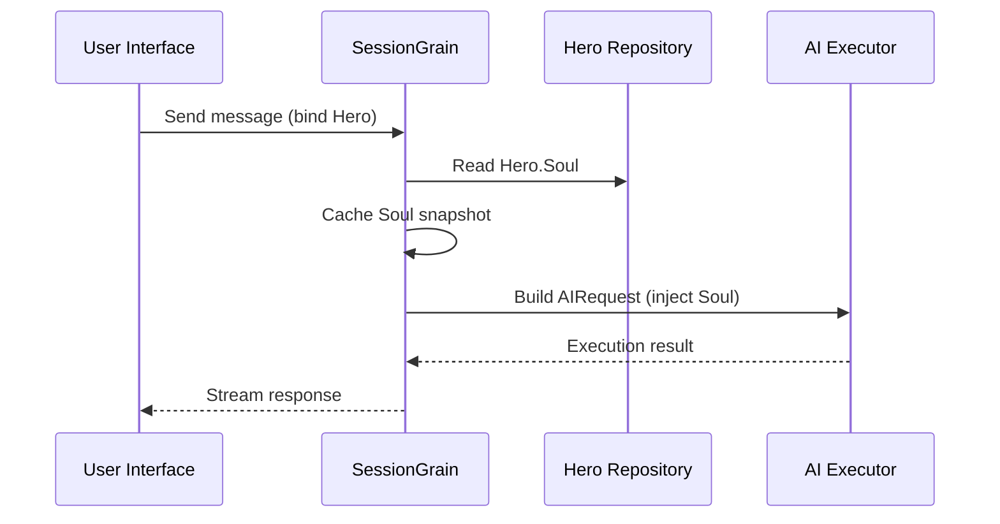

## Pengoptimalan Token Keluaran AI: Mempraktikkan Mode Tiongkok Klasik Ultra-Minimal

> Dalam pengembangan aplikasi AI, konsumsi token secara langsung mempengaruhi biaya. Dalam proyek HagiCode, kami menerapkan "mode keluaran Tiongkok Klasik ultra-minimal" melalui sistem SOUL. Tanpa mengorbankan kepadatan informasi, ini mengurangi token keluaran sekitar 30-50%. Artikel ini membagikan detail penerapan pendekatan tersebut dan pembelajaran yang kami peroleh saat menggunakannya.

## Latar Belakang

Dalam pengembangan aplikasi AI, konsumsi token merupakan masalah biaya yang tidak dapat dihindari. Hal ini menjadi sangat menyakitkan ketika AI perlu memproduksi konten dalam jumlah besar. Bagaimana cara mengurangi token keluaran tanpa mengorbankan kepadatan informasi? Semakin Anda memikirkannya, masalahnya akan semakin membuat frustrasi.

Ide pengoptimalan tradisional sebagian besar berfokus pada sisi masukan: memangkas perintah sistem, mengompresi konteks, atau menggunakan pengkodean yang lebih efisien. Namun metode ini akhirnya mencapai puncaknya. Mendorong kompresi terlalu jauh, dan Anda mulai mengganggu pemahaman AI dan kualitas keluaran. Itu pada dasarnya hanya menghapus konten, yang tidak terlalu berarti.

Lalu bagaimana dengan sisi outputnya? Bisakah kita membuat AI mengungkapkan makna yang sama dengan lebih ringkas?

Pertanyaannya terdengar sederhana, namun ada sesuatu yang tersembunyi di baliknya. Jika Anda secara langsung meminta AI untuk "ringkas", itu mungkin hanya memberi Anda beberapa kata. Jika Anda menambahkan "jaga agar informasi tetap lengkap", ini mungkin akan kembali ke gaya verbose aslinya. Batasan yang terlalu kuat akan merugikan kegunaan; batasan yang terlalu lemah tidak menghasilkan apa-apa. Dimana sebenarnya titik keseimbangannya? Tidak ada yang bisa mengatakan dengan pasti.

Untuk mengatasi masalah ini, kami membuat keputusan yang berani: mulai dari gaya bahasa itu sendiri dan merancang sistem batasan ekspresi yang dapat dikonfigurasi dan disusun. Dampak dari keputusan tersebut mungkin lebih besar dari yang Anda perkirakan. Saya akan segera membahas detailnya, dan hasilnya mungkin akan sedikit mengejutkan Anda.

## Tentang HagiCode

Pendekatan yang dibagikan dalam artikel ini berasal dari pengalaman praktis kami di [Kode Hagi](https://hagicode.com) proyek.

HagiCode adalah asisten pengkodean AI sumber terbuka yang mendukung berbagai model AI dan konfigurasi khusus. Selama pengembangan, kami menemukan bahwa penggunaan token keluaran AI terlalu tinggi, jadi kami merancang solusi untuk hal tersebut. Jika menurut Anda pendekatan ini berharga, hal itu mungkin menunjukkan hal yang baik tentang pekerjaan teknik kami. Dan jika itu masalahnya, HagiCode sendiri mungkin juga patut Anda perhatikan. Kode tidak berbohong.

## Ikhtisar Sistem JIWA

Nama lengkap sistem SOUL adalah Bahasa Universal Berorientasi Jiwa. Ini adalah sistem konfigurasi yang digunakan dalam proyek HagiCode untuk menentukan gaya bahasa Pahlawan AI. Ide intinya sederhana: dengan membatasi cara AI mengekspresikan dirinya, AI dapat mengeluarkan konten dalam bentuk linguistik yang lebih ringkas sambil menjaga kelengkapan informasi.

Ini seperti memasang topeng linguistik pada AI... meskipun sejujurnya, ini tidak terlalu mistis.

### Arsitektur Teknis

Sistem SOUL menggunakan arsitektur terpisah frontend-backend:

**Depan (Pembangun Jiwa)**:
- Dibangun dengan React + TypeScript + Vite
- Terletak di `repos/soul/` direktori
- Menyediakan antarmuka visual yang membangun Jiwa
- Mendukung penggunaan bilingual (zh-CN / en-US)

**Bagian Belakang**:
- Dibangun di atas .NET (C#) + runtime terdistribusi Orleans
- Entitas Pahlawan mencakup a `Soul` bidang (maksimum 8000 karakter)
- Menyuntikkan Jiwa ke dalam sistem melalui prompt `SessionSystemMessageCompiler`

**Pembuatan Template Agen**:
- Dihasilkan dari bahan referensi
- Keluaran ke `/agent-templates/soul/templates/` direktori
- Termasuk 50 grup Katalog utama dan 10 dimensi ortogonal

### Mekanisme Injeksi Jiwa

Saat Sesi dijalankan untuk pertama kalinya, sistem membaca konfigurasi Jiwa Pahlawan dan memasukkannya ke dalam prompt sistem:



Format prompt sistem yang disuntikkan adalah:

```
<hero_soul>
[User-defined Soul content]
</hero_soul>
```

Mekanisme injeksi ini diterapkan di `SessionSystemMessageCompiler.cs`:

```csharp
internal static string? BuildSystemMessage(
    string? existingSystemMessage,
    string? languagePreference,
    IReadOnlyList<HeroTraitDto>? traits,
    string? soul)
{
    var segments = new List<string>();

    // ... language preference and Traits handling ...

    var normalizedSoul = NormalizeSoul(soul);
    if (!string.IsNullOrWhiteSpace(normalizedSoul))
    {
        segments.Add($"<hero_soul>\n{normalizedSoul}\n</hero_soul>");
    }

    // ... other system messages ...

    return segments.Count == 0 ? null : string.Join("\n\n", segments);
}
```

Setelah Anda melihat kodenya dan memahami prinsipnya, hanya itu saja yang perlu dilakukan.

## Mode Tiongkok Klasik Ultra-Minimal

Mode Tiongkok Klasik ultra-minimal adalah strategi penyimpanan token yang paling representatif dalam sistem SOUL. Prinsip intinya adalah menggunakan kepadatan semantik yang tinggi dari bahasa Mandarin Klasik untuk mengompresi panjang keluaran sambil menjaga informasi lengkap.

### Mengapa Cina Klasik

Bahasa Mandarin Klasik memiliki beberapa keunggulan alami:

1. **Kompresi semantik**: makna yang sama dapat diungkapkan dengan karakter yang lebih sedikit.
2. **Penghapusan redundansi**: Bahasa Mandarin klasik secara alami menghilangkan banyak konjungsi dan partikel yang umum dalam bahasa Mandarin modern.
3. **Struktur ringkas**: setiap kalimat mengandung kepadatan informasi yang tinggi, sehingga cocok sebagai sarana untuk menghasilkan AI.

Berikut adalah contoh konkritnya:

Keluaran bahasa Mandarin modern (sekitar 80 karakter):
```
Based on your code analysis, I found several issues. First, on line 23, the variable name is too long and should be shortened. Second, on line 45, you did not handle null values and should add conditional logic. Finally, the overall code structure is acceptable, but it can be further optimized.
```

Keluaran bahasa Mandarin Klasik ultra-minimal (sekitar 35 karakter, menghemat 56%):
```
Code reviewed: line 23 variable name verbose, abbreviate; line 45 lacks null handling, add checks. Overall structure acceptable; minor tuning suffices.
```

Kesenjangannya cukup besar untuk membuat Anda berhenti dan berpikir.

### Templat Konfigurasi Jiwa

Konfigurasi Soul lengkap untuk mode Tiongkok Klasik ultra-minimal adalah sebagai berikut:

```json
{
  "id": "soul-orth-11-classical-chinese-ultra-minimal-mode",
  "name": "Ultra-Minimal Classical Chinese Output Mode",
  "summary": "Use relatively readable Classical Chinese to compress semantic density, convey the meaning with as few words as possible, and retain only conclusions, judgments, and necessary actions, thereby significantly reducing output tokens.",
  "soul": "Your persona core comes from the \"Ultra-Minimal Classical Chinese Output Mode\": use relatively readable Classical Chinese to compress semantic density, convey the meaning with as few words as possible, and retain only conclusions, judgments, and necessary actions, thereby significantly reducing output tokens.\nMaintain the following signature language traits: 1. Prefer concise Classical Chinese sentence patterns such as \"can\", \"should\", \"do not\", \"already\", \"however\", and \"therefore\", while avoiding obscure and difficult wording;\n2. Compress each sentence to 4-12 characters whenever possible, removing preamble, pleasantries, repeated explanation, and ineffective modifiers;\n3. Do not expand arguments unless necessary; if the user does not ask a follow-up, provide only conclusions, steps, or judgments;\n4. Do not alter the core persona of the main Catalog; only compress the expression into restrained, classical, ultra-minimal short sentences."
}
```

Ada beberapa poin penting dalam desain template ini:

1. **Hapus batasan**: 4-12 karakter per kalimat, hilangkan redundansi, prioritaskan kesimpulan.
2. **Hindari ketidakjelasan**: gunakan pola kalimat Tiongkok Klasik yang ringkas dan hindari kata-kata yang jarang dan sulit.
3. **Pertahankan persona**: hanya ubah mode ekspresi, bukan persona inti.

Saat Anda terus menyesuaikan konfigurasi, pada akhirnya semuanya bergantung pada beberapa parameter.

### Mode Ultra-Minimal Lainnya

Selain mode Tiongkok Klasik, sistem HagiCode SOUL juga menyediakan beberapa mode penyimpanan token lainnya:

**Mode keluaran ultra-minimal gaya telegraf** (`soul-orth-02`):
- Pertahankan setiap kalimat dalam 10 karakter
- Melarang kata sifat dekoratif
- Tidak ada partikel modal, tanda seru, atau reduplikasi seluruhnya

**Mode gumaman pendek terfragmentasi** (`soul-orth-01`):
- Pertahankan kalimat dalam 1-5 karakter
- Simulasikan self-talk yang terfragmentasi
- Melemahkan logika eksplisit dan memprioritaskan transmisi emosional

**Mode Tanya Jawab Terpandu** (`soul-orth-03`):
- Gunakan pertanyaan untuk memandu pemikiran pengguna
- Kurangi konten keluaran langsung
- Turunkan penggunaan token melalui interaksi

Masing-masing mode ini menekankan arah desain yang berbeda, namun tujuan intinya sama: mengurangi token keluaran sambil menjaga kualitas informasi. Ada banyak jalan menuju Roma; beberapa lebih mudah untuk berjalan daripada yang lain.

## Strategi Kombinasi

Salah satu fitur canggih dari sistem SOUL adalah dukungan untuk menggabungkan silang Katalog utama dan dimensi ortogonal:

- **50 grup Katalog utama**: menentukan persona dasar (seperti gaya penyembuhan, gaya siswa terbaik, gaya menyendiri, dan seterusnya)
- **10 dimensi ortogonal**: menentukan mode ekspresi (seperti bahasa Mandarin Klasik, gaya telegraf, gaya Tanya Jawab, dan seterusnya)
- **Efek kombinasi**: dapat menghasilkan 500+ kombinasi gaya bahasa yang unik

Misalnya, Anda dapat menggabungkan "Insinyur Pengembangan Profesional" dengan "Mode Keluaran Bahasa Mandarin Klasik Ultra-Minimal" untuk membuat asisten AI yang profesional dan ringkas. Fleksibilitas ini memungkinkan sistem SOUL beradaptasi dengan banyak skenario berbeda. Anda dapat memadupadankan sesuka Anda; ada lebih banyak kombinasi daripada yang mungkin Anda habiskan.

## Panduan Praktis

### Ciptakan Melalui Pembangun Jiwa

Kunjungi [jiwa.hagicode.com](https://soul.hagicode.com) dan ikuti langkah-langkah berikut:

1. Pilih Katalog utama (misalnya, "Insinyur Pengembangan Profesional")
2. Pilih dimensi ortogonal (misalnya, "Mode Output China Klasik Ultra-Minimal")
3. Pratinjau konten Jiwa yang dihasilkan
4. Salin konfigurasi Soul yang dihasilkan

Sebagian besar hanya tunjuk-dan-klik, jadi mungkin tidak banyak lagi yang bisa dikatakan.

### Gunakan dalam Konfigurasi Pahlawan

Terapkan konfigurasi Jiwa ke Pahlawan melalui antarmuka web atau API:

```typescript
// Hero Soul update example
const heroUpdate = {
  soul: "Your persona core comes from the \"Ultra-Minimal Classical Chinese Output Mode\": ...",
  soulCatalogId: "soul-orth-11-classical-chinese-ultra-minimal-mode",
  soulDisplayName: "Ultra-Minimal Classical Chinese Output Mode",
  soulStyleType: "orthogonal-dimension",
  soulSummary: "Use relatively readable Classical Chinese to compress semantic density..."
};

await updateHero(heroId, heroUpdate);
```

### Templat Jiwa Kustom

Pengguna dapat menyempurnakan template preset atau menulisnya dari awal. Berikut adalah contoh khusus untuk skenario peninjauan kode:

```
You are a code reviewer who pursues extreme concision.
All output must follow these rules:
1. Only point out specific problems and line numbers
2. Each issue must not exceed 15 characters
3. Use concise terms such as "should", "must", and "do not"
4. Do not provide extra explanation

Example output:
- Line 23: variable name too long, should abbreviate
- Line 45: null not handled, must add checks
- Line 67: logic redundant, can simplify
```

Anda dapat merevisi template sesuka Anda. Templat hanyalah titik awal.

### Catatan

**Kompatibilitas**:
- Mode Tiongkok Klasik berfungsi dengan 50 grup Katalog utama
- Dapat dikombinasikan dengan persona dasar apa pun
- Tidak mengubah persona inti Katalog utama

**Mekanisme cache**:
- Jiwa di-cache ketika Sesi dijalankan untuk pertama kalinya
- Cache digunakan kembali dalam SessionId yang sama
- Memodifikasi konfigurasi Hero tidak mempengaruhi Sesi yang sudah dimulai

**Kendala dan batasan**:
- Panjang maksimum bidang Jiwa adalah 8000 karakter
- Hero tanpa Soul field di data historis masih bisa digunakan dengan normal
- Slot peralatan jiwa dan gaya bersifat independen dan tidak saling menimpa

## Perbandingan Efek

Menurut data pengujian nyata dari proyek tersebut, hasil setelah mengaktifkan mode Tiongkok Klasik ultra-minimal adalah sebagai berikut:

| Skenario | Token keluaran asli | Mode Tiongkok klasik | Tabungan |
|------|------------------------|------------------------|---------|
| Tinjauan kode | 850 | 420 | 51% |
| Tanya Jawab Teknis | 620 | 380 | 39% |
| Saran solusi | 1100 | 680 | 38% |
| Rata-rata | - | - | 30-50% |

Data berasal dari statistik penggunaan aktual dalam proyek HagiCode, dan hasil pastinya bervariasi berdasarkan skenario. Namun, token yang disimpan akan bertambah dan dompet Anda akan menghargainya.

## Kesimpulan

Sistem HagiCode SOUL menawarkan cara inovatif untuk mengoptimalkan keluaran AI: mengurangi konsumsi token dengan membatasi ekspresi daripada mengompresi informasi itu sendiri. Sebagai pendekatan yang paling representatif, mode Tiongkok Klasik ultra-minimal telah menghasilkan penghematan token sebesar 30-50% dalam penggunaan di dunia nyata.

Nilai inti dari pendekatan ini terletak pada hal berikut:

1. **Pertahankan kualitas informasi**: alih-alih hanya memotong keluaran, ini mengekspresikan konten yang sama dengan lebih efisien.
2. **Fleksibel dan dapat disusun**: mendukung 500+ kombinasi persona dan gaya ekspresi.
3. **Mudah digunakan**: Soul Builder menyediakan antarmuka visual, jadi tidak diperlukan pengkodean.
4. **Stabilitas tingkat produksi**: divalidasi dalam proyek dan mampu digunakan dalam skala besar.

Jika Anda juga sedang membuat aplikasi AI, atau jika Anda tertarik dengan proyek HagiCode, silakan menghubungi kami. Arti dari open source terletak pada kemajuan bersama, dan kami juga menantikan penggunaan inovatif Anda sendiri. Pepatah tersebut mungkin sudah ketinggalan zaman, namun tetap benar adanya: seseorang bisa melaju dengan cepat, namun sekelompok orang akan melangkah lebih jauh.

## Referensi

- HagiCode GitHub: [github.com/HagiCode-org/site](https://github.com/HagiCode-org/site)
- Situs resmi HagiCode: [hagicode.com](https://hagicode.com)
- Pembangun Jiwa: [jiwa.hagicode.com](https://soul.hagicode.com)
- Panduan penerapan Docker: [docs.hagicode.com/installation/docker-compose](https://docs.hagicode.com/installation/docker-compose)
- Aplikasi desktop: [hagicode.com/desktop/](https://hagicode.com/desktop/)
- Demo langsung selama 30 menit: [www.bilibili.com/video/BV1pirZBuEzq/](https://www.bilibili.com/video/BV1pirZBuEzq/)

---

Jika artikel ini membantu Anda:
- Beri kami Bintang di GitHub: [github.com/HagiCode-org/site](https://github.com/HagiCode-org/site)
- Kunjungi situs resmi untuk mempelajari lebih lanjut: [hagicode.com](https://hagicode.com)
- Beta publik telah dimulai, dan Anda dipersilakan untuk menginstal dan mencobanya

## Pemberitahuan Hak Cipta

Terima kasih telah membaca. Jika Anda merasa artikel ini bermanfaat, silakan sukai, tandai, dan bagikan.
Konten ini dibuat dengan kolaborasi bantuan AI, dan versi final telah ditinjau dan dikonfirmasi oleh penulis.
- Penulis: [baru36524](https://www.newbe.pro)
- Tautan artikel asli: [https://docs.hagicode.com/blog/2026-04-04-soul-token-optimization-classical-chinese/](https://docs.hagicode.com/blog/2026-04-04-soul-token-optimization-classical-chinese/)
- Pemberitahuan hak cipta: Kecuali dinyatakan lain, semua artikel di blog ini dilisensikan di bawah BY-NC-SA. Harap mencantumkan sumbernya saat memposting ulang.
