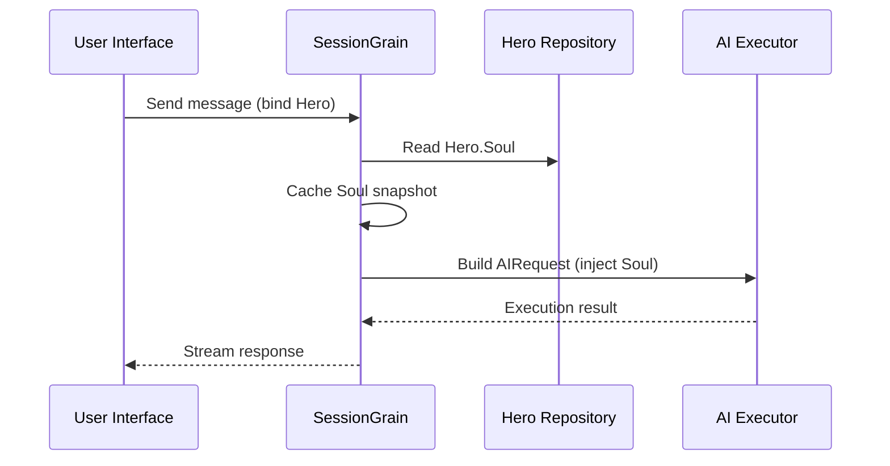

## Ottimizzazione dei token di output dell'IA: praticare una modalità cinese classica ultra-minimalista

> Nello sviluppo di applicazioni AI, il consumo di token influisce direttamente sui costi. Nel progetto HagiCode, abbiamo implementato una "modalità di output cinese classico ultra-minimal" attraverso il sistema SOUL. Senza sacrificare la densità delle informazioni, riduce i token di output di circa il 30-50%. Questo articolo condivide i dettagli di implementazione di tale approccio e le lezioni apprese utilizzandolo.

## Sfondo

Nello sviluppo di applicazioni AI, il consumo di token è un problema di costi inevitabile. Ciò diventa particolarmente doloroso negli scenari in cui l’intelligenza artificiale deve produrre grandi quantità di contenuti. Come si riducono i token di output senza sacrificare la densità delle informazioni? Più ci pensi, più il problema può diventare frustrante.

Le idee di ottimizzazione tradizionali si concentrano principalmente sul lato input: taglio dei prompt del sistema, compressione del contesto o utilizzo di una codifica più efficiente. Ma questi metodi alla fine raggiungono un limite. Spingi troppo la compressione e inizi a danneggiare la comprensione dell'intelligenza artificiale e la qualità dell'output. Fondamentalmente si tratta solo di eliminare contenuti, il che non è molto significativo.

E per quanto riguarda il lato di uscita? Potremmo fare in modo che l’intelligenza artificiale esprima lo stesso significato in modo più conciso?

La domanda sembra semplice, ma sotto c'è qualcosa di nascosto. Se chiedi direttamente all'intelligenza artificiale di "essere conciso", potrebbe davvero darti solo poche parole. Se aggiungi "mantieni le informazioni complete", potrebbe tornare allo stile dettagliato originale. Vincoli troppo forti danneggiano l’usabilità; vincoli troppo deboli non fanno nulla. Dov’è esattamente il punto di equilibrio? Nessuno può dirlo con certezza.

Per risolvere questi punti critici, abbiamo preso una decisione coraggiosa: partire dallo stile linguistico stesso e progettare un sistema di vincoli espressivi configurabile e componibile. L’impatto di tale decisione potrebbe essere ancora più grande di quanto ti aspetti. Entrerò nei dettagli a breve e il risultato potrebbe sorprendervi un po'.

## A proposito di HagiCode

L'approccio condiviso in questo articolo deriva dalla nostra esperienza pratica nel [HagiCode](https://hagicode.com) progetto.

HagiCode è un assistente di codifica AI open source che supporta più modelli AI e configurazioni personalizzate. Durante lo sviluppo, abbiamo scoperto che l'utilizzo dei token di output dell'IA era troppo elevato, quindi abbiamo progettato una soluzione al riguardo. Se ritieni utile questo approccio, probabilmente questo dice qualcosa di positivo sul nostro lavoro di ingegneria. E se è così, anche HagiCode stesso potrebbe meritare la tua attenzione. Il codice non mente.

## Panoramica del sistema SOUL

Il nome completo del sistema SOUL è Linguaggio Universale Orientato all'Anima. È il sistema di configurazione utilizzato nel progetto HagiCode per definire lo stile linguistico di un eroe AI. La sua idea di base è semplice: limitando il modo in cui l’intelligenza artificiale si esprime, può produrre contenuti in una forma linguistica più concisa preservando la completezza delle informazioni.

È un po' come mettere una maschera linguistica sull'intelligenza artificiale... anche se, onestamente, non è poi così mistico.

### Architettura tecnica

Il sistema SOUL utilizza un'architettura separata frontend-backend:

**Frontend (Costruttore di anime)**:
- Costruito con React + TypeScript + Vite
- Situato nel `repos/soul/` directory
- Fornisce un'interfaccia visiva per la costruzione dell'anima
- Supporta l'uso bilingue (zh-CN / en-US)

**Backend**:
- Costruito su .NET (C#) + runtime distribuito Orleans
- L'entità Eroe include a `Soul` campo (massimo 8000 caratteri)
- Inietta Soul nel sistema tramite prompt `SessionSystemMessageCompiler`

**Generazione di modelli di agente**:
- Generato da materiali di riferimento
- Uscita al `/agent-templates/soul/templates/` directory
- Include 50 gruppi principali del catalogo e 10 dimensioni ortogonali

### Meccanismo di iniezione dell'anima

Quando una sessione viene eseguita per la prima volta, il sistema legge la configurazione dell'Anima dell'Eroe e la inserisce nel prompt del sistema:



Il formato del prompt del sistema inserito è:

```
<hero_soul>
[User-defined Soul content]
</hero_soul>
```

Questo meccanismo di iniezione è implementato in `SessionSystemMessageCompiler.cs`:

```csharp
internal static string? BuildSystemMessage(
    string? existingSystemMessage,
    string? languagePreference,
    IReadOnlyList<HeroTraitDto>? traits,
    string? soul)
{
    var segments = new List<string>();

    // ... language preference and Traits handling ...

    var normalizedSoul = NormalizeSoul(soul);
    if (!string.IsNullOrWhiteSpace(normalizedSoul))
    {
        segments.Add($"<hero_soul>\n{normalizedSoul}\n</hero_soul>");
    }

    // ... other system messages ...

    return segments.Count == 0 ? null : string.Join("\n\n", segments);
}
```

Una volta che hai visto il codice e compreso il principio, questo è tutto quello che c'è da fare.

## Modalità cinese classica ultra-minimalista

La modalità cinese classica ultra-minimal è la strategia di risparmio di token più rappresentativa nel sistema SOUL. Il suo principio fondamentale è utilizzare l'elevata densità semantica del cinese classico per comprimere la lunghezza dell'output preservando l'informazione completa.

### Perché il cinese classico

Il cinese classico presenta diversi vantaggi naturali:

1. **Compressione semantica**: lo stesso significato può essere espresso con meno caratteri.
2. **Rimozione della ridondanza**: il cinese classico omette naturalmente molte congiunzioni e particelle comuni nel cinese moderno.
3. **Struttura concisa**: ogni frase trasporta un'elevata densità di informazioni, rendendola particolarmente adatta come veicolo per l'output dell'intelligenza artificiale.

Ecco un esempio concreto:

Produzione cinese moderno (circa 80 caratteri):
```
Based on your code analysis, I found several issues. First, on line 23, the variable name is too long and should be shortened. Second, on line 45, you did not handle null values and should add conditional logic. Finally, the overall code structure is acceptable, but it can be further optimized.
```

Output in cinese classico ultraminimale (circa 35 caratteri, risparmiando il 56%):
```
Code reviewed: line 23 variable name verbose, abbreviate; line 45 lacks null handling, add checks. Overall structure acceptable; minor tuning suffices.
```

Il divario è abbastanza grande da farti fermare e pensare.

### Modello di configurazione dell'anima

La configurazione Soul completa per la modalità cinese classica ultra-minimalista è la seguente:

```json
{
  "id": "soul-orth-11-classical-chinese-ultra-minimal-mode",
  "name": "Ultra-Minimal Classical Chinese Output Mode",
  "summary": "Use relatively readable Classical Chinese to compress semantic density, convey the meaning with as few words as possible, and retain only conclusions, judgments, and necessary actions, thereby significantly reducing output tokens.",
  "soul": "Your persona core comes from the \"Ultra-Minimal Classical Chinese Output Mode\": use relatively readable Classical Chinese to compress semantic density, convey the meaning with as few words as possible, and retain only conclusions, judgments, and necessary actions, thereby significantly reducing output tokens.\nMaintain the following signature language traits: 1. Prefer concise Classical Chinese sentence patterns such as \"can\", \"should\", \"do not\", \"already\", \"however\", and \"therefore\", while avoiding obscure and difficult wording;\n2. Compress each sentence to 4-12 characters whenever possible, removing preamble, pleasantries, repeated explanation, and ineffective modifiers;\n3. Do not expand arguments unless necessary; if the user does not ask a follow-up, provide only conclusions, steps, or judgments;\n4. Do not alter the core persona of the main Catalog; only compress the expression into restrained, classical, ultra-minimal short sentences."
}
```

Ci sono diversi punti chiave nel design di questo modello:

1. **Chiari vincoli**: 4-12 caratteri per frase, eliminazione della ridondanza, priorità delle conclusioni.
2. **Evita l'oscurità**: usa schemi di frasi concise in cinese classico ed evita parole rare e difficili.
3. **Preserva la personalità**: cambia solo la modalità di espressione, non la personalità principale.

Quando continui a regolare la configurazione, alla fine tutto si riduce a pochi parametri.

### Altre modalità ultra minimali

Oltre alla modalità cinese classica, il sistema HagiCode SOUL fornisce anche diverse altre modalità di salvataggio dei token:

**Modalità di output ultra-minimale in stile telegrafico** (`soul-orth-02`):
- Mantieni ogni frase rigorosamente entro 10 caratteri
- Proibire gli aggettivi decorativi
- Nessuna particella modale, punto esclamativo o duplicazione ovunque

**Modalità breve mormorio frammentato** (`soul-orth-01`):
- Mantieni le frasi entro 1-5 caratteri
- Simula un dialogo interiore frammentato
- Indebolire la logica esplicita e dare priorità alla trasmissione emotiva

**Modalità domande e risposte guidate** (`soul-orth-03`):
- Utilizza le domande per guidare il pensiero dell'utente
- Ridurre il contenuto dell'output diretto
- Riduzione dell'utilizzo dei token tramite l'interazione

Ognuna di queste modalità enfatizza una diversa direzione di progettazione, ma l'obiettivo principale è lo stesso: ridurre i token di output preservando la qualità delle informazioni. Ci sono molte strade per Roma; alcuni sono semplicemente più facili da percorrere rispetto ad altri.

## Strategia di combinazione

Una potente caratteristica del sistema SOUL è il supporto per la combinazione incrociata dei cataloghi principali e delle dimensioni ortogonali:

- **50 gruppi principali del catalogo**: definisci la personalità di base (come stile di guarigione, stile da studente eccellente, stile distaccato e così via)
- **10 dimensioni ortogonali**: definiscono la modalità di espressione (come cinese classico, stile telegrafico, stile domande e risposte e così via)
- **Effetto combinazione**: può generare oltre 500 combinazioni uniche di stili linguistici

Ad esempio, puoi combinare "Ingegnere di sviluppo professionale" con "Modalità di output cinese classico ultra-minimal" per creare un assistente AI che sia professionale e conciso. Questa flessibilità consente al sistema SOUL di adattarsi a molti scenari diversi. Puoi mescolare e abbinare come preferisci; ci sono più combinazioni di quelle che potresti esaurire.

## Guida pratica

### Crea tramite Soul Builder

Visita [soul.hagicode.com](https://soul.hagicode.com) e segui questi passaggi:

1. Seleziona un catalogo principale (ad esempio, "Ingegnere dello sviluppo professionale")
2. Seleziona una dimensione ortogonale (ad esempio, "Modalità di output cinese classico ultraminimale")
3. Visualizza l'anteprima del contenuto Soul generato
4. Copia la configurazione dell'Anima generata

Per lo più è solo punta e clicca, quindi probabilmente non c'è molto altro da dire.

### Utilizzare nella configurazione dell'eroe

Applica la configurazione dell'Anima a un Eroe tramite l'interfaccia web o l'API:

```typescript
// Hero Soul update example
const heroUpdate = {
  soul: "Your persona core comes from the \"Ultra-Minimal Classical Chinese Output Mode\": ...",
  soulCatalogId: "soul-orth-11-classical-chinese-ultra-minimal-mode",
  soulDisplayName: "Ultra-Minimal Classical Chinese Output Mode",
  soulStyleType: "orthogonal-dimension",
  soulSummary: "Use relatively readable Classical Chinese to compress semantic density..."
};

await updateHero(heroId, heroUpdate);
```

### Modelli di anima personalizzati

Gli utenti possono mettere a punto un modello preimpostato o scriverne uno da zero. Ecco un esempio personalizzato per uno scenario di revisione del codice:

```
You are a code reviewer who pursues extreme concision.
All output must follow these rules:
1. Only point out specific problems and line numbers
2. Each issue must not exceed 15 characters
3. Use concise terms such as "should", "must", and "do not"
4. Do not provide extra explanation

Example output:
- Line 23: variable name too long, should abbreviate
- Line 45: null not handled, must add checks
- Line 67: logic redundant, can simplify
```

Puoi modificare il modello come preferisci. Un modello è comunque solo un punto di partenza.

### Note

**Compatibilità**:
- La modalità cinese classico funziona con tutti i 50 gruppi principali del catalogo
- Può essere combinato con qualsiasi personaggio base
- Non cambia la personalità principale del catalogo principale

**Meccanismo di memorizzazione nella cache**:
- L'anima viene memorizzata nella cache quando la sessione viene eseguita per la prima volta
- La cache viene riutilizzata all'interno dello stesso SessionId
- La modifica della configurazione di Hero non influisce sulle sessioni già avviate

**Vincoli e limiti**:
- La lunghezza massima del campo Soul è di 8000 caratteri
- Gli eroi senza campo Anima nei dati storici possono ancora essere utilizzati normalmente
- Gli slot dell'equipaggiamento Soul e Style sono indipendenti e non si sovrascrivono a vicenda

## Confronto degli effetti

Secondo i dati dei test reali del progetto, i risultati dopo aver abilitato la modalità cinese classica ultra-minimal sono i seguenti:

| Scenario | Token di output originali | Modalità cinese classica | Risparmio |
|------|------------------------|------------------------|---------|
| Revisione del codice | 850 | 420 | 51% |
| Domande e risposte tecniche | 620 | 380 | 39% |
| Suggerimenti per la soluzione | 1100 | 680 | 38% |
| Nella media | - | - | 30-50% |

I dati provengono dalle statistiche sull'utilizzo effettivo nel progetto HagiCode e i risultati esatti variano in base allo scenario. Tuttavia, i token salvati si sommano e il tuo portafoglio lo apprezzerà.

## Conclusione

Il sistema HagiCode SOUL offre un modo innovativo per ottimizzare l'output dell'intelligenza artificiale: ridurre il consumo di token vincolando l'espressione anziché comprimendo le informazioni stesse. Essendo il suo approccio più rappresentativo, la modalità cinese classica ultra-minimalista ha consentito un risparmio simbolico del 30-50% nell'uso nel mondo reale.

Il valore fondamentale di questo approccio risiede in quanto segue:

1. **Preserva la qualità delle informazioni**: invece di limitarsi a troncare l'output, esprime lo stesso contenuto in modo più efficiente.
2. **Flessibile e componibile**: supporta oltre 500 combinazioni di personaggi e stili di espressione.
3. **Facile da usare**: Soul Builder fornisce un'interfaccia visiva, quindi non è richiesta alcuna codifica.
4. **Stabilità a livello di produzione**: convalidato nel progetto e utilizzabile su larga scala.

Se stai anche creando applicazioni IA o se sei interessato al progetto HagiCode, non esitare a contattarci. Il significato dell'open source sta nel progredire insieme e non vediamo l'ora di vedere i vostri usi innovativi. Il detto può essere vecchio, ma rimane vero: una persona può andare veloce, ma un gruppo va più lontano.

## Riferimenti

- HagiCode GitHub: [github.com/HagiCode-org/site](https://github.com/HagiCode-org/site)
- Sito ufficiale di HagiCode: [hagicode.com](https://hagicode.com)
- Costruttore di anime: [soul.hagicode.com](https://soul.hagicode.com)
- Guida alla distribuzione di Docker: [docs.hagicode.com/installation/docker-compose](https://docs.hagicode.com/installation/docker-compose)
- Applicazione desktop: [hagicode.com/desktop/](https://hagicode.com/desktop/)
- Demo pratica di 30 minuti: [www.bilibili.com/video/BV1pirZBuEzq/](https://www.bilibili.com/video/BV1pirZBuEzq/)

---

Se questo articolo ti ha aiutato:
- Dateci una stella su GitHub: [github.com/HagiCode-org/site](https://github.com/HagiCode-org/site)
- Visita il sito ufficiale per saperne di più: [hagicode.com](https://hagicode.com)
- La beta pubblica è iniziata e puoi installarla e provarla

## Avviso sul diritto d'autore

Grazie per aver letto Se hai trovato utile questo articolo, ti invitiamo a mettere mi piace, aggiungerlo ai segnalibri e condividerlo.
Questo contenuto è stato creato con la collaborazione assistita dall'intelligenza artificiale e la versione finale è stata rivista e confermata dall'autore.
- Autore: [newbe36524](https://www.newbe.pro)
- Link all'articolo originale: [https://docs.hagicode.com/blog/2026-04-04-soul-token-optimization-classical-chinese/](https://docs.hagicode.com/blog/2026-04-04-soul-token-optimization-classical-chinese/)
- Avviso sul copyright: se non diversamente specificato, tutti gli articoli su questo blog sono concessi in licenza da BY-NC-SA. Si prega di citare la fonte quando si ripubblica.
