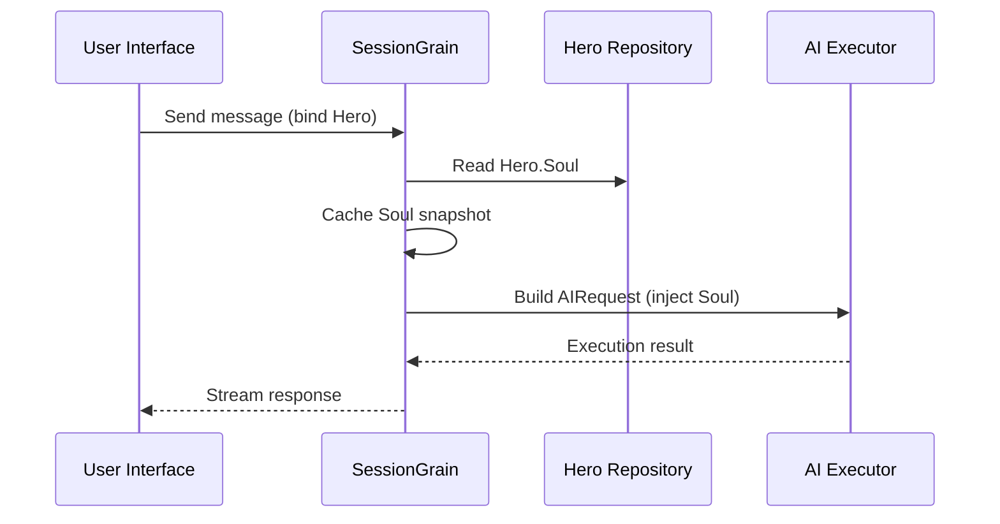

## AI Output Token Optimization: Øve en ultra-minimal klassisk kinesisk modus

> I AI-applikasjonsutvikling påvirker tokenforbruk direkte kostnadene. I HagiCode-prosjektet implementerte vi en "ultra-minimal klassisk kinesisk utdatamodus" gjennom SOUL-systemet. Uten at det går på bekostning av informasjonstettheten, reduserer det utdatatokens med omtrent 30–50 %. Denne artikkelen deler implementeringsdetaljene for den tilnærmingen og leksjonene vi har lært ved å bruke den.

## Bakgrunn

I AI-applikasjonsutvikling er tokenforbruk et uunngåelig kostnadsproblem. Dette blir spesielt smertefullt i scenarier der AI trenger å produsere store mengder innhold. Hvordan reduserer du utdata-tokens uten å ofre informasjonstettheten? Jo mer du tenker på det, jo mer frustrerende kan problemet bli.

Tradisjonelle optimaliseringsideer fokuserer stort sett på inngangssiden: trimming av systemforespørsler, komprimering av kontekst eller bruk av mer effektiv koding. Men disse metodene traff til slutt et tak. Trykk komprimering for langt, og du begynner å skade AIs forståelse og utdatakvalitet. Det er i utgangspunktet bare å slette innhold, noe som ikke er særlig meningsfullt.

Så hva med utgangssiden? Kan vi få AI til å uttrykke den samme betydningen mer konsist?

Spørsmålet høres enkelt ut, men det er ganske mye skjult under det. Hvis du direkte ber AI om å "være kortfattet", kan det egentlig bare gi deg noen få ord. Hvis du legger til "behold informasjonen komplett", kan det gå tilbake til den opprinnelige, detaljerte stilen. Begrensninger som er for sterke skader brukervennligheten; begrensninger som er for svake gjør ingenting. Hvor er balansepunktet egentlig? Ingen kan si sikkert.

For å løse disse smertepunktene tok vi en dristig beslutning: ta utgangspunkt i selve språkstilen og utform et konfigurerbart, komponerbart begrensningssystem for uttrykk. Virkningen av den avgjørelsen kan være enda større enn du forventer. Jeg skal gå inn i detaljene snart, og resultatet kan overraske deg litt.

## Om HagiCode

Tilnærmingen som deles i denne artikkelen kommer fra vår praktiske erfaring i [HagiCode](https://hagicode.com) prosjekt.

HagiCode er en åpen kildekode AI-kodingsassistent som støtter flere AI-modeller og tilpasset konfigurasjon. Under utviklingen oppdaget vi at bruken av AI-utdatatoken var for høy, så vi utviklet en løsning for det. Hvis du finner denne tilnærmingen verdifull, sier det sannsynligvis noe godt om ingeniørarbeidet vårt. Og hvis det er tilfelle, kan HagiCode i seg selv også være verdt din oppmerksomhet. Koden lyver ikke.

## SOUL System Oversikt

Det fulle navnet på SOUL-systemet er Soul Oriented Universal Language. Det er konfigurasjonssystemet som brukes i HagiCode-prosjektet for å definere språkstilen til en AI-helt. Kjerneideen er enkel: ved å begrense hvordan AI uttrykker seg, kan den produsere innhold i en mer kortfattet språklig form, samtidig som den bevarer informasjonens fullstendighet.

Det er litt som å sette en språklig maske på AI... men ærlig talt er det ikke fullt så mystisk.

### Teknisk arkitektur

SOUL-systemet bruker en frontend-backend-separert arkitektur:

**Frontend (Soul Builder)**:
- Bygget med React + TypeScript + Vite
- Ligger i `repos/soul/` katalog
- Gir et visuelt grensesnitt for sjelebygging
- Støtter tospråklig bruk (zh-CN / en-US)

**Bakside**:
- Bygget på .NET (C#) + Orleans distribuert kjøretid
- Hero-enheten inkluderer en `Soul` felt (maksimalt 8000 tegn)
- Injiserer sjel i systemprompten gjennom `SessionSystemMessageCompiler`

**Generering av agentmaler**:
- Generert fra referansemateriale
- Utgang til `/agent-templates/soul/templates/` katalog
- Inkluderer 50 hovedkataloggrupper og 10 ortogonale dimensjoner

### Soul Injection Mechanism

Når en økt kjøres for første gang, leser systemet Heltens sjel-konfigurasjon og injiserer den i systemprompten:



Det injiserte systempromptformatet er:

```
<hero_soul>
[User-defined Soul content]
</hero_soul>
```

Denne injeksjonsmekanismen er implementert i `SessionSystemMessageCompiler.cs`:

```csharp
internal static string? BuildSystemMessage(
    string? existingSystemMessage,
    string? languagePreference,
    IReadOnlyList<HeroTraitDto>? traits,
    string? soul)
{
    var segments = new List<string>();

    // ... language preference and Traits handling ...

    var normalizedSoul = NormalizeSoul(soul);
    if (!string.IsNullOrWhiteSpace(normalizedSoul))
    {
        segments.Add($"<hero_soul>\n{normalizedSoul}\n</hero_soul>");
    }

    // ... other system messages ...

    return segments.Count == 0 ? null : string.Join("\n\n", segments);
}
```

Når du har sett koden og forstått prinsippet, er det egentlig alt som skal til.

## Ultra-minimal klassisk kinesisk modus

Ultra-minimal klassisk kinesisk modus er den mest representative token-sparestrategien i SOUL-systemet. Dens kjerneprinsipp er å bruke den høye semantiske tettheten til klassisk kinesisk for å komprimere utdatalengden samtidig som fullstendig informasjon bevares.

### Hvorfor klassisk kinesisk

Klassisk kinesisk har flere naturlige fordeler:

1. **Semantisk komprimering**: samme betydning kan uttrykkes med færre tegn.
2. **Fjerning av redundans**: Klassisk kinesisk utelater naturligvis mange konjunksjoner og partikler som er vanlige i moderne kinesisk.
3. **Konsis struktur**: hver setning har høy informasjonstetthet, noe som gjør den godt egnet som et kjøretøy for AI-utgang.

Her er et konkret eksempel:

Moderne kinesisk utgang (ca. 80 tegn):
```
Based on your code analysis, I found several issues. First, on line 23, the variable name is too long and should be shortened. Second, on line 45, you did not handle null values and should add conditional logic. Finally, the overall code structure is acceptable, but it can be further optimized.
```

Ultra-minimal klassisk kinesisk utdata (ca. 35 tegn, sparer 56%):
```
Code reviewed: line 23 variable name verbose, abbreviate; line 45 lacks null handling, add checks. Overall structure acceptable; minor tuning suffices.
```

Gapet er stort nok til å få deg til å stoppe opp og tenke.

### Sjelkonfigurasjonsmal

Den komplette Soul-konfigurasjonen for ultra-minimal klassisk kinesisk modus er som følger:

```json
{
  "id": "soul-orth-11-classical-chinese-ultra-minimal-mode",
  "name": "Ultra-Minimal Classical Chinese Output Mode",
  "summary": "Use relatively readable Classical Chinese to compress semantic density, convey the meaning with as few words as possible, and retain only conclusions, judgments, and necessary actions, thereby significantly reducing output tokens.",
  "soul": "Your persona core comes from the \"Ultra-Minimal Classical Chinese Output Mode\": use relatively readable Classical Chinese to compress semantic density, convey the meaning with as few words as possible, and retain only conclusions, judgments, and necessary actions, thereby significantly reducing output tokens.\nMaintain the following signature language traits: 1. Prefer concise Classical Chinese sentence patterns such as \"can\", \"should\", \"do not\", \"already\", \"however\", and \"therefore\", while avoiding obscure and difficult wording;\n2. Compress each sentence to 4-12 characters whenever possible, removing preamble, pleasantries, repeated explanation, and ineffective modifiers;\n3. Do not expand arguments unless necessary; if the user does not ask a follow-up, provide only conclusions, steps, or judgments;\n4. Do not alter the core persona of the main Catalog; only compress the expression into restrained, classical, ultra-minimal short sentences."
}
```

Det er flere nøkkelpunkter i denne maldesignen:

1. **Tydelige begrensninger**: 4-12 tegn per setning, fjern redundans, prioriter konklusjoner.
2. **Unngå uklarhet**: bruk kortfattede klassiske kinesiske setningsmønstre og unngå sjeldne, vanskelige formuleringer.
3. **Bevar persona**: endre bare uttrykksmåten, ikke kjernepersonaen.

Når du fortsetter å justere konfigurasjonen, kommer alt ned til noen få parametere til slutt.

### Andre ultra-minimale moduser

Foruten den klassiske kinesiske modusen, gir HagiCode SOUL-systemet også flere andre token-sparemoduser:

**Telegraf-stil ultra-minimal utgangsmodus** (`soul-orth-02`):
- Hold hver setning strengt tatt innenfor 10 tegn
- Forby dekorative adjektiver
- Ingen modale partikler, utropstegn eller reduplisering hele veien

**Kort fragmentert mutting-modus** (`soul-orth-01`):
- Hold setninger innenfor 1-5 tegn
- Simuler fragmentert selvsnakk
- Svekke eksplisitt logikk og prioriter følelsesmessig overføring

**Guidet Q&A-modus** (`soul-orth-03`):
- Bruk spørsmål for å veilede brukerens tenkning
- Reduser direkte utdatainnhold
- Lavere tokenbruk gjennom interaksjon

Hver av disse modusene legger vekt på en annen designretning, men kjernemålet er det samme: redusere utdata-tokens samtidig som informasjonskvaliteten bevares. Det er mange veier til Roma; noen er rett og slett lettere å gå enn andre.

## Kombinasjonsstrategi

En kraftig funksjon i SOUL-systemet er støtte for krysskombinering av hovedkataloger og ortogonale dimensjoner:

- **50 hovedkataloggrupper**: definer basispersona (som healingstil, toppstudentstil, reservert stil, og så videre)
- **10 ortogonale dimensjoner**: definer uttrykksmåten (som klassisk kinesisk, telegrafstil, spørsmål og svarstil, og så videre)
- **Kombinasjonseffekt**: kan generere 500+ unike språklignende kombinasjoner

Du kan for eksempel kombinere "Professional Development Engineer" med "Ultra-Minimal Classical Chinese Output Mode" for å lage en AI-assistent som er både profesjonell og konsis. Denne fleksibiliteten gjør at SOUL-systemet kan tilpasse seg mange forskjellige scenarier. Du kan mikse og matche som du vil; det er flere kombinasjoner enn du sannsynligvis kommer til å bruke.

## Praktisk veiledning

### Skap gjennom Soul Builder

Besøk [soul.hagicode.com](https://soul.hagicode.com) og følg disse trinnene:

1. Velg en hovedkatalog (for eksempel "Professional Development Engineer")
2. Velg en ortogonal dimensjon (for eksempel "Ultra-minimal klassisk kinesisk utdatamodus")
3. Forhåndsvis det genererte sjelinnholdet
4. Kopier den genererte Soul-konfigurasjonen

Det er stort sett bare pek-og-klikk, så det er nok ikke så mye mer å si.

### Bruk i Hero Configuration

Bruk Soul-konfigurasjonen til en helt gjennom nettgrensesnittet eller API:

```typescript
// Hero Soul update example
const heroUpdate = {
  soul: "Your persona core comes from the \"Ultra-Minimal Classical Chinese Output Mode\": ...",
  soulCatalogId: "soul-orth-11-classical-chinese-ultra-minimal-mode",
  soulDisplayName: "Ultra-Minimal Classical Chinese Output Mode",
  soulStyleType: "orthogonal-dimension",
  soulSummary: "Use relatively readable Classical Chinese to compress semantic density..."
};

await updateHero(heroId, heroUpdate);
```

### Egendefinerte sjelmaler

Brukere kan finjustere en forhåndsinnstilt mal eller skrive en fra bunnen av. Her er et tilpasset eksempel for et scenario for kodegjennomgang:

```
You are a code reviewer who pursues extreme concision.
All output must follow these rules:
1. Only point out specific problems and line numbers
2. Each issue must not exceed 15 characters
3. Use concise terms such as "should", "must", and "do not"
4. Do not provide extra explanation

Example output:
- Line 23: variable name too long, should abbreviate
- Line 45: null not handled, must add checks
- Line 67: logic redundant, can simplify
```

Du kan revidere malen slik du vil. En mal er uansett bare et utgangspunkt.

### Notater

**Kompatibilitet**:
- Klassisk kinesisk modus fungerer med alle de 50 hovedkataloggruppene
- Kan kombineres med hvilken som helst basepersona
- Endrer ikke kjernepersonen til hovedkatalogen

**Cachingmekanisme**:
- Sjel blir bufret når økten kjøres for første gang
- Bufferen gjenbrukes innenfor samme SessionId
- Å endre Hero-konfigurasjonen påvirker ikke økter som allerede har startet

**Begrensninger og begrensninger**:
- Maksimal lengde på Soul-feltet er 8000 tegn
- Helter uten et sjelfelt i historiske data kan fortsatt brukes normalt
- Soul- og stilutstyrsplasser er uavhengige og overskriver ikke hverandre

## Effektsammenligning

I følge reelle testdata fra prosjektet er resultatene etter å ha aktivert ultra-minimal klassisk kinesisk modus som følger:

| Scenario | Originale utdata-tokens | Klassisk kinesisk modus | Besparelser |
|------|------------------------|------------------------|---------|
| Kodegjennomgang | 850 | 420 | 51% |
| Tekniske spørsmål og svar | 620 | 380 | 39% |
| Løsningsforslag | 1100 | 680 | 38% |
| Gjennomsnittlig | - | - | 30-50% |

Dataene kommer fra faktisk bruksstatistikk i HagiCode-prosjektet, og nøyaktige resultater varierer fra scenario til scenario. Likevel går de lagrede tokenene sammen, og lommeboken din vil sette pris på det.

## Konklusjon

HagiCode SOUL-systemet tilbyr en innovativ måte å optimalisere AI-utdata på: reduser tokenforbruk ved å begrense uttrykk i stedet for å komprimere selve informasjonen. Som sin mest representative tilnærming har ultra-minimal klassisk kinesisk modus levert 30–50 % symbolbesparelser ved bruk i den virkelige verden.

Kjerneverdien av denne tilnærmingen ligger i følgende:

1. **Bevar informasjonskvaliteten**: i stedet for bare å avkorte utdata, uttrykker det det samme innholdet mer effektivt.
2. **Fleksibel og komponerbar**: støtter 500+ kombinasjoner av personas og uttrykksstiler.
3. **Enkel å bruke**: Soul Builder gir et visuelt grensesnitt, så ingen koding er nødvendig.
4. **Produksjonsstabilitet**: validert i prosjektet og i stand til bruk i stor skala.

Hvis du også bygger AI-applikasjoner, eller hvis du er interessert i HagiCode-prosjektet, ta gjerne kontakt. Meningen med åpen kildekode ligger i å utvikle seg sammen, og vi ser også frem til å se dine egne innovative bruksområder. Ordtaket kan være gammelt, men det forblir sant: én person kan gå fort, men en gruppe går lenger.

## Referanser

- HagiCode GitHub: [github.com/HagiCode-org/site](https://github.com/HagiCode-org/site)
- HagiCode offisielle nettsted: [hagicode.com](https://hagicode.com)
- Soul Builder: [soul.hagicode.com](https://soul.hagicode.com)
- Docker-implementeringsveiledning: [docs.hagicode.com/installation/docker-compose](https://docs.hagicode.com/installation/docker-compose)
- Desktop-app: [hagicode.com/desktop/](https://hagicode.com/desktop/)
- 30-minutters hands-on demo: [www.bilibili.com/video/BV1pirZBuEzq/](https://www.bilibili.com/video/BV1pirZBuEzq/)

---

Hvis denne artikkelen hjalp deg:
- Gi oss en stjerne på GitHub: [github.com/HagiCode-org/site](https://github.com/HagiCode-org/site)
- Besøk den offisielle siden for å lære mer: [hagicode.com](https://hagicode.com)
- Den offentlige betaen har startet, og du er velkommen til å installere og prøve den

## Merknad om opphavsrett

Takk for at du leser. Hvis du fant denne artikkelen nyttig, er du velkommen til å like, bokmerke og dele den.
Dette innholdet ble laget med AI-assistert samarbeid, og den endelige versjonen ble gjennomgått og bekreftet av forfatteren.
- Forfatter: [newbe36524](https://www.newbe.pro)
- Link til original artikkel: [https://docs.hagicode.com/blog/2026-04-04-soul-token-optimization-classical-chinese/](https://docs.hagicode.com/blog/2026-04-04-soul-token-optimization-classical-chinese/)
- Merknad om opphavsrett: Med mindre annet er oppgitt, er alle artikler på denne bloggen lisensiert under BY-NC-SA. Vennligst oppgi kilden når du legger ut på nytt.
