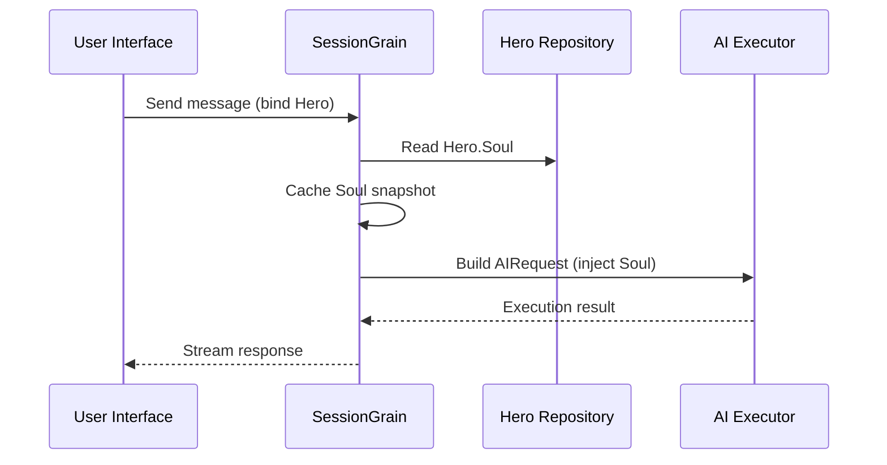

## Optimalisatie van AI-uitvoertokens: oefenen in een ultraminimale klassieke Chinese modus

> Bij de ontwikkeling van AI-applicaties heeft het gebruik van tokens rechtstreeks invloed op de kosten. In het HagiCode-project hebben we een "ultra-minimale Klassiek Chinese uitvoermodus" geïmplementeerd via het SOUL-systeem. Zonder de informatiedichtheid op te offeren, worden de outputtokens met ongeveer 30-50% verminderd. Dit artikel deelt de implementatiedetails van die aanpak en de lessen die we ervan hebben geleerd.

## Achtergrond

Bij de ontwikkeling van AI-applicaties is het gebruik van tokens een onvermijdelijk kostenprobleem. Dit wordt vooral pijnlijk in scenario’s waarin de AI grote hoeveelheden inhoud moet produceren. Hoe verkleint u de outputtokens zonder dat dit ten koste gaat van de informatiedichtheid? Hoe meer je erover nadenkt, hoe frustrerender het probleem kan worden.

Traditionele optimalisatie-ideeën richten zich vooral op de invoerkant: het inkorten van systeemprompts, het comprimeren van de context of het gebruik van efficiëntere codering. Maar deze methoden bereikten uiteindelijk een plafond. Als u de compressie te ver doorvoert, schaadt u het begrip en de uitvoerkwaliteit van de AI. Dat is eigenlijk alleen maar het verwijderen van inhoud, wat niet erg zinvol is.

Hoe zit het dan met de outputkant? Kunnen we ervoor zorgen dat de AI dezelfde betekenis beknopter uitdrukt?

De vraag klinkt eenvoudig, maar er zit nogal wat onder verborgen. Als je de AI rechtstreeks vraagt ​​om ‘beknopt te zijn’, kan het zijn dat je in werkelijkheid maar een paar woorden hebt. Als u 'houd de informatie compleet' toevoegt, kan het zijn dat u teruggaat naar de oorspronkelijke, uitgebreide stijl. Te sterke beperkingen zijn schadelijk voor de bruikbaarheid; beperkingen die te zwak zijn, doen niets. Waar ligt precies het evenwichtspunt? Niemand kan het met zekerheid zeggen.

Om deze pijnpunten op te lossen, hebben we een gedurfde beslissing genomen: beginnen bij de taalstijl zelf en een configureerbaar, samen te stellen beperkingssysteem voor expressie ontwerpen. De impact van die beslissing kan zelfs groter zijn dan je verwacht. Ik zal binnenkort op de details ingaan en het resultaat zal u misschien een beetje verrassen.

## Over HagiCode

De aanpak die in dit artikel wordt gedeeld, komt voort uit onze praktijkervaring in de [HagiCode](https://hagicode.com) project.

HagiCode is een open-source AI-coderingsassistent die meerdere AI-modellen en aangepaste configuratie ondersteunt. Tijdens de ontwikkeling ontdekten we dat het gebruik van AI-uitvoertokens te hoog was, dus hebben we er een oplossing voor ontworpen. Als u deze aanpak waardevol vindt, zegt dat waarschijnlijk iets goeds over ons engineeringswerk. En als dat het geval is, is HagiCode zelf wellicht ook uw aandacht waard. Code liegt niet.

## SOUL-systeemoverzicht

De volledige naam van het SOUL-systeem is Soul Oriented Universal Language. Het is het configuratiesysteem dat in het HagiCode-project wordt gebruikt om de taalstijl van een AI Hero te definiëren. Het kernidee is simpel: door te beperken hoe de AI zichzelf uitdrukt, kan het inhoud in een beknoptere taalvorm weergeven, terwijl de informatieve volledigheid behouden blijft.

Het lijkt een beetje op het opzetten van een taalmasker op de AI... hoewel het eerlijk gezegd niet zo mystiek is.

### Technische Architectuur

Het SOUL-systeem maakt gebruik van een frontend-backend gescheiden architectuur:

**Frontend (Zielenbouwer)**:
- Gebouwd met React + TypeScript + Vite
- Gelegen in de `repos/soul/` map
- Biedt een visuele interface voor het bouwen van zielen
- Ondersteunt tweetalig gebruik (zh-CN / en-US)

**Backend**:
- Gebouwd op .NET (C#) + de gedistribueerde runtime van Orleans
- De Hero-entiteit omvat een `Soul` veld (maximaal 8000 tekens)
- Injecteert Soul in de systeemprompt via `SessionSystemMessageCompiler`

**Agent-sjablonen genereren**:
- Gegenereerd op basis van referentiematerialen
- Uitvoer naar de `/agent-templates/soul/templates/` map
- Bevat 50 hoofdcatalogusgroepen en 10 orthogonale afmetingen

### Zielinjectiemechanisme

Wanneer een sessie voor de eerste keer wordt uitgevoerd, leest het systeem de Hero's Soul-configuratie en injecteert deze in de systeemprompt:



Het geïnjecteerde systeempromptformaat is:

```
<hero_soul>
[User-defined Soul content]
</hero_soul>
```

Dit injectiemechanisme is geïmplementeerd in `SessionSystemMessageCompiler.cs`:

```csharp
internal static string? BuildSystemMessage(
    string? existingSystemMessage,
    string? languagePreference,
    IReadOnlyList<HeroTraitDto>? traits,
    string? soul)
{
    var segments = new List<string>();

    // ... language preference and Traits handling ...

    var normalizedSoul = NormalizeSoul(soul);
    if (!string.IsNullOrWhiteSpace(normalizedSoul))
    {
        segments.Add($"<hero_soul>\n{normalizedSoul}\n</hero_soul>");
    }

    // ... other system messages ...

    return segments.Count == 0 ? null : string.Join("\n\n", segments);
}
```

Als je de code eenmaal hebt gezien en het principe hebt begrepen, is dat eigenlijk alles.

## Ultra-minimale klassieke Chinese modus

De ultraminimale klassieke Chinese modus is de meest representatieve strategie voor het besparen van tokens in het SOUL-systeem. Het kernprincipe is om de hoge semantische dichtheid van Klassiek Chinees te gebruiken om de uitvoerlengte te comprimeren terwijl de volledige informatie behouden blijft.

### Waarom Klassiek Chinees

Klassiek Chinees heeft verschillende natuurlijke voordelen:

1. **Semantische compressie**: dezelfde betekenis kan met minder tekens worden uitgedrukt.
2. **Verwijdering van redundantie**: Klassiek Chinees laat uiteraard veel voegwoorden en deeltjes weg die veel voorkomen in het moderne Chinees.
3. **Beknopte structuur**: elke zin heeft een hoge informatiedichtheid, waardoor deze zeer geschikt is als voertuig voor AI-uitvoer.

Hier is een concreet voorbeeld:

Moderne Chinese uitvoer (ongeveer 80 tekens):
```
Based on your code analysis, I found several issues. First, on line 23, the variable name is too long and should be shortened. Second, on line 45, you did not handle null values and should add conditional logic. Finally, the overall code structure is acceptable, but it can be further optimized.
```

Ultraminimale klassieke Chinese uitvoer (ongeveer 35 tekens, besparing 56%):
```
Code reviewed: line 23 variable name verbose, abbreviate; line 45 lacks null handling, add checks. Overall structure acceptable; minor tuning suffices.
```

De kloof is groot genoeg om je te laten stilstaan en nadenken.

### Zielconfiguratiesjabloon

De volledige Soul-configuratie voor de ultra-minimale Klassiek Chinese modus is als volgt:

```json
{
  "id": "soul-orth-11-classical-chinese-ultra-minimal-mode",
  "name": "Ultra-Minimal Classical Chinese Output Mode",
  "summary": "Use relatively readable Classical Chinese to compress semantic density, convey the meaning with as few words as possible, and retain only conclusions, judgments, and necessary actions, thereby significantly reducing output tokens.",
  "soul": "Your persona core comes from the \"Ultra-Minimal Classical Chinese Output Mode\": use relatively readable Classical Chinese to compress semantic density, convey the meaning with as few words as possible, and retain only conclusions, judgments, and necessary actions, thereby significantly reducing output tokens.\nMaintain the following signature language traits: 1. Prefer concise Classical Chinese sentence patterns such as \"can\", \"should\", \"do not\", \"already\", \"however\", and \"therefore\", while avoiding obscure and difficult wording;\n2. Compress each sentence to 4-12 characters whenever possible, removing preamble, pleasantries, repeated explanation, and ineffective modifiers;\n3. Do not expand arguments unless necessary; if the user does not ask a follow-up, provide only conclusions, steps, or judgments;\n4. Do not alter the core persona of the main Catalog; only compress the expression into restrained, classical, ultra-minimal short sentences."
}
```

Er zijn verschillende belangrijke punten in dit sjabloonontwerp:

1. **Duidelijke beperkingen**: 4-12 tekens per zin, verwijder overtolligheid, geef prioriteit aan conclusies.
2. **Vermijd onduidelijkheid**: gebruik beknopte klassieke Chinese zinspatronen en vermijd zeldzame, moeilijke bewoordingen.
3. **Behoud persona**: verander alleen de manier van uitdrukken, niet de kernpersona.

Als je de configuratie blijft aanpassen, komt het uiteindelijk allemaal neer op een paar parameters.

### Andere ultra-minimale modi

Naast de Klassiek Chinese modus biedt het HagiCode SOUL-systeem ook verschillende andere tokenbesparende modi:

**Ultra-minimale uitvoermodus in telegraafstijl** (`soul-orth-02`):
- Houd elke zin strikt binnen 10 tekens
- Verbied decoratieve bijvoeglijke naamwoorden
- Geen modale deeltjes, uitroeptekens of verdubbeling

**Korte gefragmenteerde mompelmodus** (`soul-orth-01`):
- Houd zinnen binnen 1-5 tekens
- Simuleer gefragmenteerde zelfpraat
- Verzwak expliciete logica en geef prioriteit aan emotionele overdracht

**Begeleide vraag- en antwoordmodus** (`soul-orth-03`):
- Gebruik vragen om het denken van de gebruiker te begeleiden
- Verminder directe uitvoerinhoud
- Verlaag het tokengebruik door interactie

Elk van deze modi benadrukt een andere ontwerprichting, maar het kerndoel is hetzelfde: het verminderen van outputtokens met behoud van de informatiekwaliteit. Er zijn veel wegen naar Rome; sommige zijn gewoon gemakkelijker te lopen dan andere.

## Combinatie Strategie

Een krachtig kenmerk van het SOUL-systeem is ondersteuning voor het combineren van hoofdcatalogi en orthogonale dimensies:

- **50 hoofdcatalogusgroepen**: definieer de basispersona (zoals genezende stijl, stijl van topstudent, afstandelijke stijl, enzovoort)
- **10 orthogonale dimensies**: definieer de uitdrukkingswijze (zoals Klassiek Chinees, telegraafstijl, vraag-en-antwoordstijl, enzovoort)
- **Combinatie-effect**: kan meer dan 500 unieke taalstijlcombinaties genereren

U kunt bijvoorbeeld "Professional Development Engineer" combineren met "Ultra-Minimal Classical Chinese Output Mode" om een AI-assistent te creëren die zowel professioneel als beknopt is. Dankzij deze flexibiliteit kan het SOUL-systeem zich aanpassen aan veel verschillende scenario's. Je kunt mixen en matchen zoals je wilt; er zijn meer combinaties dan je waarschijnlijk zult uitputten.

## Praktische gids

### Creëer via Soul Builder

Bezoek [soul.hagicode.com](https://soul.hagicode.com) en volg deze stappen:

1. Selecteer een hoofdcatalogus (bijvoorbeeld 'Professional Development Engineer')
2. Selecteer een orthogonale dimensie (bijvoorbeeld 'Ultra-minimale klassieke Chinese uitvoermodus')
3. Bekijk een voorbeeld van de gegenereerde Soul-inhoud
4. Kopieer de gegenereerde Soul-configuratie

Het is meestal alleen maar aanwijzen en klikken, dus er valt waarschijnlijk niet veel meer te zeggen.

### Gebruik in Hero-configuratie

Pas de Soul-configuratie toe op een held via de webinterface of API:

```typescript
// Hero Soul update example
const heroUpdate = {
  soul: "Your persona core comes from the \"Ultra-Minimal Classical Chinese Output Mode\": ...",
  soulCatalogId: "soul-orth-11-classical-chinese-ultra-minimal-mode",
  soulDisplayName: "Ultra-Minimal Classical Chinese Output Mode",
  soulStyleType: "orthogonal-dimension",
  soulSummary: "Use relatively readable Classical Chinese to compress semantic density..."
};

await updateHero(heroId, heroUpdate);
```

### Aangepaste Soul-sjablonen

Gebruikers kunnen een vooraf ingesteld sjabloon verfijnen of er een helemaal opnieuw schrijven. Hier is een aangepast voorbeeld van een codebeoordelingsscenario:

```
You are a code reviewer who pursues extreme concision.
All output must follow these rules:
1. Only point out specific problems and line numbers
2. Each issue must not exceed 15 characters
3. Use concise terms such as "should", "must", and "do not"
4. Do not provide extra explanation

Example output:
- Line 23: variable name too long, should abbreviate
- Line 45: null not handled, must add checks
- Line 67: logic redundant, can simplify
```

U kunt de sjabloon naar eigen inzicht aanpassen. Een sjabloon is sowieso slechts een startpunt.

### Opmerkingen

**Compatibiliteit**:
- De Klassiek Chinese modus werkt met alle 50 hoofdcatalogusgroepen
- Kan worden gecombineerd met elke basispersoon
- Verandert niets aan de kernpersoonlijkheid van de hoofdcatalogus

**Cachingmechanisme**:
- Soul wordt in de cache opgeslagen wanneer de sessie voor de eerste keer wordt uitgevoerd
- De cache wordt hergebruikt binnen dezelfde SessionId
- Het wijzigen van de Hero-configuratie heeft geen invloed op sessies die al zijn gestart

**Beperkingen en limieten**:
- De maximale lengte van het Zielveld is 8000 tekens
- Helden zonder Zielveld in historische gegevens kunnen nog steeds normaal worden gebruikt
- Soul- en stijlapparatuurslots zijn onafhankelijk en overschrijven elkaar niet

## Effectvergelijking

Volgens echte testgegevens van het project zijn de resultaten na het inschakelen van de ultra-minimale Klassiek Chinese modus als volgt:

| Scenario | Originele uitvoertokens | Klassieke Chinese modus | Besparingen |
|------|------------------------|------------------------|---------|
| Codebeoordeling | 850 | 420 | 51% |
| Technische vragen en antwoorden | 620 | 380 | 39% |
| Suggesties voor oplossingen | 1100 | 680 | 38% |
| Gemiddeld | - | - | 30-50% |

De gegevens zijn afkomstig van daadwerkelijke gebruiksstatistieken in het HagiCode-project en de exacte resultaten variëren per scenario. Toch tellen de opgeslagen tokens op, en uw portemonnee zal dit op prijs stellen.

## Conclusie

Het HagiCode SOUL-systeem biedt een innovatieve manier om de AI-uitvoer te optimaliseren: verminder het tokenverbruik door de expressie te beperken in plaats van de informatie zelf te comprimeren. Als meest representatieve benadering heeft de ultra-minimale Klassiek Chinese modus 30-50% symbolische besparingen opgeleverd bij gebruik in de echte wereld.

De kernwaarde van deze aanpak ligt in het volgende:

1. **Behoud de informatiekwaliteit**: in plaats van de uitvoer eenvoudigweg af te korten, wordt dezelfde inhoud efficiënter uitgedrukt.
2. **Flexibel en samenstelbaar**: ondersteunt meer dan 500 combinaties van persona's en expressiestijlen.
3. **Eenvoudig te gebruiken**: Soul Builder biedt een visuele interface, dus er is geen codering vereist.
4. **Stabiliteit op productieniveau**: gevalideerd in het project en geschikt voor grootschalig gebruik.

Als u ook AI-toepassingen bouwt, of als u geïnteresseerd bent in het HagiCode-project, neem dan gerust contact met ons op. De betekenis van open source ligt in het samen vooruitgang boeken, en we kijken ook uit naar uw eigen innovatieve toepassingen. Het gezegde is misschien oud, maar het blijft waar: één persoon kan snel gaan, maar een groep gaat verder.

## Referenties

- HagiCode GitHub: [github.com/HagiCode-org/site](https://github.com/HagiCode-org/site)
- Officiële HagiCode-site: [hagicode.com](https://hagicode.com)
- Zielenbouwer: [soul.hagicode.com](https://soul.hagicode.com)
- Docker-implementatiehandleiding: [docs.hagicode.com/installation/docker-compose](https://docs.hagicode.com/installation/docker-compose)
- Desktop-app: [hagicode.com/desktop/](https://hagicode.com/desktop/)
- Praktijkdemonstratie van 30 minuten: [www.bilibili.com/video/BV1pirZBuEzq/](https://www.bilibili.com/video/BV1pirZBuEzq/)

---

Als dit artikel je heeft geholpen:
- Geef ons een ster op GitHub: [github.com/HagiCode-org/site](https://github.com/HagiCode-org/site)
- Bezoek de officiële site voor meer informatie: [hagicode.com](https://hagicode.com)
- De openbare bèta is gestart en u bent van harte welkom om deze te installeren en uit te proberen

## Auteursrechtkennisgeving

Bedankt voor het lezen. Als u dit artikel nuttig vindt, kunt u het leuk vinden, een bladwijzer maken en delen.
Deze inhoud is gemaakt met behulp van AI-ondersteunde samenwerking en de definitieve versie is beoordeeld en bevestigd door de auteur.
- Auteur: [nieuwbe36524](https://www.newbe.pro)
- Originele artikellink: [https://docs.hagicode.com/blog/2026-04-04-soul-token-optimization-classical-chinese/](https://docs.hagicode.com/blog/2026-04-04-soul-token-optimization-classical-chinese/)
- Copyrightvermelding: Tenzij anders vermeld, zijn alle artikelen op deze blog gelicentieerd onder BY-NC-SA. Bij herposten graag de bron vermelden.
