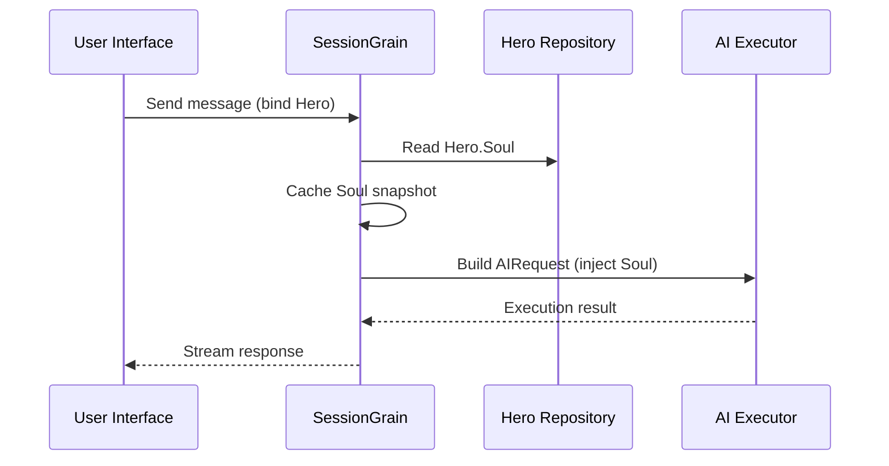

## Optymalizacja tokena wyjściowego AI: ćwiczenie ultra-minimalnego klasycznego trybu chińskiego

> W rozwoju aplikacji AI zużycie tokenów bezpośrednio wpływa na koszty. W projekcie HagiCode zaimplementowaliśmy „ultra-minimalny tryb wyjściowy klasycznego języka chińskiego” poprzez system SOUL. Bez poświęcania gęstości informacji zmniejsza tokeny wyjściowe o około 30–50%. W tym artykule opisano szczegóły implementacji tego podejścia i wnioski, jakie wyciągnęliśmy z jego stosowania.

## Tło

W przypadku tworzenia aplikacji AI zużycie tokenów jest nieuniknionym problemem kosztowym. Staje się to szczególnie bolesne w scenariuszach, w których sztuczna inteligencja musi wytwarzać duże ilości treści. Jak zmniejszyć tokeny wyjściowe bez poświęcania gęstości informacji? Im więcej o tym myślisz, tym bardziej frustrujący może być problem.

Tradycyjne pomysły optymalizacyjne skupiają się głównie na stronie wejściowej: przycinaniu podpowiedzi systemowych, kompresowaniu kontekstu lub stosowaniu bardziej wydajnego kodowania. Ale te metody w końcu osiągnęły sufit. Jeśli zastosujesz zbyt dużą kompresję, zaczniesz pogarszać zrozumienie sztucznej inteligencji i jakość wyników. Zasadniczo jest to po prostu usuwanie treści, co nie ma większego znaczenia.

A co ze stroną wyjściową? Czy moglibyśmy zmusić sztuczną inteligencję do wyrażania tego samego znaczenia w bardziej zwięzły sposób?

Pytanie wydaje się proste, ale kryje się pod nim sporo rzeczy. Jeśli bezpośrednio poprosisz sztuczną inteligencję, aby „była zwięzła”, może tak naprawdę dać ci tylko kilka słów. Jeśli dodasz „zachowaj kompletność informacji”, może powrócić do pierwotnego, szczegółowego stylu. Zbyt silne ograniczenia szkodzą użyteczności; zbyt słabe ograniczenia nic nie dają. Gdzie dokładnie jest punkt równowagi? Nikt nie może powiedzieć tego na pewno.

Aby rozwiązać te problemy, podjęliśmy odważną decyzję: zacznij od samego stylu języka i zaprojektuj konfigurowalny, dający się komponować system ograniczeń ekspresji. Wpływ tej decyzji może być jeszcze większy, niż się spodziewasz. Wkrótce przejdę do szczegółów, a wynik może Cię trochę zaskoczyć.

## O HagiCodzie

Podejście przedstawione w tym artykule wynika z naszych praktycznych doświadczeń w zakresie [Kod Hagi](https://hagicode.com) projekt.

HagiCode to asystent kodowania AI typu open source, który obsługuje wiele modeli AI i niestandardową konfigurację. Podczas opracowywania odkryliśmy, że użycie tokena wyjściowego AI było zbyt wysokie, dlatego zaprojektowaliśmy rozwiązanie tego problemu. Jeśli uznasz to podejście za wartościowe, prawdopodobnie mówi to coś dobrego o naszej pracy inżynierskiej. A jeśli tak jest, to sam HagiCode również może być warty Twojej uwagi. Kod nie kłamie.

## Przegląd systemu SOUL

Pełna nazwa systemu DUSZY to Uniwersalny Język Zorientowany na Duszę. Jest to system konfiguracyjny używany w projekcie HagiCode do definiowania stylu językowego AI Hero. Jego podstawowa idea jest prosta: ograniczając sposób wyrażania się sztucznej inteligencji, może ona generować treści w bardziej zwięzłej formie językowej, zachowując jednocześnie kompletność informacji.

To trochę jak nałożenie maski językowej na sztuczną inteligencję… choć szczerze mówiąc, nie jest to aż tak mistyczne.

### Architektura Techniczna

W systemie SOUL zastosowano architekturę rozdzieloną frontend-backend:

**Frontend (Kreator Duszy)**:
- Zbudowany przy użyciu React + TypeScript + Vite
- Znajduje się w `repos/soul/` katalog
- Zapewnia wizualny interfejs budowania duszy
- Obsługuje użycie dwujęzyczne (zh-CN / en-US)

**Zaplecze**:
- Zbudowany na platformie .NET (C#) + rozproszonym środowisku wykonawczym Orleans
- Jednostka Bohater zawiera: `Soul` pole (maksymalnie 8000 znaków)
- Wstrzykuje duszę do monitu systemowego `SessionSystemMessageCompiler`

**Generowanie szablonów agentów**:
- Wygenerowano na podstawie materiałów referencyjnych
- Wyjście do `/agent-templates/soul/templates/` katalog
- Zawiera 50 głównych grup katalogów i 10 wymiarów ortogonalnych

### Mechanizm wstrzykiwania duszy

Kiedy sesja jest wykonywana po raz pierwszy, system odczytuje konfigurację Duszy Bohatera i wstawia ją do wiersza poleceń:



Wstrzyknięty format monitu systemowego to:

```
<hero_soul>
[User-defined Soul content]
</hero_soul>
```

Ten mechanizm wtrysku jest zaimplementowany w `SessionSystemMessageCompiler.cs`:

```csharp
internal static string? BuildSystemMessage(
    string? existingSystemMessage,
    string? languagePreference,
    IReadOnlyList<HeroTraitDto>? traits,
    string? soul)
{
    var segments = new List<string>();

    // ... language preference and Traits handling ...

    var normalizedSoul = NormalizeSoul(soul);
    if (!string.IsNullOrWhiteSpace(normalizedSoul))
    {
        segments.Add($"<hero_soul>\n{normalizedSoul}\n</hero_soul>");
    }

    // ... other system messages ...

    return segments.Count == 0 ? null : string.Join("\n\n", segments);
}
```

Kiedy już zapoznasz się z kodem i zrozumiesz zasadę, to naprawdę wszystko, co w tej sprawie można zrobić.

## Ultra-minimalny klasyczny tryb chiński

Ultra-minimalny klasyczny tryb chiński jest najbardziej reprezentatywną strategią oszczędzania tokenów w systemie SOUL. Jego podstawową zasadą jest wykorzystanie dużej gęstości semantycznej klasycznego języka chińskiego do kompresji długości wyjściowej przy jednoczesnym zachowaniu pełnych informacji.

### Dlaczego klasyczny chiński

Klasyczny chiński ma kilka naturalnych zalet:

1. **Kompresja semantyczna**: to samo znaczenie można wyrazić za pomocą mniejszej liczby znaków.
2. **Usunięcie nadmiarowości**: Klasyczny język chiński naturalnie pomija wiele spójników i cząstek powszechnych we współczesnym języku chińskim.
3. **Zwięzła struktura**: każde zdanie niesie ze sobą dużą gęstość informacji, dzięki czemu dobrze nadaje się jako narzędzie wyników AI.

Oto konkretny przykład:

Współczesny tekst chiński (około 80 znaków):
```
Based on your code analysis, I found several issues. First, on line 23, the variable name is too long and should be shortened. Second, on line 45, you did not handle null values and should add conditional logic. Finally, the overall code structure is acceptable, but it can be further optimized.
```

Ultra-minimalne wyjście w klasycznym języku chińskim (około 35 znaków, oszczędność 56%):
```
Code reviewed: line 23 variable name verbose, abbreviate; line 45 lacks null handling, add checks. Overall structure acceptable; minor tuning suffices.
```

Różnica jest na tyle duża, że warto się zatrzymać i pomyśleć.

### Szablon konfiguracji duszy

Pełna konfiguracja Soul dla ultra-minimalnego trybu klasycznego języka chińskiego jest następująca:

```json
{
  "id": "soul-orth-11-classical-chinese-ultra-minimal-mode",
  "name": "Ultra-Minimal Classical Chinese Output Mode",
  "summary": "Use relatively readable Classical Chinese to compress semantic density, convey the meaning with as few words as possible, and retain only conclusions, judgments, and necessary actions, thereby significantly reducing output tokens.",
  "soul": "Your persona core comes from the \"Ultra-Minimal Classical Chinese Output Mode\": use relatively readable Classical Chinese to compress semantic density, convey the meaning with as few words as possible, and retain only conclusions, judgments, and necessary actions, thereby significantly reducing output tokens.\nMaintain the following signature language traits: 1. Prefer concise Classical Chinese sentence patterns such as \"can\", \"should\", \"do not\", \"already\", \"however\", and \"therefore\", while avoiding obscure and difficult wording;\n2. Compress each sentence to 4-12 characters whenever possible, removing preamble, pleasantries, repeated explanation, and ineffective modifiers;\n3. Do not expand arguments unless necessary; if the user does not ask a follow-up, provide only conclusions, steps, or judgments;\n4. Do not alter the core persona of the main Catalog; only compress the expression into restrained, classical, ultra-minimal short sentences."
}
```

Ten projekt szablonu składa się z kilku kluczowych punktów:

1. **Wyraźne ograniczenia**: 4–12 znaków na zdanie, usuń zbędne elementy, ustal priorytety wniosków.
2. **Unikaj niejasności**: używaj zwięzłych klasycznych chińskich wzorów zdań i unikaj rzadkich, trudnych sformułowań.
3. **Zachowaj osobowość**: zmieniaj jedynie sposób wyrażania się, a nie podstawową osobowość.

Kiedy ciągle dostosowujesz konfigurację, wszystko ostatecznie sprowadza się do kilku parametrów.

### Inne ultra-minimalne tryby

Oprócz klasycznego trybu chińskiego, system HagiCode SOUL udostępnia także kilka innych trybów oszczędzania tokenów:

**Tryb ultraminimalnego wyjścia w stylu telegrafu** (`soul-orth-02`):
- Każde zdanie powinno mieć maksymalnie 10 znaków
- Zabroń przymiotników dekoracyjnych
- Żadnych cząstek modalnych, wykrzykników ani reduplikacji w całym tekście

**Krótki tryb fragmentarycznego mamrotania** (`soul-orth-01`):
- Zachowaj zdania o długości od 1 do 5 znaków
- Symuluj fragmentaryczną rozmowę wewnętrzną
- Osłabiaj wyraźną logikę i traktuj priorytetowo przekaz emocjonalny

**Tryb pytań i odpowiedzi z przewodnikiem** (`soul-orth-03`):
- Używaj pytań, aby kierować myśleniem użytkownika
- Zmniejsz bezpośrednią zawartość wyjściową
- Niższe wykorzystanie tokena poprzez interakcję

Każdy z tych trybów kładzie nacisk na inny kierunek projektowania, ale główny cel jest ten sam: zmniejszenie liczby żetonów wyjściowych przy jednoczesnym zachowaniu jakości informacji. Do Rzymu prowadzi wiele dróg; po niektórych po prostu łatwiej jest chodzić niż po innych.

## Strategia kombinacji

Jedną z potężnych funkcji systemu SOUL jest obsługa krzyżowego łączenia głównych katalogów i wymiarów ortogonalnych:

- **50 głównych grup katalogów**: zdefiniuj podstawową osobowość (taką jak styl uzdrawiania, styl najlepszego ucznia, styl powściągliwości i tak dalej)
- **10 wymiarów ortogonalnych**: zdefiniuj sposób wyrażania (taki jak klasyczny chiński, styl telegraficzny, styl pytań i odpowiedzi itd.)
- **Efekt kombinacji**: może wygenerować ponad 500 unikalnych kombinacji stylów językowych

Na przykład możesz połączyć opcję „Inżynier ds. rozwoju zawodowego” z „Ultra-minimalnym klasycznym trybem wyjściowym w języku chińskim”, aby utworzyć asystenta AI, który będzie zarówno profesjonalny, jak i zwięzły. Ta elastyczność pozwala systemowi SOUL dostosować się do wielu różnych scenariuszy. Możesz mieszać i dopasowywać, jak chcesz; jest więcej kombinacji, niż jesteś w stanie wyczerpać.

## Praktyczny przewodnik

### Twórz poprzez Soul Builder

Odwiedź [soul.hagicode.com](https://soul.hagicode.com) i wykonaj następujące kroki:

1. Wybierz katalog główny (na przykład „Inżynier ds. rozwoju zawodowego”)
2. Wybierz wymiar ortogonalny (na przykład „Tryb wyjściowy ultraminimalnego klasycznego języka chińskiego”)
3. Podgląd wygenerowanej zawartości Duszy
4. Skopiuj wygenerowaną konfigurację Soul

Jest to głównie metoda typu „wskaż i kliknij”, więc prawdopodobnie nie ma wiele więcej do powiedzenia.

### Użyj w konfiguracji bohatera

Zastosuj konfigurację Duszy do Bohatera poprzez interfejs sieciowy lub API:

```typescript
// Hero Soul update example
const heroUpdate = {
  soul: "Your persona core comes from the \"Ultra-Minimal Classical Chinese Output Mode\": ...",
  soulCatalogId: "soul-orth-11-classical-chinese-ultra-minimal-mode",
  soulDisplayName: "Ultra-Minimal Classical Chinese Output Mode",
  soulStyleType: "orthogonal-dimension",
  soulSummary: "Use relatively readable Classical Chinese to compress semantic density..."
};

await updateHero(heroId, heroUpdate);
```

### Niestandardowe szablony duszy

Użytkownicy mogą dostosować gotowy szablon lub napisać go od zera. Oto niestandardowy przykład scenariusza przeglądu kodu:

```
You are a code reviewer who pursues extreme concision.
All output must follow these rules:
1. Only point out specific problems and line numbers
2. Each issue must not exceed 15 characters
3. Use concise terms such as "should", "must", and "do not"
4. Do not provide extra explanation

Example output:
- Line 23: variable name too long, should abbreviate
- Line 45: null not handled, must add checks
- Line 67: logic redundant, can simplify
```

Możesz zmienić szablon według własnego uznania. Szablon i tak jest tylko punktem wyjścia.

### Notatki

**Kompatybilność**:
- Klasyczny tryb chiński współpracuje ze wszystkimi 50 głównymi grupami katalogów
- Można łączyć z dowolną podstawową osobą
- Nie zmienia podstawowej postaci głównego katalogu

**Mechanizm buforowania**:
- Dusza jest buforowana, gdy sesja jest wykonywana po raz pierwszy
- Pamięć podręczna jest ponownie wykorzystywana w ramach tego samego identyfikatora sesji
- Modyfikowanie konfiguracji Bohatera nie ma wpływu na już rozpoczęte Sesje

**Ograniczenia i limity**:
- Maksymalna długość pola Duszy wynosi 8000 znaków
- Bohaterów bez pola Duszy w danych historycznych można nadal normalnie używać
- Sloty na wyposażenie Soul i Style są niezależne i nie nadpisują się nawzajem

## Porównanie efektów

Według rzeczywistych danych testowych z projektu, wyniki po włączeniu ultra-minimalnego trybu chińskiego klasycznego są następujące:

| Scenariusz | Oryginalne tokeny wyjściowe | Klasyczny tryb chiński | Oszczędności |
|------|------------------------|------------------------|---------|
| Przegląd kodu | 850 | 420 | 51% |
| Pytania i odpowiedzi techniczne | 620 | 380 | 39% |
| Sugestie rozwiązań | 1100 | 680 | 38% |
| Średnia | - | - | 30-50% |

Dane pochodzą z rzeczywistych statystyk użytkowania w projekcie HagiCode, a dokładne wyniki różnią się w zależności od scenariusza. Mimo to zaoszczędzone tokeny sumują się, a Twój portfel to doceni.

## Wniosek

System HagiCode SOUL oferuje innowacyjny sposób optymalizacji wyników AI: ogranicza zużycie tokenów poprzez ograniczanie ekspresji, a nie kompresowanie samych informacji. Jako najbardziej reprezentatywne podejście, ultraminimalny tryb klasycznego języka chińskiego zapewnił 30-50% oszczędności tokenów w rzeczywistym użyciu.

Podstawowa wartość tego podejścia polega na tym, że:

1. **Zachowaj jakość informacji**: zamiast po prostu obcinać dane wyjściowe, skuteczniej wyrażają tę samą treść.
2. **Elastyczny i komponowalny**: obsługuje ponad 500 kombinacji osobowości i stylów ekspresji.
3. **Łatwy w użyciu**: Soul Builder zapewnia interfejs wizualny, więc nie jest wymagane żadne kodowanie.
4. **Stabilność na poziomie produkcyjnym**: sprawdzona w projekcie i nadająca się do użytku na dużą skalę.

Jeśli tworzysz również aplikacje AI lub jesteś zainteresowany projektem HagiCode, skontaktuj się z nami. Znaczenie otwartego oprogramowania polega na wspólnym postępie. Nie możemy się doczekać, aż zobaczymy Twoje własne innowacyjne zastosowania. Powiedzenie może i stare, ale pozostaje prawdziwe: jedna osoba może iść szybko, ale grupa idzie dalej.

## Referencje

- HagiCode w GitHubie: [github.com/HagiCode-org/site](https://github.com/HagiCode-org/site)
- Oficjalna strona HagiCode: [hagicode.com](https://hagicode.com)
- Budowniczy Duszy: [soul.hagicode.com](https://soul.hagicode.com)
- Przewodnik wdrażania Dockera: [https://docs.hagicode.com/installation/docker-compose](https://docs.hagicode.com/installation/docker-compose)
- Aplikacja komputerowa: [hagicode.com/desktop/](https://hagicode.com/desktop/)
- 30-minutowe praktyczne demo: [www.bilibili.com/video/BV1pirZBuEzq/](https://www.bilibili.com/video/BV1pirZBuEzq/)

---

Jeśli ten artykuł Ci pomógł:
- Daj nam gwiazdkę na GitHubie: [github.com/HagiCode-org/site](https://github.com/HagiCode-org/site)
- Odwiedź oficjalną stronę, aby dowiedzieć się więcej: [hagicode.com](https://hagicode.com)
- Rozpoczęła się publiczna wersja beta. Możesz ją zainstalować i wypróbować

## Informacja o prawach autorskich

Dziękuję za przeczytanie. Jeśli ten artykuł był dla Ciebie przydatny, możesz go polubić, dodać do zakładek i udostępnić.
Ta treść została stworzona we współpracy ze sztuczną inteligencją, a ostateczna wersja została sprawdzona i zatwierdzona przez autora.
- Autor: [nowość36524](https://www.newbe.pro)
- Link do oryginalnego artykułu: [https://docs.hagicode.com/blog/2026-04-04-soul-token-optimization-classical-chinese/](https://docs.hagicode.com/blog/2026-04-04-soul-token-optimization-classical-chinese/)
- Informacja o prawach autorskich: O ile nie zaznaczono inaczej, wszystkie artykuły na tym blogu są objęte licencją BY-NC-SA. Przy ponownym zamieszczaniu prosimy o podanie źródła.
