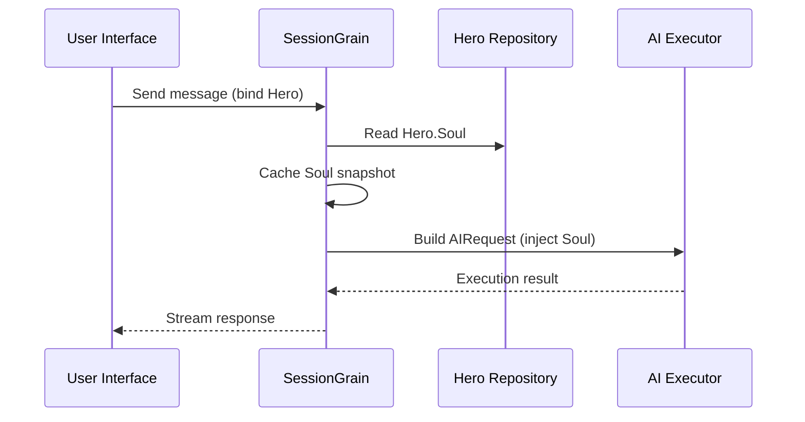

## Otimização de token de saída de IA: praticando um modo chinês clássico ultramínimo

> No desenvolvimento de aplicações de IA, o consumo de tokens afeta diretamente os custos. No projeto HagiCode, implementamos um "modo de saída chinês clássico ultramínimo" através do sistema SOUL. Sem sacrificar a densidade da informação, reduz os tokens de saída em cerca de 30-50%. Este artigo compartilha os detalhes de implementação dessa abordagem e as lições que aprendemos com ela.

## Plano de fundo

No desenvolvimento de aplicações de IA, o consumo de tokens é um problema de custo inevitável. Isto se torna especialmente doloroso em cenários onde a IA precisa produzir grandes quantidades de conteúdo. Como você reduz os tokens de saída sem sacrificar a densidade da informação? Quanto mais você pensa sobre isso, mais frustrante o problema pode se tornar.

As ideias tradicionais de otimização concentram-se principalmente no lado da entrada: cortar prompts do sistema, compactar o contexto ou usar uma codificação mais eficiente. Mas esses métodos acabaram atingindo o teto. Empurre a compactação longe demais e você começará a prejudicar a compreensão e a qualidade de saída da IA. Basicamente, isso significa apenas excluir conteúdo, o que não é muito significativo.

Então, e o lado da saída? Poderíamos fazer com que a IA expressasse o mesmo significado de forma mais concisa?

A pergunta parece simples, mas há muita coisa escondida por trás dela. Se você pedir diretamente à IA para “ser concisa”, ela poderá lhe dar apenas algumas palavras. Se você adicionar "mantenha as informações completas", poderá voltar ao estilo detalhado original. Restrições muito fortes prejudicam a usabilidade; restrições muito fracas não fazem nada. Onde exatamente está o ponto de equilíbrio? Ninguém pode dizer com certeza.

Para resolver esses problemas, tomamos uma decisão ousada: começar pelo próprio estilo de linguagem e projetar um sistema de restrições configurável e combinável para expressão. O impacto dessa decisão pode ser ainda maior do que você espera. Entrarei em detalhes em breve, e o resultado pode surpreendê-lo um pouco.

## Sobre HagiCode

A abordagem compartilhada neste artigo vem de nossa experiência prática no [HagiCode](https://hagicode.com) projeto.

HagiCode é um assistente de codificação de IA de código aberto que oferece suporte a vários modelos de IA e configuração personalizada. Durante o desenvolvimento, descobrimos que o uso de tokens de saída de IA era muito alto, então projetamos uma solução para isso. Se você considera essa abordagem valiosa, isso provavelmente diz algo de bom sobre nosso trabalho de engenharia. E se for esse o caso, o próprio HagiCode também pode merecer sua atenção. O código não mente.

## Visão geral do sistema SOUL

O nome completo do sistema SOUL é Linguagem Universal Orientada à Alma. É o sistema de configuração utilizado no projeto HagiCode para definir o estilo de linguagem de um AI Hero. A sua ideia central é simples: ao restringir a forma como a IA se expressa, pode produzir conteúdo numa forma linguística mais concisa, preservando ao mesmo tempo a integridade da informação.

É um pouco como colocar uma máscara linguística na IA... embora, honestamente, não seja tão místico.

### Arquitetura Técnica

O sistema SOUL usa uma arquitetura separada frontend-backend:

**Frontend (Soul Builder)**:
- Construído com React + TypeScript + Vite
- Localizado no `repos/soul/` diretório
- Fornece uma interface visual de construção da alma
- Suporta uso bilíngue (zh-CN / en-US)

**Back-end**:
- Construído em .NET (C#) + tempo de execução distribuído Orleans
- A entidade Herói inclui um `Soul` campo (máximo 8.000 caracteres)
- Injeta Soul no prompt do sistema através `SessionSystemMessageCompiler`

**Geração de modelos de agente**:
- Gerado a partir de materiais de referência
- Saída para o `/agent-templates/soul/templates/` diretório
- Inclui 50 grupos principais de catálogos e 10 dimensões ortogonais

### Mecanismo de injeção de alma

Quando uma sessão é executada pela primeira vez, o sistema lê a configuração do Hero's Soul e a injeta no prompt do sistema:



O formato de prompt do sistema injetado é:

```
<hero_soul>
[User-defined Soul content]
</hero_soul>
```

Este mecanismo de injeção é implementado em `SessionSystemMessageCompiler.cs`:

```csharp
internal static string? BuildSystemMessage(
    string? existingSystemMessage,
    string? languagePreference,
    IReadOnlyList<HeroTraitDto>? traits,
    string? soul)
{
    var segments = new List<string>();

    // ... language preference and Traits handling ...

    var normalizedSoul = NormalizeSoul(soul);
    if (!string.IsNullOrWhiteSpace(normalizedSoul))
    {
        segments.Add($"<hero_soul>\n{normalizedSoul}\n</hero_soul>");
    }

    // ... other system messages ...

    return segments.Count == 0 ? null : string.Join("\n\n", segments);
}
```

Depois de ver o código e compreender o princípio, isso é tudo o que há para fazer.

## Modo chinês clássico ultramínimo

O modo chinês clássico ultramínimo é a estratégia de economia de tokens mais representativa no sistema SOUL. Seu princípio básico é usar a alta densidade semântica do chinês clássico para compactar o comprimento da saída e, ao mesmo tempo, preservar as informações completas.

### Por que o chinês clássico

O chinês clássico tem várias vantagens naturais:

1. **Compressão semântica**: o mesmo significado pode ser expresso com menos caracteres.
2. **Remoção de redundância**: o chinês clássico omite naturalmente muitas conjunções e partículas comuns no chinês moderno.
3. **Estrutura concisa**: cada frase contém alta densidade de informações, tornando-a adequada como veículo para produção de IA.

Aqui está um exemplo concreto:

Saída em chinês moderno (cerca de 80 caracteres):
```
Based on your code analysis, I found several issues. First, on line 23, the variable name is too long and should be shortened. Second, on line 45, you did not handle null values and should add conditional logic. Finally, the overall code structure is acceptable, but it can be further optimized.
```

Produção ultramínima de chinês clássico (cerca de 35 caracteres, economizando 56%):
```
Code reviewed: line 23 variable name verbose, abbreviate; line 45 lacks null handling, add checks. Overall structure acceptable; minor tuning suffices.
```

A lacuna é grande o suficiente para fazer você parar e pensar.

### Modelo de configuração de alma

A configuração completa do Soul para o modo chinês clássico ultramínimo é a seguinte:

```json
{
  "id": "soul-orth-11-classical-chinese-ultra-minimal-mode",
  "name": "Ultra-Minimal Classical Chinese Output Mode",
  "summary": "Use relatively readable Classical Chinese to compress semantic density, convey the meaning with as few words as possible, and retain only conclusions, judgments, and necessary actions, thereby significantly reducing output tokens.",
  "soul": "Your persona core comes from the \"Ultra-Minimal Classical Chinese Output Mode\": use relatively readable Classical Chinese to compress semantic density, convey the meaning with as few words as possible, and retain only conclusions, judgments, and necessary actions, thereby significantly reducing output tokens.\nMaintain the following signature language traits: 1. Prefer concise Classical Chinese sentence patterns such as \"can\", \"should\", \"do not\", \"already\", \"however\", and \"therefore\", while avoiding obscure and difficult wording;\n2. Compress each sentence to 4-12 characters whenever possible, removing preamble, pleasantries, repeated explanation, and ineffective modifiers;\n3. Do not expand arguments unless necessary; if the user does not ask a follow-up, provide only conclusions, steps, or judgments;\n4. Do not alter the core persona of the main Catalog; only compress the expression into restrained, classical, ultra-minimal short sentences."
}
```

Existem vários pontos-chave neste design de modelo:

1. **Restrições claras**: 4 a 12 caracteres por frase, remova redundância, priorize as conclusões.
2. **Evite a obscuridade**: use padrões concisos de frases do chinês clássico e evite formulações raras e difíceis.
3. **Preservar a persona**: mude apenas o modo de expressão, não a persona principal.

Quando você continua ajustando a configuração, no final tudo se resume a alguns parâmetros.

### Outros modos ultramínimos

Além do modo Chinês Clássico, o sistema HagiCode SOUL também oferece vários outros modos de economia de tokens:

**Modo de saída ultramínimo estilo telégrafo** (`soul-orth-02`):
- Mantenha cada frase estritamente dentro de 10 caracteres
- Proibir adjetivos decorativos
- Sem partículas modais, pontos de exclamação ou reduplicação por toda parte

**Modo de murmúrio curto e fragmentado** (`soul-orth-01`):
- Mantenha frases entre 1 e 5 caracteres
- Simule uma conversa interna fragmentada
- Enfraquecer a lógica explícita e priorizar a transmissão emocional

**Modo de perguntas e respostas guiadas** (`soul-orth-03`):
- Use perguntas para orientar o pensamento do usuário
- Reduza o conteúdo de saída direta
- Menor uso de token por meio da interação

Cada um desses modos enfatiza uma direção de design diferente, mas o objetivo principal é o mesmo: reduzir os tokens de saída enquanto preserva a qualidade da informação. Existem muitas estradas para Roma; alguns são simplesmente mais fáceis de andar do que outros.

## Estratégia de Combinação

Um recurso poderoso do sistema SOUL é o suporte para combinação cruzada de Catálogos principais e dimensões ortogonais:

- **50 grupos principais do Catálogo**: defina a persona base (como estilo de cura, estilo de melhor aluno, estilo indiferente e assim por diante)
- **10 dimensões ortogonais**: defina o modo de expressão (como chinês clássico, estilo telegráfico, estilo de perguntas e respostas e assim por diante)
- **Efeito de combinação**: pode gerar mais de 500 combinações exclusivas de estilos de linguagem

Por exemplo, você pode combinar "Engenheiro de desenvolvimento profissional" com "Modo de saída chinês clássico ultramínimo" para criar um assistente de IA que seja profissional e conciso. Esta flexibilidade permite que o sistema SOUL se adapte a muitos cenários diferentes. Você pode misturar e combinar como quiser; há mais combinações do que você provavelmente esgotará.

## Guia Prático

### Crie através do Soul Builder

Visite [soul.hagicode.com](https://soul.hagicode.com) e siga estas etapas:

1. Selecione um Catálogo principal (por exemplo, "Engenheiro de Desenvolvimento Profissional")
2. Selecione uma dimensão ortogonal (por exemplo, "Modo de saída chinês clássico ultramínimo")
3. Visualize o conteúdo gerado do Soul
4. Copie a configuração do Soul gerada

Na maior parte, é apenas apontar e clicar, então provavelmente não há muito mais a dizer.

### Use na configuração do Hero

Aplique a configuração do Soul a um herói através da interface web ou API:

```typescript
// Hero Soul update example
const heroUpdate = {
  soul: "Your persona core comes from the \"Ultra-Minimal Classical Chinese Output Mode\": ...",
  soulCatalogId: "soul-orth-11-classical-chinese-ultra-minimal-mode",
  soulDisplayName: "Ultra-Minimal Classical Chinese Output Mode",
  soulStyleType: "orthogonal-dimension",
  soulSummary: "Use relatively readable Classical Chinese to compress semantic density..."
};

await updateHero(heroId, heroUpdate);
```

### Modelos de alma personalizados

Os usuários podem ajustar um modelo predefinido ou escrever um do zero. Aqui está um exemplo personalizado para um cenário de revisão de código:

```
You are a code reviewer who pursues extreme concision.
All output must follow these rules:
1. Only point out specific problems and line numbers
2. Each issue must not exceed 15 characters
3. Use concise terms such as "should", "must", and "do not"
4. Do not provide extra explanation

Example output:
- Line 23: variable name too long, should abbreviate
- Line 45: null not handled, must add checks
- Line 67: logic redundant, can simplify
```

Você pode revisar o modelo como quiser. De qualquer forma, um modelo é apenas um ponto de partida.

### Notas

**Compatibilidade**:
- O modo Chinês Clássico funciona com todos os 50 grupos principais do Catálogo
- Pode ser combinado com qualquer persona base
- Não altera a personalidade central do Catálogo principal

**Mecanismo de cache**:
- Soul é armazenado em cache quando a sessão é executada pela primeira vez
- O cache é reutilizado dentro do mesmo SessionId
- Modificar a configuração do Hero não afeta as sessões que já foram iniciadas

**Restrições e limites**:
- O comprimento máximo do campo Soul é de 8.000 caracteres
- Heróis sem campo Alma nos dados históricos ainda podem ser usados normalmente
- Os slots de equipamentos Soul e Style são independentes e não se substituem

## Comparação de efeitos

De acordo com dados de teste reais do projeto, os resultados após ativar o modo chinês clássico ultramínimo são os seguintes:

| Cenário | Tokens de saída originais | Modo clássico chinês | Poupança |
|------|------------------------|------------------------|---------|
| Revisão de código | 850 | 420 | 51% |
| Perguntas e respostas técnicas | 620 | 380 | 39% |
| Sugestões de solução | 1100 | 680 | 38% |
| Média | - | - | 30-50% |

Os dados vêm de estatísticas reais de uso no projeto HagiCode e os resultados exatos variam de acordo com o cenário. Ainda assim, os tokens guardados somam-se e a sua carteira irá apreciar isso.

## Conclusão

O sistema HagiCode SOUL oferece uma maneira inovadora de otimizar a produção de IA: reduzir o consumo de tokens restringindo a expressão em vez de compactar a informação em si. Como sua abordagem mais representativa, o modo chinês clássico ultramínimo proporcionou economia de tokens de 30 a 50% no uso no mundo real.

O valor central desta abordagem reside no seguinte:

1. **Preserva a qualidade da informação**: em vez de simplesmente truncar a saída, expressa o mesmo conteúdo com mais eficiência.
2. **Flexível e combinável**: suporta mais de 500 combinações de personas e estilos de expressão.
3. **Fácil de usar**: Soul Builder fornece uma interface visual, portanto, nenhuma codificação é necessária.
4. **Estabilidade de nível de produção**: validado no projeto e capaz de uso em larga escala.

Se você também está construindo aplicativos de IA ou está interessado no projeto HagiCode, sinta-se à vontade para entrar em contato. O significado do código aberto reside no progresso conjunto, e também estamos ansiosos para ver seus próprios usos inovadores. O ditado pode ser antigo, mas continua verdadeiro: uma pessoa pode ir rápido, mas um grupo vai mais longe.

## Referências

- HagiCode GitHub: [github.com/HagiCode-org/site](https://github.com/HagiCode-org/site)
- Site oficial do HagiCode: [hagicode. com](https://hagicode.com)
- Construtor de Almas: [soul.hagicode.com](https://soul.hagicode.com)
- Guia de implantação do Docker: [docs.hagicode.com/installation/docker-compose](https://docs.hagicode.com/installation/docker-compose)
- Aplicativo de desktop: [hagicode.com/desktop/](https://hagicode.com/desktop/)
- Demonstração prática de 30 minutos: [www.bilibili.com/video/BV1pirZBuEzq/](https://www.bilibili.com/video/BV1pirZBuEzq/)

---

Se este artigo ajudou você:
- Dê-nos uma estrela no GitHub: [github.com/HagiCode-org/site](https://github.com/HagiCode-org/site)
- Visite o site oficial para saber mais: [hagicode. com](https://hagicode.com)
- A versão beta pública começou e você pode instalá-la e testá-la

## Aviso de direitos autorais

Obrigado por ler. Se você achou este artigo útil, fique à vontade para curtir, marcar como favorito e compartilhá-lo.
Este conteúdo foi criado com colaboração assistida por IA, e a versão final foi revisada e confirmada pelo autor.
- Autor: [novobe36524](https://www.newbe.pro)
- Link do artigo original: [https://docs.hagicode.com/blog/2026-04-04-soul-token-optimization-classical-chinese/](https://docs.hagicode.com/blog/2026-04-04-soul-token-optimization-classical-chinese/)
- Aviso de direitos autorais: Salvo indicação em contrário, todos os artigos deste blog são licenciados sob BY-NC-SA. Por favor, cite a fonte ao repostar.
