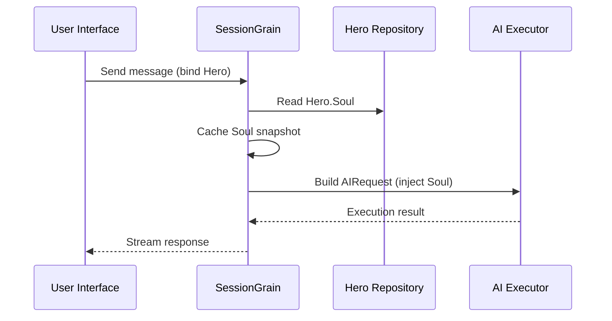

## Optimizarea token-urilor de ieșire AI: Practicarea unui mod ultra-minimal în chineza clasică

> În dezvoltarea aplicațiilor AI, consumul de token-uri este o problemă de cost inevitabilă. În proiectul HagiCode, am implementat un „mod de ieșire în chineză clasică ultra-minimal" prin sistemul SOUL. Fără a sacrifica densitatea informației, reduce token-urile de ieșire cu aproximativ 30-50%. Acest articol împărtășește detaliile de implementare ale acestei abordări și lecțiile pe care le-am învățat folosind-o.

## Context

În dezvoltarea aplicațiilor AI, consumul de token-uri este o problemă de cost inevitabilă. Aceasta devine deosebit de dureroasă în scenariile în care AI-ul trebuie să producă cantități mari de conținut. Cum reduceți token-urile de ieșire fără a sacrifica densitatea informației? Cu cât vă gândiți mai mult, cu atât problema devine mai frustrantă.

Ideile tradiționale de optimizare se concentrează mai ales pe partea de intrare: tăierea prompturilor de sistem, comprimarea contextului sau folosirea unei codificări mai eficiente. Dar aceste metode ating eventual un plafon. Dacă împingeți comprimarea prea departe, începeți să dăunați înțelegerii și calității ieșirii AI-ului. Acest lucru este în esență doar ștergerea conținutului, ceea ce nu este foarte semnificativ.

Dar ce ziceți de partea de ieșire? Am putea face AI-ul să exprime același sens mai concis?

Întrebarea sună simplu, dar există destul de mult ascuns sub ea. Dacă cereți direct AI-ului să „fie concis", s-ar putea să vă dea într-adevăr doar câteva cuvinte. Dacă adăugați „păstrați informația completă", s-ar putea să revină la stilul verbal original. Constrângerile prea puternice dăunează utilizabilității; constrângerile prea slabe nu fac nimic. Unde este exact punctul de echilibru? Nimeni nu poate spune cu siguranță.

Pentru a rezolva aceste puncte dureroase, am luat o decizie curajoasă: am pornit de la stilul lingvistic însuși și am proiectat un sistem de constrângeri configurabil și compozabil pentru exprimare. Impactul acestei decizii poate fi chiar mai mare decât vă așteptați. Voi intra în detalii în curând, iar rezultatul vă poate surprinde un pic.

## Despre HagiCode

Abordarea împărtășită în acest articol provine din experiența noastră practică în proiectul [HagiCode](https://hagicode.com).

HagiCode este un asistent de codare AI cu sursă deschisă care suportă multiple modele AI și configurație personalizată. În timpul dezvoltării, am descoperit că utilizarea token-urilor de ieșire AI era prea mare, așa că am proiectat o soluție pentru aceasta. Dacă găsiți această abordare valoroasă, asta probabil spune ceva bun despre munca noastră de inginerie. Iar dacă acesta este cazul, HagiCode însuși poate merita de asemenea atenția dumneavoastră. Codul nu minte.

## Prezentare generală a sistemului SOUL

Numele complet al sistemului SOUL este Soul Oriented Universal Language. Este sistemul de configurare folosit în proiectul HagiCode pentru a defini stilul lingvistic al unui AI Hero. Ideea sa de bază este simplă: prin constrângerea modului în care AI-ul se exprimă, poate scoate conținut într-o formă lingvistică mai concisă păstrând în același timp completitudinea informațională.

Este un pic ca și cum ai pune o mască lingvistică pe AI... deși sincer, nu este chiar atât de mistic.

### Arhitectura tehnică

Sistemul SOUL folosește o arhitectură separată frontend-backend:

**Frontend (Soul Builder)**:
- Construit cu React + TypeScript + Vite
- Localizat în directorul `repos/soul/`
- Oferă o interfață vizuală de construire Soul
- Suportă utilizare bilingvă (zh-CN / en-US)

**Backend**:
- Construit pe .NET (C#) + runtime distribuit Orleans
- Entitatea Hero include un câmp `Soul` (maxim 8000 de caractere)
- Injectează Soul în promptul de sistem prin `SessionSystemMessageCompiler`

**Generare șabloane Agent**:
- Generate din materiale de referință
- Ieșire în directorul `/agent-templates/soul/templates/`
- Include 50 grupuri principale Catalog și 10 dimensiuni ortogonale

### Mecanismul de injecție Soul

Când o Sesiune se execută pentru prima dată, sistemul citește configurația Soul a Hero-ului și o injectează în promptul de sistem:



Formatul promptului de sistem injectat este:

```
<hero_soul>
[User-defined Soul content]
</hero_soul>
```

Acest mecanism de injecție este implementat în `SessionSystemMessageCompiler.cs`:

```csharp
internal static string? BuildSystemMessage(
    string? existingSystemMessage,
    string? languagePreference,
    IReadOnlyList<HeroTraitDto>? traits,
    string? soul)
{
    var segments = new List<string>();

    // ... gestionare preferințe lingvistice și Traits ...

    var normalizedSoul = NormalizeSoul(soul);
    if (!string.IsNullOrWhiteSpace(normalizedSoul))
    {
        segments.Add($"<hero_soul>\n{normalizedSoul}\n</hero_soul>");
    }

    // ... alte mesaje de sistem ...

    return segments.Count == 0 ? null : string.Join("\n\n", segments);
}
```

Odată ce ați văzut codul și ați înțeles principiul, acesta este într-adevăr tot ce este de spus.

## Modul Ultra-Minimal în Chineză Clasică

Modul ultra-minimal în chineză clasică este cea mai reprezentativă strategie de economisire a token-urilor din sistemul SOUL. Principiul său de bază este să folosească densitatea semantică ridicată a chinezei clasice pentru a comprima lungimea ieșirii păstrând în același timp informația completă.

### De ce chineza clasică

Chineza clasică are mai multe avantaje naturale:

1. **Comprimare semantică**: același sens poate fi exprimat cu mai puține caractere.
2. **Eliminarea redundanțelor**: Chineza clasică omite natural multe conjuncții și particule comune în chineza modernă.
3. **Structură concisă**: fiecare propoziție poartă o densitate informațională ridicată, făcând-o bine adaptată ca vehicul pentru ieșirea AI.

Iată un exemplu concret:

Ieșire în chineză modernă (aproximativ 80 de caractere):
```
Based on your code analysis, I found several issues. First, on line 23, the variable name is too long and should be shortened. Second, on line 45, you did not handle null values and should add conditional logic. Finally, the overall code structure is acceptable, but it can be further optimized.
```

Ieșire ultra-minimal în chineză clasică (aproximativ 35 de caractere, economisind 56%):
```
Code reviewed: line 23 variable name verbose, abbreviate; line 45 lacks null handling, add checks. Overall structure acceptable; minor tuning suffices.
```

Diferența este suficient de mare încât să vă opriți și să vă gândiți.

### Șablon de configurare Soul

Configurația Soul completă pentru modul ultra-minimal în chineză clasică este următoarea:

```json
{
  "id": "soul-orth-11-classical-chinese-ultra-minimal-mode",
  "name": "Ultra-Minimal Classical Chinese Output Mode",
  "summary": "Use relatively readable Classical Chinese to compress semantic density, convey the meaning with as few words as possible, and retain only conclusions, judgments, and necessary actions, thereby significantly reducing output tokens.",
  "soul": "Your persona core comes from the \"Ultra-Minimal Classical Chinese Output Mode\": use relatively readable Classical Chinese to compress semantic density, convey the meaning with as few words as possible, and retain only conclusions, judgments, and necessary actions, thereby significantly reducing output tokens.\nMaintain the following signature language traits: 1. Prefer concise Classical Chinese sentence patterns such as \"can\", \"should\", \"do not\", \"already\", \"however\", and \"therefore\", while avoiding obscure and difficult wording;\n2. Compress each sentence to 4-12 characters whenever possible, removing preamble, pleasantries, repeated explanation, and ineffective modifiers;\n3. Do not expand arguments unless necessary; if the user does not ask a follow-up, provide only conclusions, steps, or judgments;\n4. Do not alter the core persona of the main Catalog; only compress the expression into restrained, classical, ultra-minimal short sentences."
}
```

Există mai multe puncte cheie în acest design de șablon:

1. **Constrângeri clare**: 4-12 caractere per propoziție, eliminarea redundanței, prioritate concluziilor.
2. **Evitarea obscurității**: folosește modele de propoziții concise în chineză clasică și evită formulări rare, dificile.
3. **Păstrarea personajului**: schimbă doar modul de exprimare, nu personajul de bază.

Când continuați să ajustați configurația, totul se reduce la câțiva parametri în cele din urmă.

### Alte moduri ultra-minimale

Pe lângă modul în chineză clasică, sistemul HagiCode SOUL oferă și alte câteva moduri de economisire a token-urilor:

**Modul de ieșire ultra-minimal în stil telegrafic** (`soul-orth-02`):
- Menține fiecare propoziție strict sub 10 caractere
- Interzice adjectivele decorative
- Fără particule modale, semne de exclamare sau reduplicare pe tot parcursul

**Modul de mormăit fragmentat scurt** (`soul-orth-01`):
- Menține propozițiile între 1-5 caractere
- Simulează monolog fragmentat
- Slăbește logica explicită și prioritizează transmiterea emoțională

**Modul Întrebare-Răspuns ghidat** (`soul-orth-03`):
- Folosește întrebări pentru a ghida gândirea utilizatorului
- Reduce conținutul ieșirii directe
- Reduce utilizarea token-urilor prin interacțiune

Fiecare dintre aceste moduri subliniază o direcție diferită de design, dar obiectivul de bază este același: reduce token-urile de ieșire păstrând calitatea informației. Sunt multe drumuri spre Roma; unele sunt pur și simplu mai ușor de parcurs decât altele.

## Strategia de combinare

O caracteristică puternică a sistemului SOUL este suportul pentru combinarea încrucișată a Cataloagelor principale și dimensiunilor ortogonale:

- **50 grupuri principale Catalog**: definesc personajul de bază (cum ar fi stil de vindecare, stil de elev eminent, stil distant, și așa mai departe)
- **10 dimensiuni ortogonale**: definesc modul de exprimare (cum ar fi chineză clasică, stil telegrafic, stil Î&R, și așa mai departe)
- **Efect de combinare**: poate genera 500+ combinații unice de stil lingvistic

De exemplu, puteți combina „Inginer de Dezvoltare Profesional" cu „Mod de Ieșire Ultra-Minimal în Chineză Clasică" pentru a crea un asistent AI care este și profesionist și concis. Această flexibilitate permite sistemului SOUL să se adapteze la multe scenarii diferite. Puteți amesteca și potrivi cum doriți; sunt mai multe combinații decât probabil veți epuiza.

## Ghid practic

### Creare prin Soul Builder

Vizitați [soul.hagicode.com](https://soul.hagicode.com) și urmați acești pași:

1. Selectați un Catalog principal (de exemplu, „Inginer de Dezvoltare Profesional")
2. Selectați o dimensiune ortogonală (de exemplu, „Mod de Ieșire Ultra-Minimal în Chineză Clasică")
3. Previzualizați conținutul Soul generat
4. Copiați configurația Soul generată

Este în mare parte doar click, deci probabil nu este mult mai mult de spus.

### Utilizare în configurația Hero

Aplicați configurația Soul unui Hero prin interfața web sau API:

```typescript
// Exemplu actualizare Hero Soul
const heroUpdate = {
  soul: "Your persona core comes from the \"Ultra-Minimal Classical Chinese Output Mode\": ...",
  soulCatalogId: "soul-orth-11-classical-chinese-ultra-minimal-mode",
  soulDisplayName: "Ultra-Minimal Classical Chinese Output Mode",
  soulStyleType: "orthogonal-dimension",
  soulSummary: "Use relatively readable Classical Chinese to compress semantic density..."
};

await updateHero(heroId, heroUpdate);
```

### Șabloane Soul personalizate

Utilizatorii pot ajusta fin un șablon preconfigurat sau scrie unul de la zero. Iată un exemplu personalizat pentru un scenariu de revizuire a codului:

```
You are a code reviewer who pursues extreme concision.
All output must follow these rules:
1. Only point out specific problems and line numbers
2. Each issue must not exceed 15 characters
3. Use concise terms such as "should", "must", and "do not"
4. Do not provide extra explanation

Example output:
- Line 23: variable name too long, should abbreviate
- Line 45: null not handled, must add checks
- Line 67: logic redundant, can simplify
```

Puteți revizui șablonul cum doriți. Un șablon este doar un punct de plecare oricum.

### Note

**Compatibilitate**:
- Modul în chineză clasică funcționează cu toate cele 50 grupuri principale Catalog
- Poate fi combinat cu orice personaj de bază
- Nu schimbă personajul de bază al Catalogului principal

**Mecanism de cache**:
- Soul este stocat în cache când Sesiunea se execută pentru prima dată
- Cache-ul este reutilizat în același SessionId
- Modificarea configurației Hero nu afectează Sesiunile care au deja început

**Constrângeri și limite**:
- Lungimea maximă a câmpului Soul este de 8000 de caractere
- Hero-urile fără câmp Soul în datele istorice pot fi încă folosite normal
- Soul și sloturile de echipare de stil sunt independente și nu se suprascriu reciproc

## Comparație de efecte

Conform datelor reale de testare din proiect, rezultatele după activarea modului ultra-minimal în chineză clasică sunt următoarele:

| Scenariu | Token-uri ieșire originale | Mod chineză clasică | Economii |
|------|------------------------|------------------------|---------|
| Revizuire cod | 850 | 420 | 51% |
| Î&R Tehnic | 620 | 380 | 39% |
| Sugestii soluții | 1100 | 680 | 38% |
| Medie | - | - | 30-50% |

Datele provin din statistici de utilizare reală în proiectul HagiCode, iar rezultatele exacte variază în funcție de scenariu. Totuși, token-urile economisite se acumulează, iar portofelul dumneavoastră va aprecia.

## Concluzie

Sistemul SOUL HagiCode oferă o modalitate inovatoare de a optimiza ieșirea AI: reduce consumul de token-uri prin constrângerea exprimării în loc să comprime informația însăși. Ca cea mai reprezentativă abordare a sa, modul ultra-minimal în chineză clasică a livrat economii de token-uri de 30-50% în utilizarea reală.

Valoarea de bază a acestei abordări constă în următoarele:

1. **Păstrarea calității informației**: în loc de trunchierea simplă a ieșirii, exprimă același conținut mai eficient.
2. **Flexibil și compozabil**: suportă 500+ combinații de personaj și stiluri de exprimare.
3. **Ușor de utilizat**: Soul Builder oferă o interfață vizuală, deci nu este necesară codificarea.
4. **Stabilitate de nivel producție**: validat în proiect și capabil de utilizare la scară largă.

Dacă construiți și aplicații AI, sau dacă sunteți interesat de proiectul HagiCode, nu ezitați să ne contactați. Sensul open source stă în a progresa împreună, iar noi așteptăm cu interes să vedem propriile utilizări inovatoare ale dumneavoastră. Zicala poate fi veche, dar rămâne adevărată: o persoană poate merge repede, dar un grup merge mai departe.

## Referințe

- HagiCode GitHub: [github.com/HagiCode-org/site](https://github.com/HagiCode-org/site)
- Site-ul oficial HagiCode: [hagicode.com](https://hagicode.com)
- Soul Builder: [soul.hagicode.com](https://soul.hagicode.com)
- Ghid de implementare Docker: [docs.hagicode.com/installation/docker-compose](https://docs.hagicode.com/installation/docker-compose)
- Aplicația Desktop: [hagicode.com/desktop/](https://hagicode.com/desktop/)
- Demonstrație practică de 30 de minute: [www.bilibili.com/video/BV1pirZBuEzq/](https://www.bilibili.com/video/BV1pirZBuEzq/)

---

Dacă acest articol v-a ajutat:
- Oferiți-ne un Star pe GitHub: [github.com/HagiCode-org/site](https://github.com/HagiCode-org/site)
- Vizitați site-ul oficial pentru a afla mai multe: [hagicode.com](https://hagicode.com)
- Beta publică a început, iar sunteți binevenit să instalați și să încercați

## Notă privind drepturile de autor

Vă mulțumim pentru lectură. Dacă v-a fost util acest articol, sunteți binevenit să apreciați, salvați și distribuiți.
Acest conținut a fost creat prin colaborare asistată de AI, iar versiunea finală a fost revizuită și confirmată de autor.
- Autor: [newbe36524](https://www.newbe.pro)
- Link articol original: [https://docs.hagicode.com/blog/2026-04-04-soul-token-optimization-classical-chinese/](https://docs.hagicode.com/blog/2026-04-04-soul-token-optimization-classical-chinese/)
- Notă privind drepturile de autor: Cu excepția cazului în care se specifică altfel, toate articolele de pe acest blog sunt licențiate sub BY-NC-SA. Vă rugăm să citați sursa la republicare.
