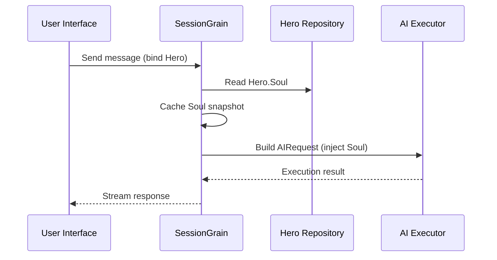

## AI Output Token Optimization: Öva ett ultraminimalt klassiskt kinesiskt läge

> Inom AI-applikationsutveckling påverkar tokenförbrukningen direkt kostnaden. I HagiCode-projektet implementerade vi ett "ultraminimalt klassiskt kinesiskt utdataläge" genom SOUL-systemet. Utan att offra informationstätheten minskar det utdatatokens med ungefär 30-50 %. Den här artikeln delar med sig av implementeringsdetaljerna för det tillvägagångssättet och de lärdomar vi lärde oss av det.

## Bakgrund

Inom AI-applikationsutveckling är tokenförbrukning en oundviklig kostnadsfråga. Detta blir särskilt smärtsamt i scenarier där AI behöver producera stora mängder innehåll. Hur minskar du utdatatokens utan att offra informationstätheten? Ju mer du tänker på det, desto mer frustrerande kan problemet bli.

Traditionella optimeringsidéer fokuserar mest på inmatningssidan: trimma systemuppmaningar, komprimera sammanhang eller använda mer effektiv kodning. Men dessa metoder slog till slut i tak. Tryck på komprimeringen för långt och du börjar skada AI:s förståelse och utdatakvalitet. Det är i princip bara att ta bort innehåll, vilket inte är särskilt meningsfullt.

Så hur är det med utgångssidan? Kan vi få AI:n att uttrycka samma betydelse mer koncist?

Frågan låter enkel, men det finns en hel del gömt under den. Om du direkt ber AI:n att "vara kortfattad" kan det egentligen bara ge dig några få ord. Om du lägger till "håll informationen komplett" kan den glida tillbaka till den ursprungliga verbose stilen. Begränsningar som är för starka skadar användbarheten; begränsningar som är för svaga gör ingenting. Var exakt är balanspunkten? Ingen kan säga säkert.

För att lösa dessa smärtpunkter tog vi ett djärvt beslut: utgå från själva språkstilen och designa ett konfigurerbart, komponerbart begränsningssystem för uttryck. Effekten av det beslutet kan bli ännu större än du förväntar dig. Jag kommer att gå in på detaljerna inom kort, och resultatet kan överraska dig lite.

## Om HagiCode

Tillvägagångssättet som delas i den här artikeln kommer från vår praktiska erfarenhet av [HagiCode](https://hagicode.com) projekt.

HagiCode är en AI-kodningsassistent med öppen källkod som stöder flera AI-modeller och anpassad konfiguration. Under utvecklingen upptäckte vi att användningen av AI-utdatatoken var för hög, så vi designade en lösning för det. Om du tycker att detta tillvägagångssätt är värdefullt säger det förmodligen något bra om vårt ingenjörsarbete. Och om så är fallet kan HagiCode i sig också vara värt din uppmärksamhet. Koden ljuger inte.

## SOUL Systemöversikt

Det fullständiga namnet på SOUL-systemet är Soul Oriented Universal Language. Det är konfigurationssystemet som används i HagiCode-projektet för att definiera språkstilen för en AI-hjälte. Dess kärnidé är enkel: genom att begränsa hur AI uttrycker sig kan den mata ut innehåll i en mer kortfattad språklig form samtidigt som informationsfullständigheten bevaras.

Det är lite som att sätta en språklig mask på AI... fast ärligt talat, det är inte riktigt så mystiskt.

### Teknisk arkitektur

SOUL-systemet använder en frontend-backend-separerad arkitektur:

**Frontend (Soul Builder)**:
- Byggd med React + TypeScript + Vite
- Beläget i `repos/soul/` katalog
- Ger ett visuellt gränssnitt för själsbyggande
- Stöder tvåspråkig användning (zh-CN / sv-US)

**Bakgrund**:
- Byggd på .NET (C#) + Orleans distribuerade körtid
- Hero-entiteten inkluderar en `Soul` fält (max 8000 tecken)
- Injicerar Soul i systemprompten igenom `SessionSystemMessageCompiler`

**Generering av agentmallar**:
- Genereras från referensmaterial
- Utgång till `/agent-templates/soul/templates/` katalog
- Inkluderar 50 huvudkataloggrupper och 10 ortogonala dimensioner

### Soul Injection Mekanism

När en session körs för första gången läser systemet av hjältens själs konfiguration och injicerar den i systemprompten:



Det injicerade systempromptformatet är:

```
<hero_soul>
[User-defined Soul content]
</hero_soul>
```

Denna injektionsmekanism är implementerad i `SessionSystemMessageCompiler.cs`:

```csharp
internal static string? BuildSystemMessage(
    string? existingSystemMessage,
    string? languagePreference,
    IReadOnlyList<HeroTraitDto>? traits,
    string? soul)
{
    var segments = new List<string>();

    // ... language preference and Traits handling ...

    var normalizedSoul = NormalizeSoul(soul);
    if (!string.IsNullOrWhiteSpace(normalizedSoul))
    {
        segments.Add($"<hero_soul>\n{normalizedSoul}\n</hero_soul>");
    }

    // ... other system messages ...

    return segments.Count == 0 ? null : string.Join("\n\n", segments);
}
```

När du har sett koden och förstått principen är det egentligen allt som finns.

## Ultra-minimalt klassiskt kinesiskt läge

Ultraminimalt klassiskt kinesiskt läge är den mest representativa token-sparstrategin i SOUL-systemet. Dess kärnprincip är att använda den höga semantiska tätheten hos klassisk kinesiska för att komprimera utdatalängden samtidigt som fullständig information bevaras.

### Varför klassisk kinesiska

Klassisk kinesiska har flera naturliga fördelar:

1. **Semantisk komprimering**: samma betydelse kan uttryckas med färre tecken.
2. **Borttagning av redundans**: Klassisk kinesiska utelämnar naturligtvis många konjunktioner och partiklar som är vanliga i modern kinesiska.
3. **Koncis struktur**: varje mening har hög informationstäthet, vilket gör den väl lämpad som ett fordon för AI-utdata.

Här är ett konkret exempel:

Modern kinesisk utdata (cirka 80 tecken):
```
Based on your code analysis, I found several issues. First, on line 23, the variable name is too long and should be shortened. Second, on line 45, you did not handle null values and should add conditional logic. Finally, the overall code structure is acceptable, but it can be further optimized.
```

Ultra-minimal klassisk kinesisk utdata (cirka 35 tecken, besparing 56%):
```
Code reviewed: line 23 variable name verbose, abbreviate; line 45 lacks null handling, add checks. Overall structure acceptable; minor tuning suffices.
```

Gapet är tillräckligt stort för att du ska stanna upp och tänka.

### Själskonfigurationsmall

Den kompletta Soul-konfigurationen för ultraminimalt klassiskt kinesiskt läge är som följer:

```json
{
  "id": "soul-orth-11-classical-chinese-ultra-minimal-mode",
  "name": "Ultra-Minimal Classical Chinese Output Mode",
  "summary": "Use relatively readable Classical Chinese to compress semantic density, convey the meaning with as few words as possible, and retain only conclusions, judgments, and necessary actions, thereby significantly reducing output tokens.",
  "soul": "Your persona core comes from the \"Ultra-Minimal Classical Chinese Output Mode\": use relatively readable Classical Chinese to compress semantic density, convey the meaning with as few words as possible, and retain only conclusions, judgments, and necessary actions, thereby significantly reducing output tokens.\nMaintain the following signature language traits: 1. Prefer concise Classical Chinese sentence patterns such as \"can\", \"should\", \"do not\", \"already\", \"however\", and \"therefore\", while avoiding obscure and difficult wording;\n2. Compress each sentence to 4-12 characters whenever possible, removing preamble, pleasantries, repeated explanation, and ineffective modifiers;\n3. Do not expand arguments unless necessary; if the user does not ask a follow-up, provide only conclusions, steps, or judgments;\n4. Do not alter the core persona of the main Catalog; only compress the expression into restrained, classical, ultra-minimal short sentences."
}
```

Det finns flera nyckelpunkter i denna malldesign:

1. **Tydliga begränsningar**: 4-12 tecken per mening, ta bort redundans, prioritera slutsatser.
2. **Undvik otydlighet**: använd kortfattade klassiska kinesiska meningsmönster och undvik sällsynta, svåra formuleringar.
3. **Bevara persona**: ändra bara uttryckssättet, inte kärnpersonan.

När du fortsätter att justera konfigurationen, kommer det hela ner på några parametrar i slutändan.

### Andra ultra-minimala lägen

Förutom det klassiska kinesiska läget tillhandahåller HagiCode SOUL-systemet även flera andra token-sparlägen:

**Ultraminimalt utgångsläge i telegrafstil** (`soul-orth-02`):
- Håll varje mening strikt inom 10 tecken
- Förbjud dekorativa adjektiv
- Inga modala partiklar, utropstecken eller reduplicering genomgående

**Kort fragmenterat muttringsläge** (`soul-orth-01`):
- Håll meningar inom 1-5 tecken
- Simulera fragmenterat självtal
- Försvaga den explicita logiken och prioritera känslomässig överföring

**Guidad Q&A-läge** (`soul-orth-03`):
- Använd frågor för att vägleda användarens tänkande
- Minska direktutgångsinnehåll
- Lägre tokenanvändning genom interaktion

Vart och ett av dessa lägen betonar en annan designriktning, men kärnmålet är detsamma: minska utmatningstoken samtidigt som informationskvaliteten bevaras. Det finns många vägar till Rom; vissa är helt enkelt lättare att gå än andra.

## Kombinationsstrategi

En kraftfull funktion hos SOUL-systemet är stöd för korskombination av huvudkataloger och ortogonala dimensioner:

- **50 huvudkataloggrupper**: definiera baspersonan (som healingstil, toppstudentstil, distanserad stil och så vidare)
- **10 ortogonala dimensioner**: definierar uttryckssättet (som klassisk kinesiska, telegrafstil, Q&A-stil, och så vidare)
- **Kombinationseffekt**: kan generera 500+ unika språkkombinationer

Till exempel kan du kombinera "Professional Development Engineer" med "Ultra-Minimal Classical Chinese Output Mode" för att skapa en AI-assistent som är både professionell och koncis. Denna flexibilitet gör att SOUL-systemet kan anpassa sig till många olika scenarier. Du kan mixa och matcha hur du vill; det finns fler kombinationer än du sannolikt kommer att uttömma.

## Praktisk guide

### Skapa genom Soul Builder

Besök [soul.hagicode.com](https://soul.hagicode.com) och följ dessa steg:

1. Välj en huvudkatalog (till exempel "Professionell utvecklingsingenjör")
2. Välj en ortogonal dimension (till exempel "Ultra-minimal klassisk kinesisk utdataläge")
3. Förhandsgranska det genererade själsinnehållet
4. Kopiera den genererade själskonfigurationen

Det är mest bara peka-och-klicka, så det finns nog inte så mycket mer att säga.

### Använd i Hero Configuration

Tillämpa själskonfigurationen på en hjälte via webbgränssnittet eller API:et:

```typescript
// Hero Soul update example
const heroUpdate = {
  soul: "Your persona core comes from the \"Ultra-Minimal Classical Chinese Output Mode\": ...",
  soulCatalogId: "soul-orth-11-classical-chinese-ultra-minimal-mode",
  soulDisplayName: "Ultra-Minimal Classical Chinese Output Mode",
  soulStyleType: "orthogonal-dimension",
  soulSummary: "Use relatively readable Classical Chinese to compress semantic density..."
};

await updateHero(heroId, heroUpdate);
```

### Anpassade själsmallar

Användare kan finjustera en förinställd mall eller skriva en från början. Här är ett anpassat exempel för ett scenario för kodgranskning:

```
You are a code reviewer who pursues extreme concision.
All output must follow these rules:
1. Only point out specific problems and line numbers
2. Each issue must not exceed 15 characters
3. Use concise terms such as "should", "must", and "do not"
4. Do not provide extra explanation

Example output:
- Line 23: variable name too long, should abbreviate
- Line 45: null not handled, must add checks
- Line 67: logic redundant, can simplify
```

Du kan revidera mallen hur du vill. En mall är ändå bara en utgångspunkt.

### Anteckningar

**Kompatibilitet**:
- Klassiskt kinesiskt läge fungerar med alla 50 huvudkataloggrupperna
- Kan kombineras med vilken baspersonlighet som helst
- Ändrar inte kärnan i huvudkatalogen

**Cachingmekanism**:
- Själen cachelagras när sessionen körs för första gången
- Cachen återanvänds inom samma SessionId
- Att ändra Hero-konfigurationen påverkar inte sessioner som redan har startat

**Begränsningar och begränsningar**:
- Den maximala längden på Soul-fältet är 8000 tecken
- Hjältar utan ett själsfält i historisk data kan fortfarande användas normalt
- Soul- och stilutrustningsplatser är oberoende och skriver inte över varandra

## Effektjämförelse

Enligt verkliga testdata från projektet är resultaten efter att ha aktiverat ultraminimalt klassiskt kinesiskt läge följande:

| Scenario | Original utmatningstoken | Klassiskt kinesiskt läge | Besparingar |
|------|------------------------|------------------------|---------|
| Kodgranskning | 850 | 420 | 51% |
| Tekniska frågor och svar | 620 | 380 | 39% |
| Lösningsförslag | 1100 | 680 | 38% |
| Genomsnittlig | - | - | 30-50% |

Uppgifterna kommer från faktisk användningsstatistik i HagiCode-projektet, och exakta resultat varierar beroende på scenario. Ändå går de sparade tokens ihop, och din plånbok kommer att uppskatta det.

## Slutsats

HagiCode SOUL-systemet erbjuder ett innovativt sätt att optimera AI-utdata: minska tokenförbrukningen genom att begränsa uttrycket snarare än att komprimera själva informationen. Som sitt mest representativa tillvägagångssätt har det ultraminimala klassiska kinesiska läget levererat 30-50 % tokenbesparingar i verklig användning.

Kärnvärdet av detta tillvägagångssätt ligger i följande:

1. **Bevara informationens kvalitet**: istället för att bara trunkera utdata uttrycker det samma innehåll mer effektivt.
2. **Flexibel och komponerbar**: stöder 500+ kombinationer av personas och uttrycksstilar.
3. **Lätt att använda**: Soul Builder ger ett visuellt gränssnitt, så ingen kodning krävs.
4. **Stabilitet i produktionsgrad**: validerad i projektet och kan användas i stor skala.

Om du också bygger AI-applikationer, eller om du är intresserad av HagiCode-projektet, hör gärna av dig. Meningen med öppen källkod ligger i att utvecklas tillsammans, och vi ser också fram emot att se dina egna innovativa användningsområden. Ordspråket kan vara gammalt, men det förblir sant: en person kan gå snabbt, men en grupp går längre.

## Referenser

- HagiCode GitHub: [github.com/HagiCode-org/site](https://github.com/HagiCode-org/site)
- HagiCodes officiella webbplats: [hagicode.com](https://hagicode.com)
- Soul Builder: [soul.hagicode.com](https://soul.hagicode.com)
- Docker-implementeringsguide: [docs.hagicode.com/installation/docker-compose](https://docs.hagicode.com/installation/docker-compose)
- Skrivbordsapp: [hagicode.com/desktop/](https://hagicode.com/desktop/)
- 30 minuters praktisk demo: [www.bilibili.com/video/BV1pirZBuEzq/](https://www.bilibili.com/video/BV1pirZBuEzq/)

---

Om den här artikeln hjälpte dig:
- Ge oss en stjärna på GitHub: [github.com/HagiCode-org/site](https://github.com/HagiCode-org/site)
- Besök den officiella webbplatsen för att lära dig mer: [hagicode.com](https://hagicode.com)
- Den offentliga betan har startat, och du är välkommen att installera och prova den

## Upphovsrättsmeddelande

Tack för att du läser. Om du tyckte att den här artikeln var användbar är du välkommen att gilla, bokmärka och dela den.
Detta innehåll skapades med AI-assisterat samarbete, och den slutliga versionen granskades och bekräftades av författaren.
- Författare: [newbe36524](https://www.newbe.pro)
- Originalartikellänk: [https://docs.hagicode.com/blog/2026-04-04-soul-token-optimization-classical-chinese/](https://docs.hagicode.com/blog/2026-04-04-soul-token-optimization-classical-chinese/)
- Upphovsrättsmeddelande: Om inget annat anges är alla artiklar på den här bloggen licensierade under BY-NC-SA. Ange källan när du postar om.
