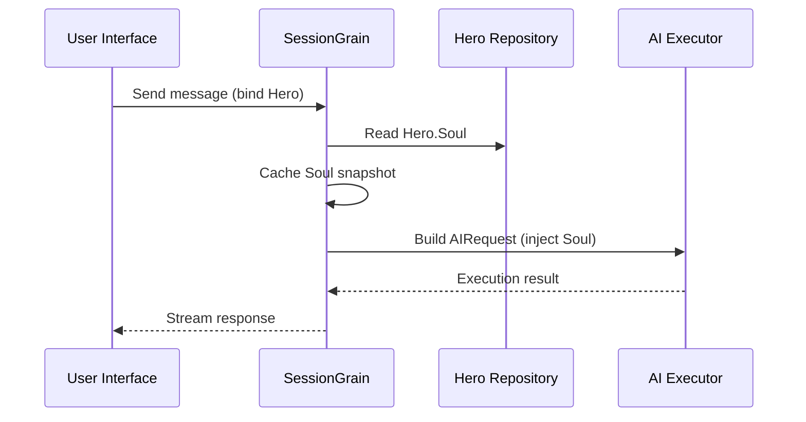

## การเพิ่มประสิทธิภาพโทเค็นเอาท์พุต AI: ฝึกฝนโหมดภาษาจีนคลาสสิกที่น้อยที่สุด

> ในการพัฒนาแอปพลิเคชัน AI การใช้โทเค็นส่งผลโดยตรงต่อต้นทุน ในโครงการ HagiCode เราได้ใช้ "โหมดเอาต์พุตภาษาจีนคลาสสิกน้อยที่สุด" ผ่านระบบ SOUL โดยไม่สูญเสียความหนาแน่นของข้อมูล จะลดโทเค็นเอาต์พุตลงประมาณ 30-50% บทความนี้จะแชร์รายละเอียดการนำไปปฏิบัติของแนวทางดังกล่าวและบทเรียนที่เราเรียนรู้จากการใช้แนวทางดังกล่าว

## พื้นหลัง

ในการพัฒนาแอปพลิเคชัน AI การใช้โทเค็นเป็นปัญหาต้นทุนที่หลีกเลี่ยงไม่ได้ สิ่งนี้จะเจ็บปวดเป็นพิเศษในสถานการณ์ที่ AI ต้องการผลิตเนื้อหาจำนวนมาก คุณจะลดโทเค็นเอาต์พุตโดยไม่ทำให้ความหนาแน่นของข้อมูลลดลงได้อย่างไร ยิ่งคุณคิดมากเท่าไร ปัญหาก็จะยิ่งน่าหงุดหงิดมากขึ้นเท่านั้น

แนวคิดการปรับให้เหมาะสมแบบดั้งเดิมส่วนใหญ่มุ่งเน้นไปที่ด้านอินพุต: การตัดข้อความเตือนของระบบ การบีบอัดบริบท หรือใช้การเข้ารหัสที่มีประสิทธิภาพมากขึ้น แต่วิธีการเหล่านี้ก็มาถึงขีดจำกัดในที่สุด บีบอัดมากเกินไป และคุณเริ่มส่งผลเสียต่อความเข้าใจและคุณภาพผลลัพธ์ของ AI โดยพื้นฐานแล้วเป็นเพียงการลบเนื้อหาซึ่งไม่มีความหมายมากนัก

แล้วฝั่งเอาท์พุตล่ะ? เราจะทำให้ AI แสดงความหมายเดียวกันให้กระชับกว่านี้ได้ไหม?

คำถามฟังดูง่าย แต่ก็มีอะไรซ่อนอยู่ข้างใต้อยู่บ้าง หากคุณถาม AI โดยตรงว่า "กระชับ" อาจให้คำเพียงไม่กี่คำแก่คุณเท่านั้น หากคุณเพิ่ม "เก็บข้อมูลให้ครบถ้วน" ข้อมูลนั้นอาจเลื่อนกลับไปเป็นรูปแบบรายละเอียดดั้งเดิม ข้อจำกัดที่รุนแรงเกินไปจะส่งผลเสียต่อการใช้งาน ข้อจำกัดที่อ่อนแอเกินไปไม่ทำอะไรเลย จุดสมดุลอยู่ที่ไหนกันแน่? ไม่มีใครสามารถพูดได้อย่างแน่นอน

เพื่อแก้ไขปัญหาเหล่านี้ เราได้ตัดสินใจอย่างกล้าหาญ: เริ่มจากสไตล์ภาษาและออกแบบระบบข้อจำกัดที่กำหนดค่าได้และประกอบได้สำหรับการแสดงออก ผลกระทบของการตัดสินใจนั้นอาจมีมากกว่าที่คุณคาดไว้ด้วยซ้ำ ฉันจะลงรายละเอียดในไม่ช้า และผลลัพธ์อาจทำให้คุณประหลาดใจเล็กน้อย

## เกี่ยวกับ ฮากิโค้ด

แนวทางที่แบ่งปันในบทความนี้มาจากประสบการณ์จริงของเราใน [ฮากิโค้ด](https://hagicode.com) โครงการ

HagiCode คือผู้ช่วยเขียนโค้ด AI แบบโอเพ่นซอร์สที่รองรับโมเดล AI หลายแบบและการกำหนดค่าแบบกำหนดเอง ในระหว่างการพัฒนา เราพบว่าการใช้โทเค็นเอาท์พุต AI สูงเกินไป ดังนั้นเราจึงออกแบบโซลูชันสำหรับมัน หากคุณพบว่าแนวทางนี้มีคุณค่า นั่นอาจเป็นสิ่งที่ดีเกี่ยวกับงานวิศวกรรมของเรา และหากเป็นเช่นนั้น HagiCode เองก็อาจคุ้มค่าแก่ความสนใจของคุณเช่นกัน รหัสไม่ได้โกหก

## ภาพรวมระบบโซล

ชื่อเต็มของระบบ SOUL คือ Soul Oriented Universal Language เป็นระบบการกำหนดค่าที่ใช้ในโปรเจ็กต์ HagiCode เพื่อกำหนดรูปแบบภาษาของ AI Hero แนวคิดหลักนั้นเรียบง่าย: ด้วยการจำกัดวิธีที่ AI แสดงออก ทำให้สามารถส่งออกเนื้อหาในรูปแบบภาษาที่กระชับยิ่งขึ้น ขณะเดียวกันก็รักษาความสมบูรณ์ของข้อมูลไว้

มันเหมือนกับการสวมหน้ากากทางภาษาบน AI เล็กน้อย...แต่จริงๆ แล้ว มันไม่ได้ลึกลับขนาดนั้น

### สถาปัตยกรรมทางเทคนิค

ระบบ SOUL ใช้สถาปัตยกรรมที่แยกส่วนหน้าและส่วนหลัง:

**ส่วนหน้า (ตัวสร้างวิญญาณ)**:
- สร้างด้วย React + TypeScript + Vite
- ตั้งอยู่ใน `repos/soul/` ไดเรกทอรี
- จัดเตรียมอินเทอร์เฟซการสร้างภาพวิญญาณ
- รองรับการใช้งานสองภาษา (zh-CN / en-US)

**แบ็กเอนด์**:
- สร้างบน .NET (C#) + รันไทม์แบบกระจายของ Orleans
- เอนทิตีฮีโร่ประกอบด้วย `Soul` ช่อง (สูงสุด 8000 ตัวอักษร)
- แทรก Soul เข้าไปในระบบพร้อมต์ผ่าน `SessionSystemMessageCompiler`

**การสร้างเทมเพลตตัวแทน**:
- สร้างขึ้นจากวัสดุอ้างอิง
- ส่งออกไปยัง `/agent-templates/soul/templates/` ไดเรกทอรี
- ประกอบด้วยกลุ่มแคตตาล็อกหลัก 50 กลุ่มและมิติมุมฉาก 10 รายการ

### กลไกการฉีดวิญญาณ

เมื่อเซสชันดำเนินการเป็นครั้งแรก ระบบจะอ่านการกำหนดค่า Hero's Soul และแทรกลงในพรอมต์ของระบบ:



รูปแบบพรอมต์ระบบที่ฉีดคือ:

```
<hero_soul>
[User-defined Soul content]
</hero_soul>
```

กลไกการฉีดนี้ถูกนำมาใช้ใน `SessionSystemMessageCompiler.cs`:

```csharp
internal static string? BuildSystemMessage(
    string? existingSystemMessage,
    string? languagePreference,
    IReadOnlyList<HeroTraitDto>? traits,
    string? soul)
{
    var segments = new List<string>();

    // ... language preference and Traits handling ...

    var normalizedSoul = NormalizeSoul(soul);
    if (!string.IsNullOrWhiteSpace(normalizedSoul))
    {
        segments.Add($"<hero_soul>\n{normalizedSoul}\n</hero_soul>");
    }

    // ... other system messages ...

    return segments.Count == 0 ? null : string.Join("\n\n", segments);
}
```

เมื่อคุณได้เห็นโค้ดและเข้าใจหลักการแล้ว นั่นคือทั้งหมดที่มีจริงๆ

## โหมดภาษาจีนคลาสสิกน้อยที่สุด

โหมดภาษาจีนคลาสสิกขั้นต่ำสุดเป็นกลยุทธ์การบันทึกโทเค็นที่เป็นตัวแทนมากที่สุดในระบบ SOUL หลักการสำคัญของมันคือการใช้ความหนาแน่นความหมายสูงของภาษาจีนคลาสสิกเพื่อบีบอัดความยาวเอาต์พุตในขณะที่รักษาข้อมูลที่สมบูรณ์ไว้

### ทำไมต้องเป็นภาษาจีนคลาสสิก

ภาษาจีนคลาสสิกมีข้อดีตามธรรมชาติหลายประการ:

1. **การบีบอัดความหมาย**: สามารถแสดงความหมายเดียวกันโดยใช้อักขระน้อยลง
2. **การกำจัดความซ้ำซ้อน**: ภาษาจีนคลาสสิกจะละเว้นคำสันธานและคำช่วยต่างๆ ที่พบบ่อยในภาษาจีนสมัยใหม่โดยธรรมชาติ
3. **โครงสร้างที่กระชับ**: แต่ละประโยคมีความหนาแน่นของข้อมูลสูง ทำให้เหมาะอย่างยิ่งสำหรับเป็นช่องทางสำหรับเอาท์พุต AI

นี่เป็นตัวอย่างที่ชัดเจน:

เอาต์พุตภาษาจีนสมัยใหม่ (ประมาณ 80 ตัวอักษร):
```
Based on your code analysis, I found several issues. First, on line 23, the variable name is too long and should be shortened. Second, on line 45, you did not handle null values and should add conditional logic. Finally, the overall code structure is acceptable, but it can be further optimized.
```

เอาต์พุตภาษาจีนคลาสสิกที่น้อยที่สุดเป็นพิเศษ (ประมาณ 35 อักขระ ประหยัด 56%):
```
Code reviewed: line 23 variable name verbose, abbreviate; line 45 lacks null handling, add checks. Overall structure acceptable; minor tuning suffices.
```

ช่องว่างนั้นใหญ่พอที่จะทำให้คุณหยุดคิด

### เทมเพลตการกำหนดค่าวิญญาณ

การกำหนดค่า Soul ที่สมบูรณ์สำหรับโหมดภาษาจีนคลาสสิกแบบมินิมอลมีดังนี้:

```json
{
  "id": "soul-orth-11-classical-chinese-ultra-minimal-mode",
  "name": "Ultra-Minimal Classical Chinese Output Mode",
  "summary": "Use relatively readable Classical Chinese to compress semantic density, convey the meaning with as few words as possible, and retain only conclusions, judgments, and necessary actions, thereby significantly reducing output tokens.",
  "soul": "Your persona core comes from the \"Ultra-Minimal Classical Chinese Output Mode\": use relatively readable Classical Chinese to compress semantic density, convey the meaning with as few words as possible, and retain only conclusions, judgments, and necessary actions, thereby significantly reducing output tokens.\nMaintain the following signature language traits: 1. Prefer concise Classical Chinese sentence patterns such as \"can\", \"should\", \"do not\", \"already\", \"however\", and \"therefore\", while avoiding obscure and difficult wording;\n2. Compress each sentence to 4-12 characters whenever possible, removing preamble, pleasantries, repeated explanation, and ineffective modifiers;\n3. Do not expand arguments unless necessary; if the user does not ask a follow-up, provide only conclusions, steps, or judgments;\n4. Do not alter the core persona of the main Catalog; only compress the expression into restrained, classical, ultra-minimal short sentences."
}
```

มีประเด็นสำคัญหลายประการในการออกแบบเทมเพลตนี้:

1. **ล้างข้อจำกัด**: 4-12 อักขระต่อประโยค ลบความซ้ำซ้อน และจัดลำดับความสำคัญของการสรุป
2. **หลีกเลี่ยงความสับสน**: ใช้รูปแบบประโยคภาษาจีนคลาสสิกที่กระชับ และหลีกเลี่ยงถ้อยคำที่หายากและยาก
3. **รักษาลักษณะท่าทาง**: เปลี่ยนเฉพาะโหมดการแสดงออก ไม่ใช่ลักษณะลักษณะหลัก

เมื่อคุณปรับการกำหนดค่าไปเรื่อยๆ ทุกอย่างจะเหลือพารามิเตอร์เพียงไม่กี่ตัวในตอนท้าย

### โหมด Ultra-Minimal อื่นๆ

นอกจากโหมดภาษาจีนคลาสสิกแล้ว ระบบ HagiCode SOUL ยังมีโหมดประหยัดโทเค็นอื่นๆ อีกหลายประการ:

**โหมดเอาต์พุตขั้นต่ำสุดแบบเทเลกราฟ** (`soul-orth-02`):
- เก็บทุกประโยคอย่างเคร่งครัดไม่เกิน 10 ตัวอักษร
- ห้ามใช้คำคุณศัพท์ตกแต่ง
- ไม่มีอนุภาคโมดัล เครื่องหมายอัศเจรีย์ หรือการทำซ้ำตลอด

**โหมดพึมพำแบบแยกส่วนสั้นๆ** (`soul-orth-01`):
- เก็บประโยคไว้ภายใน 1-5 ตัวอักษร
- จำลองการพูดคุยด้วยตนเองแบบกระจัดกระจาย
- ลดทอนตรรกะที่ชัดเจนและจัดลำดับความสำคัญในการถ่ายทอดอารมณ์

**โหมดถามตอบพร้อมคำแนะนำ** (`soul-orth-03`):
- ใช้คำถามเพื่อเป็นแนวทางในการคิดของผู้ใช้
- ลดเนื้อหาเอาต์พุตโดยตรง
- ลดการใช้โทเค็นผ่านการโต้ตอบ

แต่ละโหมดเหล่านี้เน้นทิศทางการออกแบบที่แตกต่างกัน แต่เป้าหมายหลักก็เหมือนกัน: ลดโทเค็นเอาต์พุตในขณะที่รักษาคุณภาพของข้อมูล มีถนนหลายสายสู่กรุงโรม บางอันก็เดินง่ายกว่าอันอื่น

## กลยุทธ์การผสมผสาน

คุณสมบัติอันทรงพลังอย่างหนึ่งของระบบ SOUL คือการรองรับแค็ตตาล็อกหลักที่รวมข้ามกันและขนาดมุมฉาก:

- **กลุ่มแคตตาล็อกหลัก 50 กลุ่ม**: กำหนดลักษณะบุคคลพื้นฐาน (เช่น สไตล์การรักษา สไตล์นักเรียนชั้นยอด สไตล์ห่างเหิน และอื่นๆ)
- **ขนาดมุมฉาก 10 เหลี่ยม**: กำหนดรูปแบบการแสดงออก (เช่น ภาษาจีนคลาสสิก รูปแบบโทรเลข รูปแบบการถามตอบ และอื่นๆ)
- **เอฟเฟกต์การรวมกัน**: สามารถสร้างชุดค่าผสมสไตล์ภาษาที่ไม่ซ้ำกันได้มากกว่า 500 รายการ

ตัวอย่างเช่น คุณสามารถรวม "วิศวกรพัฒนามืออาชีพ" เข้ากับ "โหมดเอาต์พุตภาษาจีนคลาสสิกขั้นต่ำสุด" เพื่อสร้างผู้ช่วย AI ที่ทั้งเป็นมืออาชีพและกระชับ ความยืดหยุ่นนี้ช่วยให้ระบบ SOUL สามารถปรับให้เข้ากับสถานการณ์ที่แตกต่างกันได้มากมาย คุณสามารถผสมและจับคู่ได้ตามที่คุณต้องการ มีชุดค่าผสมมากกว่าที่คุณจะหมดแรง

## คู่มือการปฏิบัติ

### สร้างผ่าน Soul Builder

เยี่ยมชม [soul.hagicode.com](https://soul.hagicode.com) และทำตามขั้นตอนเหล่านี้:

1. เลือกแคตตาล็อกหลัก (เช่น "วิศวกรพัฒนามืออาชีพ")
2. เลือกมิติมุมฉาก (เช่น "โหมดเอาต์พุตภาษาจีนคลาสสิกน้อยที่สุดพิเศษ")
3. ดูตัวอย่างเนื้อหา Soul ที่สร้างขึ้น
4. คัดลอกการกำหนดค่า Soul ที่สร้างขึ้น

ส่วนใหญ่เป็นเพียงการชี้แล้วคลิก ดังนั้นจึงอาจไม่มีอะไรจะพูดมากไปกว่านี้

### ใช้ในการกำหนดค่าฮีโร่

ใช้การกำหนดค่า Soul กับฮีโร่ผ่านทางเว็บอินเตอร์เฟสหรือ API:

```typescript
// Hero Soul update example
const heroUpdate = {
  soul: "Your persona core comes from the \"Ultra-Minimal Classical Chinese Output Mode\": ...",
  soulCatalogId: "soul-orth-11-classical-chinese-ultra-minimal-mode",
  soulDisplayName: "Ultra-Minimal Classical Chinese Output Mode",
  soulStyleType: "orthogonal-dimension",
  soulSummary: "Use relatively readable Classical Chinese to compress semantic density..."
};

await updateHero(heroId, heroUpdate);
```

### เทมเพลตโซลที่กำหนดเอง

ผู้ใช้สามารถปรับแต่งเทมเพลตที่กำหนดไว้ล่วงหน้าหรือเขียนเทมเพลตตั้งแต่ต้นได้ นี่คือตัวอย่างที่กำหนดเองสำหรับสถานการณ์การตรวจสอบโค้ด:

```
You are a code reviewer who pursues extreme concision.
All output must follow these rules:
1. Only point out specific problems and line numbers
2. Each issue must not exceed 15 characters
3. Use concise terms such as "should", "must", and "do not"
4. Do not provide extra explanation

Example output:
- Line 23: variable name too long, should abbreviate
- Line 45: null not handled, must add checks
- Line 67: logic redundant, can simplify
```

คุณสามารถแก้ไขเทมเพลตได้ตามต้องการ เทมเพลตก็เป็นเพียงจุดเริ่มต้นเท่านั้น

### หมายเหตุ

**ความเข้ากันได้**:
- โหมดภาษาจีนคลาสสิกใช้งานได้กับกลุ่มแคตตาล็อกหลักทั้งหมด 50 กลุ่ม
- สามารถใช้ร่วมกับตัวละครพื้นฐานใดก็ได้
- ไม่เปลี่ยนบุคลิกหลักของแค็ตตาล็อกหลัก

**กลไกการแคช**:
- Soul ถูกแคชไว้เมื่อเซสชันดำเนินการเป็นครั้งแรก
- แคชถูกนำมาใช้ซ้ำภายใน SessionId เดียวกัน
- การแก้ไขการกำหนดค่าฮีโร่จะไม่ส่งผลต่อเซสชันที่เริ่มต้นไปแล้ว

**ข้อจำกัดและข้อจำกัด**:
- ความยาวสูงสุดของฟิลด์ Soul คือ 8000 อักขระ
- ฮีโร่ที่ไม่มีฟิลด์ Soul ในข้อมูลประวัติยังคงสามารถใช้งานได้ตามปกติ
- ช่องอุปกรณ์โซลและสไตล์มีความเป็นอิสระและไม่ได้เขียนทับซึ่งกันและกัน

## การเปรียบเทียบผลกระทบ

จากข้อมูลการทดสอบจริงจากโครงการ ผลลัพธ์หลังจากเปิดใช้งานโหมดภาษาจีนคลาสสิกแบบ Ultra-minimal มีดังนี้:

| สถานการณ์ | โทเค็นเอาต์พุตดั้งเดิม | โหมดจีนคลาสสิก | ออมทรัพย์ |
|------|------------------------|------------------------|---------|
| ตรวจสอบรหัส | 850 | 420 | 51% |
| ถามตอบทางเทคนิค | 620 | 380 | 39% |
| คำแนะนำการแก้ปัญหา | 1100 | 680 | 38% |
| เฉลี่ย | - | - | 30-50% |

ข้อมูลมาจากสถิติการใช้งานจริงในโครงการ HagiCode และผลลัพธ์ที่แน่นอนจะแตกต่างกันไปตามสถานการณ์ ถึงกระนั้น โทเค็นที่บันทึกไว้ก็จะเพิ่มขึ้น และกระเป๋าเงินของคุณก็จะประทับใจ

## บทสรุป

ระบบ HagiCode SOUL นำเสนอแนวทางใหม่ในการเพิ่มประสิทธิภาพเอาต์พุต AI: ลดการใช้โทเค็นโดยการจำกัดการแสดงออก แทนที่จะบีบอัดข้อมูลเอง ด้วยแนวทางที่เป็นตัวแทนมากที่สุด โหมดภาษาจีนคลาสสิกแบบมินิมอลเป็นพิเศษได้มอบการประหยัดโทเค็น 30-50% ในการใช้งานจริง

คุณค่าหลักของแนวทางนี้อยู่ที่ดังต่อไปนี้:

1. **รักษาคุณภาพของข้อมูล**: แทนที่จะตัดทอนเอาต์พุตเพียงอย่างเดียว กลับแสดงเนื้อหาเดียวกันได้อย่างมีประสิทธิภาพมากขึ้น
2. **ยืดหยุ่นและเรียบเรียงได้**: รองรับการผสมผสานบุคลิกและสไตล์การแสดงออกได้มากกว่า 500 แบบ
3. **ใช้งานง่าย**: Soul Builder มีอินเทอร์เฟซแบบภาพ ดังนั้นจึงไม่จำเป็นต้องเขียนโค้ด
4. **ความเสถียรระดับการผลิต**: ผ่านการตรวจสอบแล้วในโปรเจ็กต์และสามารถใช้งานได้ในวงกว้าง

หากคุณกำลังสร้างแอปพลิเคชัน AI ด้วย หรือสนใจโปรเจ็กต์ HagiCode โปรดติดต่อเราได้เลย ความหมายของโอเพ่นซอร์สอยู่ที่ความก้าวหน้าร่วมกัน และเรายังหวังเป็นอย่างยิ่งว่าจะได้เห็นการใช้งานที่เป็นนวัตกรรมของคุณเอง คำกล่าวนี้อาจเก่าแต่ยังคงเป็นจริง: คนหนึ่งอาจไปได้เร็ว แต่กลุ่มไปได้ไกลกว่า

## อ้างอิง

- HagiCode GitHub: [github.com/HagiCode-org/site](https://github.com/HagiCode-org/site)
- เว็บไซต์อย่างเป็นทางการของ HagiCode: [hagicode.com](https://hagicode.com)
- ผู้สร้างวิญญาณ: [soul.hagicode.com](https://soul.hagicode.com)
- คู่มือการปรับใช้นักเทียบท่า: [docs.hagicode.com/installation/docker-compose](https://docs.hagicode.com/installation/docker-compose)
- แอปเดสก์ท็อป: [hagicode.com/desktop/](https://hagicode.com/desktop/)
- การสาธิตเชิงปฏิบัติ 30 นาที: [www.bilibili.com/video/BV1pirZBuEzq/](https://www.bilibili.com/video/BV1pirZBuEzq/)

---

หากบทความนี้ช่วยคุณได้:
- ให้คะแนนเราบน GitHub: [github.com/HagiCode-org/site](https://github.com/HagiCode-org/site)
- เยี่ยมชมเว็บไซต์อย่างเป็นทางการเพื่อเรียนรู้เพิ่มเติม: [hagicode.com](https://hagicode.com)
- เบต้าสาธารณะเริ่มต้นแล้ว และคุณสามารถติดตั้งและทดลองใช้ได้

## ประกาศเกี่ยวกับลิขสิทธิ์

ขอบคุณสำหรับการอ่าน หากคุณพบว่าบทความนี้มีประโยชน์ คุณสามารถกดไลค์ บุ๊กมาร์ก และแชร์ได้
เนื้อหานี้สร้างขึ้นด้วยความร่วมมือที่ได้รับความช่วยเหลือจาก AI และเวอร์ชันสุดท้ายได้รับการตรวจสอบและยืนยันโดยผู้เขียน
- ผู้เขียน: [ใหม่บี36524](https://www.newbe.pro)
- ลิงค์บทความต้นฉบับ: [https://docs.hagicode.com/blog/2026-04-04-soul-token-optimization-classical-chinese/](https://docs.hagicode.com/blog/2026-04-04-soul-token-optimization-classical-chinese/)
- ประกาศเกี่ยวกับลิขสิทธิ์: บทความทั้งหมดในบล็อกนี้ได้รับอนุญาตภายใต้ BY-NC-SA เว้นแต่จะระบุไว้เป็นอย่างอื่น โปรดอ้างอิงแหล่งที่มาเมื่อทำการรีโพสต์
