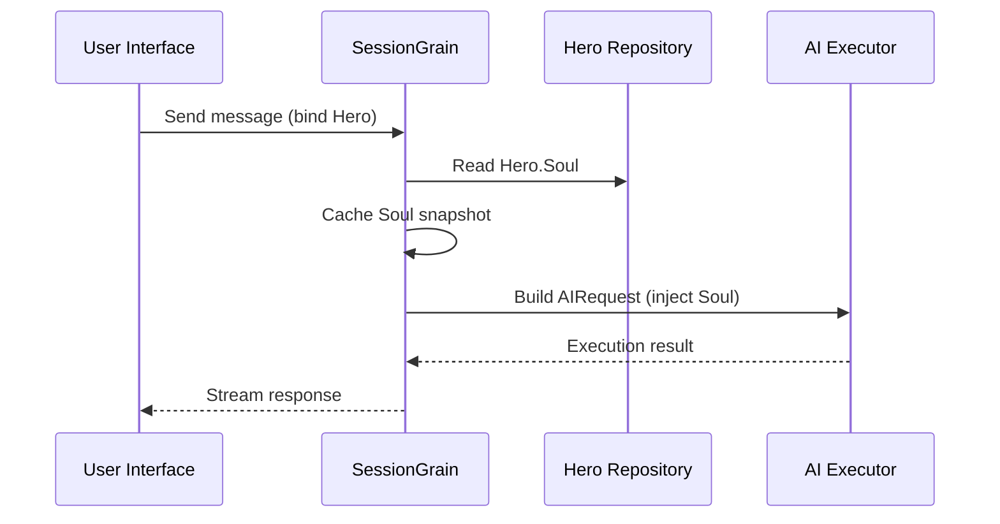

## AI Çıkış Token Optimizasyonu: Ultra Minimal Klasik Çin Modu Uygulaması

> Yapay zeka uygulama geliştirmede token tüketimi maliyeti doğrudan etkiler. HagiCode projesinde SOUL sistemi aracılığıyla "ultra minimum Klasik Çince çıktı modunu" uyguladık. Bilgi yoğunluğundan ödün vermeden çıktı tokenlarını yaklaşık %30-50 oranında azaltır. Bu makale, bu yaklaşımın uygulama ayrıntılarını ve onu kullanarak öğrendiğimiz dersleri paylaşıyor.

## Arka plan

Yapay zeka uygulama geliştirmede token tüketimi kaçınılmaz bir maliyet sorunudur. Bu, özellikle yapay zekanın büyük miktarlarda içerik üretmesi gereken senaryolarda acı verici hale geliyor. Bilgi yoğunluğundan ödün vermeden çıktı jetonlarını nasıl azaltırsınız? Üzerinde ne kadar çok düşünürseniz, sorun o kadar sinir bozucu hale gelebilir.

Geleneksel optimizasyon fikirleri çoğunlukla girdi tarafına odaklanır: sistem istemlerini kırpmak, bağlamı sıkıştırmak veya daha verimli kodlama kullanmak. Ancak bu yöntemler sonunda tavan yaptı. Sıkıştırmayı çok ileri götürürseniz yapay zekanın anlama ve çıktı kalitesine zarar vermeye başlarsınız. Bu aslında sadece içeriğin silinmesidir ve bu pek anlamlı değildir.

Peki çıktı tarafı ne olacak? Yapay zekanın aynı anlamı daha net ifade etmesini sağlayabilir miyiz?

Soru basit gibi görünse de altında pek çok şey gizlidir. Yapay zekadan doğrudan "özlü olmasını" isterseniz, size gerçekten yalnızca birkaç kelime verebilir. "Bilgiyi eksiksiz tutun" ifadesini eklerseniz orijinal ayrıntılı stile geri dönülebilir. Çok güçlü kısıtlamalar kullanılabilirliğe zarar verir; çok zayıf kısıtlamalar hiçbir şey yapmaz. Denge noktası tam olarak nerede? Kimse kesin olarak söyleyemez.

Bu sıkıntılı noktaları çözmek için cesur bir karar aldık: dil stilinin kendisinden yola çıktık ve ifade için yapılandırılabilir, birleştirilebilir bir kısıtlama sistemi tasarladık. Bu kararın etkisi beklediğinizden daha büyük olabilir. Birazdan ayrıntılara gireceğim, sonuç sizi biraz şaşırtabilir.

## HagiCode Hakkında

Bu makalede paylaşılan yaklaşım, uygulamadaki deneyimlerimizden gelmektedir. [Hagi Kodu](https://hagicode.com) proje.

HagiCode, birden fazla AI modelini ve özel yapılandırmayı destekleyen açık kaynaklı bir AI kodlama yardımcısıdır. Geliştirme sırasında AI çıkış token kullanımının çok yüksek olduğunu keşfettik ve buna yönelik bir çözüm tasarladık. Bu yaklaşımı değerli buluyorsanız, bu muhtemelen mühendislik çalışmalarımız hakkında iyi şeyler söylüyordur. Ve eğer durum buysa, HagiCode'un kendisi de ilginize değer olabilir. Kod yalan söylemez.

## SOUL Sistemine Genel Bakış

SOUL sisteminin tam adı Ruh Odaklı Evrensel Dil'dir. Bir AI Hero'nun dil stilini tanımlamak için HagiCode projesinde kullanılan konfigürasyon sistemidir. Temel fikri basit: Yapay zekanın kendisini ifade etme biçimini kısıtlayarak, bilgi bütünlüğünü korurken içeriği daha kısa bir dilsel biçimde üretebilir.

Bu biraz yapay zekaya dilsel bir maske takmaya benziyor... gerçi dürüst olmak gerekirse o kadar da mistik değil.

### Teknik Mimari

SOUL sistemi ön uç-arka uçtan ayrılmış bir mimari kullanır:

**Ön uç (Ruh Oluşturucu)**:
- React + TypeScript + Vite ile oluşturuldu
- Bulunan `repos/soul/` dizin
- Görsel bir Ruh oluşturma arayüzü sağlar
- İki dilli kullanımı destekler (zh-CN / en-US)

**Arka uç**:
- .NET (C#) + Orleans dağıtılmış çalışma zamanı üzerine kurulmuştur
- Kahraman varlığı şunları içerir: `Soul` alan (maksimum 8000 karakter)
- Soul'u sisteme istem yoluyla enjekte eder `SessionSystemMessageCompiler`

**Ajan Şablonları oluşturma**:
- Referans materyallerden üretilmiştir
- Çıkış `/agent-templates/soul/templates/` dizin
- 50 ana Katalog grubu ve 10 ortogonal boyut içerir

### Ruh Enjeksiyon Mekanizması

Bir Oturum ilk kez yürütüldüğünde, sistem Kahramanın Ruhu yapılandırmasını okur ve bunu sistem istemine enjekte eder:



Enjekte edilen sistem istemi formatı şöyledir:

```
<hero_soul>
[User-defined Soul content]
</hero_soul>
```

Bu enjeksiyon mekanizması şu şekilde uygulanır: `SessionSystemMessageCompiler.cs`:

```csharp
internal static string? BuildSystemMessage(
    string? existingSystemMessage,
    string? languagePreference,
    IReadOnlyList<HeroTraitDto>? traits,
    string? soul)
{
    var segments = new List<string>();

    // ... language preference and Traits handling ...

    var normalizedSoul = NormalizeSoul(soul);
    if (!string.IsNullOrWhiteSpace(normalizedSoul))
    {
        segments.Add($"<hero_soul>\n{normalizedSoul}\n</hero_soul>");
    }

    // ... other system messages ...

    return segments.Count == 0 ? null : string.Join("\n\n", segments);
}
```

Kodu gördüğünüzde ve prensibi anladığınızda, aslında hepsi bu kadar.

## Ultra Minimal Klasik Çin Modu

Ultra minimal Klasik Çin modu, SOUL sistemindeki en temsili jeton tasarrufu stratejisidir. Temel ilkesi, tüm bilgiyi korurken çıktı uzunluğunu sıkıştırmak için Klasik Çincenin yüksek anlamsal yoğunluğunu kullanmaktır.

### Neden Klasik Çince

Klasik Çincenin birçok doğal avantajı vardır:

1. **Anlamsal sıkıştırma**: Aynı anlam daha az karakterle ifade edilebilir.
2. **Fazlalıkların kaldırılması**: Klasik Çince doğal olarak modern Çincede yaygın olan birçok bağlacı ve parçacığı atlar.
3. **Kısa yapı**: Her cümle yüksek bilgi yoğunluğu taşır ve bu da onu yapay zeka çıktısı için bir araç olarak çok uygun hale getirir.

İşte somut bir örnek:

Modern Çince çıktı (yaklaşık 80 karakter):
```
Based on your code analysis, I found several issues. First, on line 23, the variable name is too long and should be shortened. Second, on line 45, you did not handle null values and should add conditional logic. Finally, the overall code structure is acceptable, but it can be further optimized.
```

Ultra minimum Klasik Çince çıktı (yaklaşık 35 karakter, %56 tasarruf):
```
Code reviewed: line 23 variable name verbose, abbreviate; line 45 lacks null handling, add checks. Overall structure acceptable; minor tuning suffices.
```

Boşluk sizi durdurup düşündürecek kadar büyük.

### Soul Yapılandırma Şablonu

Ultra minimal Klasik Çin modu için tam Soul konfigürasyonu aşağıdaki gibidir:

```json
{
  "id": "soul-orth-11-classical-chinese-ultra-minimal-mode",
  "name": "Ultra-Minimal Classical Chinese Output Mode",
  "summary": "Use relatively readable Classical Chinese to compress semantic density, convey the meaning with as few words as possible, and retain only conclusions, judgments, and necessary actions, thereby significantly reducing output tokens.",
  "soul": "Your persona core comes from the \"Ultra-Minimal Classical Chinese Output Mode\": use relatively readable Classical Chinese to compress semantic density, convey the meaning with as few words as possible, and retain only conclusions, judgments, and necessary actions, thereby significantly reducing output tokens.\nMaintain the following signature language traits: 1. Prefer concise Classical Chinese sentence patterns such as \"can\", \"should\", \"do not\", \"already\", \"however\", and \"therefore\", while avoiding obscure and difficult wording;\n2. Compress each sentence to 4-12 characters whenever possible, removing preamble, pleasantries, repeated explanation, and ineffective modifiers;\n3. Do not expand arguments unless necessary; if the user does not ask a follow-up, provide only conclusions, steps, or judgments;\n4. Do not alter the core persona of the main Catalog; only compress the expression into restrained, classical, ultra-minimal short sentences."
}
```

Bu şablon tasarımında birkaç önemli nokta vardır:

1. **Kısıtlamaları temizleyin**: Cümle başına 4-12 karakter, fazlalığı kaldırın, sonuçlara öncelik verin.
2. **Belirsizlikten kaçının**: Kısa ve öz Klasik Çince cümle kalıpları kullanın ve nadir, zor ifadelerden kaçının.
3. **Kişiliği koruyun**: Temel kişiliği değil, yalnızca ifade tarzını değiştirin.

Yapılandırmayı ayarlamaya devam ettiğinizde, sonuçta her şey birkaç parametreye indirgenir.

### Diğer Ultra Minimal Modlar

HagiCode SOUL sistemi, Klasik Çin modunun yanı sıra birkaç başka jeton tasarruf modu da sağlar:

**Telgraf tarzı ultra minimum çıkış modu** (`soul-orth-02`):
- Her cümleyi kesinlikle 10 karakter dahilinde tutun
- Dekoratif sıfatları yasakla
- Hiçbir modal parçacık, ünlem işareti veya yineleme yok

**Kısa parçalı mırıldanma modu** (`soul-orth-01`):
- Cümleleri 1-5 karakter arasında tutun
- Parçalanmış kendi kendine konuşmayı simüle edin
- Açık mantığı zayıflatın ve duygusal aktarıma öncelik verin

**Yönlendirmeli Soru-Cevap modu** (`soul-orth-03`):
- Kullanıcının düşünmesine rehberlik edecek sorular kullanın
- Doğrudan çıktı içeriğini azaltın
- Etkileşim yoluyla daha düşük token kullanımı

Bu modların her biri farklı bir tasarım yönünü vurgular ancak temel amaç aynıdır: bilgi kalitesini korurken çıktı tokenlarını azaltmak. Roma'ya giden birçok yol var; bazılarının yürümesi diğerlerinden daha kolaydır.

## Kombinasyon Stratejisi

SOUL sisteminin güçlü bir özelliği, ana Katalogları ve ortogonal boyutları çapraz birleştirme desteğidir:

- **50 ana Katalog grubu**: temel kişiliği tanımlayın (iyileştirme stili, en iyi öğrenci stili, uzak stil vb. gibi)
- **10 ortogonal boyut**: ifade tarzını tanımlayın (Klasik Çince, telgraf stili, Soru-Cevap stili vb. gibi)
- **Kombinasyon etkisi**: 500'den fazla benzersiz dil stili kombinasyonu oluşturabilir

Örneğin, hem profesyonel hem de özlü bir yapay zeka asistanı oluşturmak için "Profesyonel Geliştirme Mühendisi"ni "Ultra Minimal Klasik Çince Çıktı Modu" ile birleştirebilirsiniz. Bu esneklik, SOUL sisteminin birçok farklı senaryoya uyum sağlamasına olanak tanır. İstediğiniz gibi karıştırıp eşleştirebilirsiniz; tüketebileceğinizden daha fazla kombinasyon var.

## Pratik Kılavuz

### Soul Builder Aracılığıyla Oluşturun

Ziyaret edin [soul.hagicode.com](https://soul.hagicode.com) ve şu adımları izleyin:

1. Bir ana Katalog seçin (örneğin, "Mesleki Gelişim Mühendisi")
2. Dik bir boyut seçin (örneğin, "Ultra Minimal Klasik Çince Çıktı Modu")
3. Oluşturulan Soul içeriğini önizleyin
4. Oluşturulan Soul konfigürasyonunu kopyalayın

Çoğunlukla sadece işaretle ve tıkla, dolayısıyla muhtemelen söylenecek fazla bir şey yok.

### Kahraman Yapılandırmasında Kullan

Soul yapılandırmasını web arayüzü veya API aracılığıyla bir Hero'ya uygulayın:

```typescript
// Hero Soul update example
const heroUpdate = {
  soul: "Your persona core comes from the \"Ultra-Minimal Classical Chinese Output Mode\": ...",
  soulCatalogId: "soul-orth-11-classical-chinese-ultra-minimal-mode",
  soulDisplayName: "Ultra-Minimal Classical Chinese Output Mode",
  soulStyleType: "orthogonal-dimension",
  soulSummary: "Use relatively readable Classical Chinese to compress semantic density..."
};

await updateHero(heroId, heroUpdate);
```

### Özel Soul Şablonları

Kullanıcılar önceden ayarlanmış bir şablona ince ayar yapabilir veya sıfırdan bir şablon yazabilir. Aşağıda kod inceleme senaryosuna yönelik özel bir örnek verilmiştir:

```
You are a code reviewer who pursues extreme concision.
All output must follow these rules:
1. Only point out specific problems and line numbers
2. Each issue must not exceed 15 characters
3. Use concise terms such as "should", "must", and "do not"
4. Do not provide extra explanation

Example output:
- Line 23: variable name too long, should abbreviate
- Line 45: null not handled, must add checks
- Line 67: logic redundant, can simplify
```

Şablonu dilediğiniz gibi revize edebilirsiniz. Bir şablon zaten yalnızca bir başlangıç noktasıdır.

### Notlar

**Uyumluluk**:
- Klasik Çince modu 50 ana Katalog grubunun tamamıyla çalışır
- Herhangi bir temel karakterle birleştirilebilir
- Ana Kataloğun temel kişiliğini değiştirmez

**Önbelleğe alma mekanizması**:
- Oturum ilk kez yürütüldüğünde Soul önbelleğe alınır
- Önbellek aynı SessionId içinde yeniden kullanılır
- Hero yapılandırmasını değiştirmek, halihazırda başlamış olan Oturumları etkilemez

**Kısıtlamalar ve sınırlar**:
- Soul alanının maksimum uzunluğu 8000 karakterdir
- Geçmiş verilerde Ruh alanı bulunmayan kahramanlar hâlâ normal şekilde kullanılabilir
- Ruh ve stil ekipmanı yuvaları bağımsızdır ve birbirlerinin üzerine yazılmaz

## Efekt Karşılaştırması

Projeden elde edilen gerçek test verilerine göre, ultra minimum Klasik Çince modunun etkinleştirilmesinden sonraki sonuçlar aşağıdaki gibidir:

| Senaryo | Orijinal çıktı jetonları | Klasik Çin modu | Tasarruf |
|------|------------------------|------------------------|---------|
| Kod incelemesi | 850 | 420 | 51% |
| Teknik Soru-Cevap | 620 | 380 | 39% |
| Çözüm önerileri | 1100 | 680 | 38% |
| Ortalama | - | - | 30-50% |

Veriler HagiCode projesindeki gerçek kullanım istatistiklerinden gelir ve kesin sonuçlar senaryoya göre değişir. Yine de kaydedilen jetonlar birikecek ve cüzdanınız bunu takdir edecektir.

## Sonuç

HagiCode SOUL sistemi, yapay zeka çıktısını optimize etmek için yenilikçi bir yol sunar: bilginin kendisini sıkıştırmak yerine ifadeyi kısıtlayarak jeton tüketimini azaltın. En temsili yaklaşım olarak ultra minimal Klasik Çin modu, gerçek dünya kullanımında %30-50 token tasarrufu sağladı.

Bu yaklaşımın temel değeri şudur:

1. **Bilgi kalitesini koruyun**: Çıktıyı basitçe kısaltmak yerine aynı içeriği daha verimli bir şekilde ifade eder.
2. **Esnek ve şekillendirilebilir**: 500'den fazla kişilik ve ifade stili kombinasyonunu destekler.
3. **Kullanımı kolay**: Soul Builder görsel bir arayüz sağladığından kodlamaya gerek yoktur.
4. **Üretim düzeyinde kararlılık**: projede doğrulanmıştır ve büyük ölçekli kullanıma uygundur.

Siz de yapay zeka uygulamaları geliştiriyorsanız veya HagiCode projesiyle ilgileniyorsanız bizimle iletişime geçmekten çekinmeyin. Açık kaynağın anlamı birlikte ilerlemektir ve sizin de yenilikçi kullanımlarınızı görmek için sabırsızlanıyoruz. Bu söz eski olabilir ama geçerliliğini koruyor: Bir kişi hızlı gidebilir, ancak bir grup daha ileri gider.

## Referanslar

- HagiCode GitHub: [github.com/HagiCode-org/site](https://github.com/HagiCode-org/site)
- HagiCode'un resmi sitesi: [hagicode.com](https://hagicode.com)
- Ruh Oluşturucu: [soul.hagicode.com](https://soul.hagicode.com)
- Docker dağıtım kılavuzu: [docs.hagicode.com/installation/docker-compose](https://docs.hagicode.com/installation/docker-compose)
- Masaüstü uygulaması: [hagicode.com/desktop/](https://hagicode.com/desktop/)
- 30 dakikalık uygulamalı demo: [www.bilibili.com/video/BV1pirZBuEzq/](https://www.bilibili.com/video/BV1pirZBuEzq/)

---

Bu makale size yardımcı olduysa:
- GitHub'da bize bir Yıldız verin: [github.com/HagiCode-org/site](https://github.com/HagiCode-org/site)
- Daha fazla bilgi edinmek için resmi siteyi ziyaret edin: [hagicode.com](https://hagicode.com)
- Herkese açık beta başladı; yükleyip deneyebilirsiniz

## Telif Hakkı Uyarısı

Okuduğunuz için teşekkür ederiz. Bu makaleyi faydalı bulduysanız beğenebilir, favorilerinize ekleyebilir ve paylaşabilirsiniz.
Bu içerik yapay zeka destekli işbirliğiyle oluşturuldu ve son sürüm, yazar tarafından incelenip onaylandı.
- Yazar: [yenibe36524](https://www.newbe.pro)
- Orijinal makale linki: [https://docs.hagicode.com/blog/2026-04-04-soul-token-optimization-classical-chinese/](https://docs.hagicode.com/blog/2026-04-04-soul-token-optimization-classical-chinese/)
- Telif hakkı uyarısı: Aksi belirtilmediği sürece bu blogdaki tüm makaleler BY-NC-SA kapsamında lisanslıdır. Lütfen yeniden yayınlarken kaynak belirtin.
