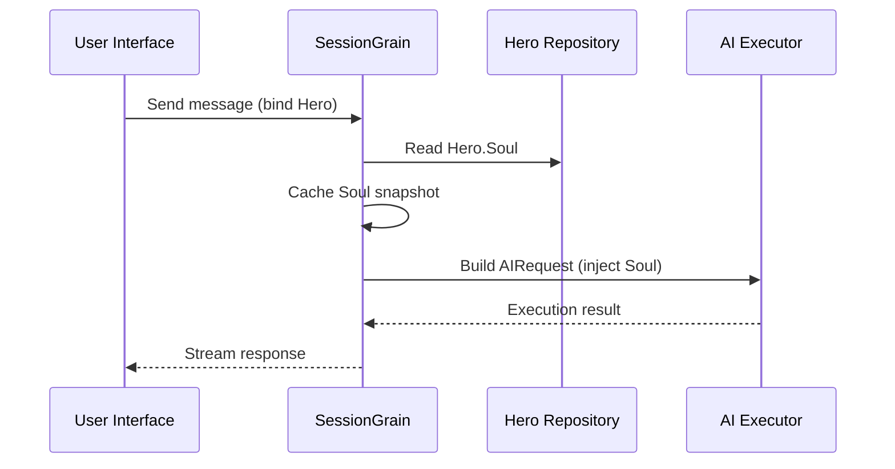

## Оптимізація маркерів виводу штучного інтелекту: практика надмінімального режиму класичної китайської мови

> У розробці додатків ШІ споживання токенів безпосередньо впливає на вартість. У проекті HagiCode ми реалізували «надмінімальний режим виведення класичної китайської мови» через систему SOUL. Без шкоди для щільності інформації він зменшує вихідні токени приблизно на 30-50%. У цій статті розповідається про деталі реалізації цього підходу та уроки, які ми отримали з його використання.

## Фон

У розробці додатків ШІ споживання токенів є неминучою проблемою витрат. Це стає особливо болючим у сценаріях, коли штучному інтелекту потрібно створити велику кількість вмісту. Як зменшити вихідні токени без шкоди для щільності інформації? Чим більше ви думаєте про це, тим більше розчаровує проблема.

Традиційні ідеї оптимізації здебільшого зосереджені на стороні введення: обрізання системних підказок, стиснення контексту або використання більш ефективного кодування. Але ці методи з часом досягають стелі. Завищуйте стиснення, і ви почнете шкодити розумінню ШІ та якості виводу. Це просто видалення вмісту, що не має сенсу.

А як щодо вихідної сторони? Чи можемо ми змусити штучний інтелект виражати те саме значення більш стисло?

Питання звучить просто, але під ним приховано чимало. Якщо ви прямо попросите ШІ «бути лаконічним», він дійсно може дати вам лише кілька слів. Якщо ви додасте «зберігати повну інформацію», він може повернутися до оригінального багатослівного стилю. Надто сильні обмеження шкодять зручності використання; занадто слабкі обмеження нічого не роблять. Де саме знаходиться точка балансу? Ніхто не може сказати точно.

Щоб вирішити ці проблеми, ми прийняли сміливе рішення: почніть із самого мовного стилю та розробіть конфігуровану, складну систему обмежень для вираження. Вплив цього рішення може бути навіть більшим, ніж ви очікуєте. Незабаром я розповім про подробиці, і результат може вас трохи здивувати.

## Про HagiCode

Підхід, поширений у цій статті, базується на нашому практичному досвіді в [HagiCode](https://hagicode.com) проект.

HagiCode — це помічник кодування штучного інтелекту з відкритим кодом, який підтримує кілька моделей штучного інтелекту та спеціальну конфігурацію. Під час розробки ми виявили, що вихідні маркери штучного інтелекту використовувалися занадто високо, тому ми розробили рішення для цього. Якщо ви вважаєте цей підхід цінним, це, ймовірно, говорить щось хороше про нашу інженерну роботу. І якщо це так, сам HagiCode також може бути вартий вашої уваги. Код не бреше.

## Огляд системи SOUL

Повна назва системи SOUL - Soul Oriented Universal Language. Це система конфігурації, яка використовується в проекті HagiCode для визначення мовного стилю AI Hero. Його основна ідея проста: обмежуючи спосіб самовираження ШІ, він може виводити вміст у більш стислій лінгвістичній формі, зберігаючи повноту інформації.

Це трохи схоже на накладання лінгвістичної маски на ШІ... хоча, чесно кажучи, це не так вже й містично.

### Технічна архітектура

Система SOUL використовує архітектуру, розділену на фронтенд і бекенд:

**Frontend (Soul Builder)**:
- Створено за допомогою React + TypeScript + Vite
- Знаходиться в `repos/soul/` каталог
- Забезпечує візуальний інтерфейс створення Soul
- Підтримує двомовне використання (zh-CN / en-US)

**Бекенд**:
- Створено на .NET (C#) + розподілене середовище виконання Orleans
- Сутність Hero включає a `Soul` поле (максимум 8000 символів)
- Вводить душу в системну підказку `SessionSystemMessageCompiler`

**Генерація шаблонів агентів**:
- Сформовано з довідкових матеріалів
- Вихід на `/agent-templates/soul/templates/` каталог
- Включає 50 основних груп каталогу та 10 ортогональних розмірів

### Механізм ін'єкції душі

Коли сеанс виконується вперше, система зчитує конфігурацію душі героя та вводить її в системне повідомлення:



Формат введеного системного запиту:

```
<hero_soul>
[User-defined Soul content]
</hero_soul>
```

Цей механізм ін’єкції реалізовано в `SessionSystemMessageCompiler.cs`:

```csharp
internal static string? BuildSystemMessage(
    string? existingSystemMessage,
    string? languagePreference,
    IReadOnlyList<HeroTraitDto>? traits,
    string? soul)
{
    var segments = new List<string>();

    // ... language preference and Traits handling ...

    var normalizedSoul = NormalizeSoul(soul);
    if (!string.IsNullOrWhiteSpace(normalizedSoul))
    {
        segments.Add($"<hero_soul>\n{normalizedSoul}\n</hero_soul>");
    }

    // ... other system messages ...

    return segments.Count == 0 ? null : string.Join("\n\n", segments);
}
```

Щойно ви побачите код і зрозумієте принцип, це все.

## Ультрамінімальний класичний китайський режим

Ультрамінімальний режим класичної китайської мови є найбільш репрезентативною стратегією збереження жетонів у системі SOUL. Його основний принцип полягає у використанні високої семантичної щільності класичної китайської мови для стискання довжини вихідного тексту, зберігаючи повну інформацію.

### Чому класична китайська

Класична китайська мова має кілька природних переваг:

1. **Семантичне стиснення**: те саме значення можна виразити меншою кількістю символів.
2. **Усунення надлишків**: класична китайська мова природно пропускає багато сполучників і частинок, поширених у сучасній китайській мові.
3. **Стисла структура**: кожне речення несе в собі високу щільність інформації, що робить його добре придатним як засіб для виведення ШІ.

Ось конкретний приклад:

Сучасна китайська мова (близько 80 символів):
```
Based on your code analysis, I found several issues. First, on line 23, the variable name is too long and should be shortened. Second, on line 45, you did not handle null values and should add conditional logic. Finally, the overall code structure is acceptable, but it can be further optimized.
```

Ультрамінімальний вихід класичної китайської мови (близько 35 символів, економія 56%):
```
Code reviewed: line 23 variable name verbose, abbreviate; line 45 lacks null handling, add checks. Overall structure acceptable; minor tuning suffices.
```

Проміжок досить великий, щоб ви зупинилися і подумали.

### Шаблон конфігурації душі

Повна конфігурація Soul для ультрамінімального режиму класичної китайської мови така:

```json
{
  "id": "soul-orth-11-classical-chinese-ultra-minimal-mode",
  "name": "Ultra-Minimal Classical Chinese Output Mode",
  "summary": "Use relatively readable Classical Chinese to compress semantic density, convey the meaning with as few words as possible, and retain only conclusions, judgments, and necessary actions, thereby significantly reducing output tokens.",
  "soul": "Your persona core comes from the \"Ultra-Minimal Classical Chinese Output Mode\": use relatively readable Classical Chinese to compress semantic density, convey the meaning with as few words as possible, and retain only conclusions, judgments, and necessary actions, thereby significantly reducing output tokens.\nMaintain the following signature language traits: 1. Prefer concise Classical Chinese sentence patterns such as \"can\", \"should\", \"do not\", \"already\", \"however\", and \"therefore\", while avoiding obscure and difficult wording;\n2. Compress each sentence to 4-12 characters whenever possible, removing preamble, pleasantries, repeated explanation, and ineffective modifiers;\n3. Do not expand arguments unless necessary; if the user does not ask a follow-up, provide only conclusions, steps, or judgments;\n4. Do not alter the core persona of the main Catalog; only compress the expression into restrained, classical, ultra-minimal short sentences."
}
```

У цьому шаблоні є кілька ключових моментів:

1. **Чіткі обмеження**: 4-12 символів у реченні, усуньте зайве, розставте висновки за пріоритетністю.
2. **Уникайте незрозумілості**: використовуйте стислі класичні китайські моделі речень і уникайте рідкісних, складних формулювань.
3. **Збережіть персону**: змініть лише спосіб вираження, а не основну персону.

Коли ви продовжуєте налаштовувати конфігурацію, у підсумку все зводиться до кількох параметрів.

### Інші ультрамінімальні режими

Окрім режиму класичної китайської мови, система HagiCode SOUL також надає кілька інших режимів збереження токенів:

**Ультрамінімальний вихідний режим у стилі Telegraph** (`soul-orth-02`):
- Тримайте кожне речення строго в межах 10 символів
- Заборонити декоративні прикметники
- Жодних модальних частинок, знаків оклику чи дублювання повсюди

**Режим короткого фрагментованого бурмотіння** (`soul-orth-01`):
- Тримайте речення в межах 1-5 символів
- Імітуйте фрагментарну саморозмову
- Послабте чітку логіку та віддайте пріоритет емоційній передачі

**Режим запитань і відповідей** (`soul-orth-03`):
- Використовуйте запитання, щоб направляти думки користувача
- Зменшіть вміст прямого виведення
- Зменште використання токенів завдяки взаємодії

Кожен із цих режимів наголошує на іншому напрямку дизайну, але основна мета та сама: зменшити вихідні маркери, зберігаючи якість інформації. До Риму веде багато доріг; деякі просто легше ходити, ніж інші.

## Стратегія комбінування

Однією з потужних особливостей системи SOUL є підтримка перехресного поєднання основних каталогів і ортогональних розмірів:

- **50 основних груп каталогу**: визначте базову персону (наприклад, стиль лікування, стиль найкращого студента, стиль відстороненості тощо)
- **10 ортогональних розмірів**: визначте спосіб вираження (наприклад, класична китайська мова, телеграфний стиль, стиль запитань і відповідей тощо).
- **Ефект комбінування**: може генерувати понад 500 унікальних комбінацій мовних стилів

Наприклад, ви можете об’єднати «Професійний інженер-розробник» із «Надмінімальним класичним китайським режимом виведення», щоб створити професійного та лаконічного помічника ШІ. Ця гнучкість дозволяє системі SOUL адаптуватися до багатьох різних сценаріїв. Ви можете змішувати та поєднувати, як завгодно; є більше комбінацій, ніж ви можете вичерпати.

## Практичний посібник

### Творіть через Soul Builder

Відвідайте [soul.hagicode.com](https://soul.hagicode.com) і виконайте такі дії:

1. Виберіть основний каталог (наприклад, «Професійний інженер-розробник»)
2. Виберіть ортогональний розмір (наприклад, «Ультрамінімальний класичний китайський режим виведення»)
3. Попередній перегляд створеного вмісту Soul
4. Скопіюйте згенеровану конфігурацію Soul

Це здебільшого просто вказівка та клацання, тож, ймовірно, нема чого більше сказати.

### Використовуйте в конфігурації героя

Застосуйте конфігурацію Soul до героя через веб-інтерфейс або API:

```typescript
// Hero Soul update example
const heroUpdate = {
  soul: "Your persona core comes from the \"Ultra-Minimal Classical Chinese Output Mode\": ...",
  soulCatalogId: "soul-orth-11-classical-chinese-ultra-minimal-mode",
  soulDisplayName: "Ultra-Minimal Classical Chinese Output Mode",
  soulStyleType: "orthogonal-dimension",
  soulSummary: "Use relatively readable Classical Chinese to compress semantic density..."
};

await updateHero(heroId, heroUpdate);
```

### Користувацькі шаблони Soul

Користувачі можуть точно налаштувати попередньо встановлений шаблон або написати його з нуля. Ось власний приклад сценарію перевірки коду:

```
You are a code reviewer who pursues extreme concision.
All output must follow these rules:
1. Only point out specific problems and line numbers
2. Each issue must not exceed 15 characters
3. Use concise terms such as "should", "must", and "do not"
4. Do not provide extra explanation

Example output:
- Line 23: variable name too long, should abbreviate
- Line 45: null not handled, must add checks
- Line 67: logic redundant, can simplify
```

Ви можете переглядати шаблон як завгодно. У будь-якому разі шаблон — це лише відправна точка.

### Примітки

**Сумісність**:
- Класичний китайський режим працює з усіма 50 основними групами каталогу
- Можна поєднувати з будь-якою базовою персоною
- Не змінює основного персонажа основного каталогу

**Механізм кешування**:
- Soul зберігається в кеші, коли сеанс виконується вперше
- Кеш повторно використовується в тому ж SessionId
- Зміна конфігурації героя не впливає на вже розпочаті сеанси

**Обмеження та обмеження**:
- Максимальна довжина поля Soul становить 8000 символів
- Героїв без поля Душі в історичних даних все ще можна використовувати як звичайно
- Слоти обладнання Soul і Style є незалежними і не перезаписують один одного

## Порівняння ефектів

Відповідно до реальних даних тестування проекту, результати після ввімкнення ультрамінімального режиму класичної китайської мови такі:

| Сценарій | Оригінальні вихідні маркери | Класичний китайський режим | Економія |
|------|------------------------|------------------------|---------|
| Огляд коду | 850 | 420 | 51% |
| Технічні запитання та відповіді | 620 | 380 | 39% |
| Пропозиції щодо вирішення | 1100 | 680 | 38% |
| Середній | - | - | 30-50% |

Дані отримані з фактичної статистики використання в проекті HagiCode, і точні результати залежать від сценарію. Тим не менш, збережені токени складаються, і ваш гаманець це оцінить.

## Висновок

Система HagiCode SOUL пропонує інноваційний спосіб оптимізації результатів штучного інтелекту: зменшіть споживання токенів, обмежуючи вираз, а не стискаючи саму інформацію. Ультрамінімальний режим класичної китайської мови, як найбільш типовий підхід, забезпечив 30-50% економії токенів у реальному використанні.

Основна цінність цього підходу полягає в наступному:

1. **Зберігайте якість інформації**: замість того, щоб просто скорочувати вихідні дані, він ефективніше відображає той самий вміст.
2. **Гнучкий і компонований**: підтримує понад 500 комбінацій персонажів і стилів вираження.
3. **Простий у використанні**: Soul Builder має візуальний інтерфейс, тому кодування не потрібне.
4. **Стабільність виробничого рівня**: перевірено в проекті та придатне для широкомасштабного використання.

Якщо ви також створюєте додатки штучного інтелекту або якщо вас цікавить проект HagiCode, не соромтеся звертатися. Сенс відкритого коду полягає в тому, щоб розвиватися разом, і ми також з нетерпінням чекаємо ваших власних інноваційних способів використання. Приказка може бути старою, але вона залишається вірною: одна людина може йти швидше, але група йде далі.

## Список літератури

- HagiCode GitHub: [github.com/HagiCode-org/site](https://github.com/HagiCode-org/site)
- Офіційний сайт HagiCode: [hagicode.com](https://hagicode.com)
- Будівельник душі: [soul.hagicode.com](https://soul.hagicode.com)
- Інструкція з розгортання Docker: [docs.hagicode.com/installation/docker-compose](https://docs.hagicode.com/installation/docker-compose)
- Настільна програма: [hagicode.com/desktop/](https://hagicode.com/desktop/)
- 30-хвилинна практична демонстрація: [www.bilibili.com/video/BV1pirZBuEzq/](https://www.bilibili.com/video/BV1pirZBuEzq/)

---

Якщо ця стаття допомогла вам:
- Поставте нам зірку на GitHub: [github.com/HagiCode-org/site](https://github.com/HagiCode-org/site)
- Відвідайте офіційний сайт, щоб дізнатися більше: [hagicode.com](https://hagicode.com)
- Публічна бета-версія почалася, і ви можете встановити та спробувати її

## Повідомлення про авторські права

Дякую, що прочитали. Якщо ви знайшли цю статтю корисною, можете поставити лайк, додати її в закладки та поділитися нею.
Цей вміст було створено за допомогою штучного інтелекту, а остаточну версію перевірив і підтвердив автор.
- Автор: [newbe36524](https://www.newbe.pro)
- Посилання на оригінальну статтю: [https://docs.hagicode.com/blog/2026-04-04-soul-token-optimization-classical-chinese/](https://docs.hagicode.com/blog/2026-04-04-soul-token-optimization-classical-chinese/)
- Повідомлення про авторські права: якщо не вказано інше, усі статті в цьому блозі мають ліцензію BY-NC-SA. Під час репосту вказуйте джерело.
