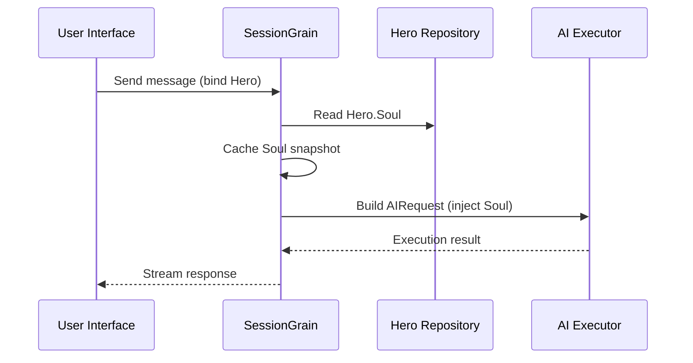

## Tối ưu hóa mã thông báo đầu ra AI: Thực hành chế độ Trung Quốc cổ điển cực kỳ tối giản

> Trong phát triển ứng dụng AI, việc tiêu thụ token ảnh hưởng trực tiếp đến chi phí. Trong dự án HagiCode, chúng tôi đã triển khai "chế độ đầu ra tiếng Trung Cổ điển cực kỳ tối giản" thông qua hệ thống SOUL. Không làm giảm mật độ thông tin, nó làm giảm mã thông báo đầu ra khoảng 30-50%. Bài viết này chia sẻ chi tiết triển khai của phương pháp đó và những bài học chúng tôi đã học được khi sử dụng phương pháp đó.

## Nền

Trong phát triển ứng dụng AI, việc tiêu thụ token là vấn đề chi phí không thể tránh khỏi. Điều này trở nên đặc biệt khó khăn trong các tình huống mà AI cần tạo ra lượng lớn nội dung. Làm cách nào để giảm mã thông báo đầu ra mà không làm giảm mật độ thông tin? Bạn càng nghĩ về nó, vấn đề càng trở nên khó chịu hơn.

Các ý tưởng tối ưu hóa truyền thống chủ yếu tập trung vào khía cạnh đầu vào: cắt bớt lời nhắc của hệ thống, nén ngữ cảnh hoặc sử dụng mã hóa hiệu quả hơn. Nhưng những phương pháp này cuối cùng đã đạt đến mức trần. Đẩy quá trình nén đi quá xa và bạn bắt đầu làm tổn hại đến khả năng hiểu và chất lượng đầu ra của AI. Về cơ bản đó chỉ là xóa nội dung, không có ý nghĩa gì nhiều.

Vậy còn phía đầu ra thì sao? Liệu chúng ta có thể khiến AI diễn đạt ý nghĩa tương tự một cách chính xác hơn không?

Câu hỏi nghe có vẻ đơn giản nhưng lại ẩn chứa khá nhiều điều ẩn giấu bên dưới nó. Nếu bạn trực tiếp yêu cầu AI "ngắn gọn", nó thực sự có thể chỉ cung cấp cho bạn một vài từ. Nếu bạn thêm "giữ thông tin đầy đủ", nó có thể quay trở lại kiểu dài dòng ban đầu. Những hạn chế quá mạnh sẽ ảnh hưởng đến khả năng sử dụng; những ràng buộc quá yếu không làm được gì. Điểm cân bằng chính xác nằm ở đâu? Không ai có thể nói chắc chắn.

Để giải quyết những điểm yếu này, chúng tôi đã đưa ra một quyết định táo bạo: bắt đầu từ chính phong cách ngôn ngữ và thiết kế một hệ thống ràng buộc có thể cấu hình và tổng hợp để diễn đạt. Tác động của quyết định đó có thể còn lớn hơn bạn mong đợi. Tôi sẽ đi vào chi tiết ngay và kết quả có thể làm bạn ngạc nhiên một chút.

## Giới thiệu về HagiCode

Cách tiếp cận được chia sẻ trong bài viết này xuất phát từ kinh nghiệm thực tế của chúng tôi trong [Mã Hagi](https://hagicode.com) dự án.

HagiCode là trợ lý mã hóa AI mã nguồn mở hỗ trợ nhiều mô hình AI và cấu hình tùy chỉnh. Trong quá trình phát triển, chúng tôi phát hiện ra rằng mức sử dụng mã thông báo đầu ra AI quá cao nên chúng tôi đã thiết kế một giải pháp cho vấn đề đó. Nếu bạn thấy phương pháp này có giá trị thì điều đó có thể nói lên điều gì đó tốt đẹp về công việc kỹ thuật của chúng tôi. Và nếu đúng như vậy, bản thân HagiCode cũng có thể đáng để bạn quan tâm. Mã không nói dối.

## Tổng quan về hệ thống SOUL

Tên đầy đủ của hệ thống LINH HỒN là Ngôn ngữ phổ quát hướng tâm hồn. Đây là hệ thống cấu hình được sử dụng trong dự án HagiCode để xác định phong cách ngôn ngữ của AI Hero. Ý tưởng cốt lõi của nó rất đơn giản: bằng cách hạn chế cách AI thể hiện chính nó, nó có thể xuất nội dung ở dạng ngôn ngữ ngắn gọn hơn trong khi vẫn đảm bảo tính đầy đủ của thông tin.

Nó hơi giống như đeo một chiếc mặt nạ ngôn ngữ cho AI... mặc dù thành thật mà nói, nó không quá thần bí.

### Kiến trúc kỹ thuật

Hệ thống SOUL sử dụng kiến trúc tách biệt giữa frontend-backend:

**Giao diện người dùng (Người tạo linh hồn)**:
- Được xây dựng bằng React + TypeScript + Vite
- Nằm ở `repos/soul/` thư mục
- Cung cấp giao diện xây dựng Soul trực quan
- Hỗ trợ sử dụng song ngữ (zh-CN / en-US)

**Phần cuối**:
- Được xây dựng trên .NET (C#) + thời gian chạy phân tán Orleans
- Thực thể Hero bao gồm một `Soul` trường (tối đa 8000 ký tự)
- Đưa linh hồn vào lời nhắc hệ thống thông qua `SessionSystemMessageCompiler`

**Tạo mẫu đại lý**:
- Được tạo từ tài liệu tham khảo
- Đầu ra tới `/agent-templates/soul/templates/` thư mục
- Bao gồm 50 nhóm Danh mục chính và 10 kích thước trực giao

### Cơ chế tiêm linh hồn

Khi Phiên thực thi lần đầu tiên, hệ thống sẽ đọc cấu hình Linh hồn của Anh hùng và đưa cấu hình đó vào lời nhắc hệ thống:



Định dạng lời nhắc hệ thống được chèn là:

```
<hero_soul>
[User-defined Soul content]
</hero_soul>
```

Cơ chế tiêm này được thực hiện trong `SessionSystemMessageCompiler.cs`:

```csharp
internal static string? BuildSystemMessage(
    string? existingSystemMessage,
    string? languagePreference,
    IReadOnlyList<HeroTraitDto>? traits,
    string? soul)
{
    var segments = new List<string>();

    // ... language preference and Traits handling ...

    var normalizedSoul = NormalizeSoul(soul);
    if (!string.IsNullOrWhiteSpace(normalizedSoul))
    {
        segments.Add($"<hero_soul>\n{normalizedSoul}\n</hero_soul>");
    }

    // ... other system messages ...

    return segments.Count == 0 ? null : string.Join("\n\n", segments);
}
```

Khi bạn đã xem mã và hiểu nguyên tắc, đó thực sự là tất cả những gì cần làm.

## Chế độ Trung Hoa cổ điển cực kỳ tối giản

Chế độ Trung Quốc cổ điển cực kỳ tối giản là chiến lược tiết kiệm mã thông báo tiêu biểu nhất trong hệ thống SOUL. Nguyên tắc cốt lõi của nó là sử dụng mật độ ngữ nghĩa cao của tiếng Trung cổ để nén độ dài đầu ra trong khi vẫn giữ được thông tin đầy đủ.

### Tại sao Trung Quốc cổ điển

Tiếng Trung cổ điển có một số lợi thế tự nhiên:

1. **Nén ngữ nghĩa**: ý nghĩa tương tự có thể được diễn đạt với ít ký tự hơn.
2. **Loại bỏ sự dư thừa**: Tiếng Trung cổ điển đương nhiên lược bỏ nhiều liên từ và trợ từ phổ biến trong tiếng Trung hiện đại.
3. **Cấu trúc ngắn gọn**: mỗi câu mang mật độ thông tin cao, khiến nó rất phù hợp làm phương tiện cho đầu ra AI.

Đây là một ví dụ cụ thể:

Đầu ra tiếng Trung hiện đại (khoảng 80 ký tự):
```
Based on your code analysis, I found several issues. First, on line 23, the variable name is too long and should be shortened. Second, on line 45, you did not handle null values and should add conditional logic. Finally, the overall code structure is acceptable, but it can be further optimized.
```

Đầu ra tiếng Trung cổ điển cực kỳ tối giản (khoảng 35 ký tự, tiết kiệm 56%):
```
Code reviewed: line 23 variable name verbose, abbreviate; line 45 lacks null handling, add checks. Overall structure acceptable; minor tuning suffices.
```

Khoảng cách đủ lớn để khiến bạn phải dừng lại và suy nghĩ.

### Mẫu cấu hình linh hồn

Cấu hình Soul hoàn chỉnh cho chế độ Cổ điển Trung Hoa cực kỳ tối giản như sau:

```json
{
  "id": "soul-orth-11-classical-chinese-ultra-minimal-mode",
  "name": "Ultra-Minimal Classical Chinese Output Mode",
  "summary": "Use relatively readable Classical Chinese to compress semantic density, convey the meaning with as few words as possible, and retain only conclusions, judgments, and necessary actions, thereby significantly reducing output tokens.",
  "soul": "Your persona core comes from the \"Ultra-Minimal Classical Chinese Output Mode\": use relatively readable Classical Chinese to compress semantic density, convey the meaning with as few words as possible, and retain only conclusions, judgments, and necessary actions, thereby significantly reducing output tokens.\nMaintain the following signature language traits: 1. Prefer concise Classical Chinese sentence patterns such as \"can\", \"should\", \"do not\", \"already\", \"however\", and \"therefore\", while avoiding obscure and difficult wording;\n2. Compress each sentence to 4-12 characters whenever possible, removing preamble, pleasantries, repeated explanation, and ineffective modifiers;\n3. Do not expand arguments unless necessary; if the user does not ask a follow-up, provide only conclusions, steps, or judgments;\n4. Do not alter the core persona of the main Catalog; only compress the expression into restrained, classical, ultra-minimal short sentences."
}
```

Có một số điểm chính trong thiết kế mẫu này:

1. **Rõ ràng ràng buộc**: 4-12 ký tự mỗi câu, loại bỏ dư thừa, ưu tiên kết luận.
2. **Tránh tối nghĩa**: sử dụng các mẫu câu tiếng Trung Cổ điển ngắn gọn và tránh dùng từ ngữ khó, hiếm.
3. **Giữ gìn nhân cách**: chỉ thay đổi phương thức biểu đạt, không thay đổi nhân cách cốt lõi.

Khi bạn tiếp tục điều chỉnh cấu hình, cuối cùng tất cả sẽ chỉ còn một vài thông số.

### Các chế độ cực kỳ tối giản khác

Bên cạnh chế độ Trung Quốc cổ điển, hệ thống HagiCode SOUL còn cung cấp một số chế độ lưu mã thông báo khác:

**Chế độ đầu ra cực kỳ tối thiểu kiểu điện báo** (`soul-orth-02`):
- Giữ mỗi câu nghiêm ngặt trong vòng 10 ký tự
- Cấm tính từ trang trí
- Không có các hạt phương thức, dấu chấm than hoặc lặp lại trong suốt

**Chế độ lẩm bẩm phân mảnh ngắn** (`soul-orth-01`):
- Giữ câu trong vòng 1-5 ký tự
- Mô phỏng tự nói chuyện bị phân mảnh
- Làm suy yếu logic rõ ràng và ưu tiên truyền tải cảm xúc

**Chế độ hỏi đáp có hướng dẫn** (`soul-orth-03`):
- Sử dụng câu hỏi để hướng dẫn suy nghĩ của người dùng
- Giảm nội dung đầu ra trực tiếp
- Giảm mức sử dụng token thông qua tương tác

Mỗi chế độ này nhấn mạnh một hướng thiết kế khác nhau, nhưng mục tiêu cốt lõi là giống nhau: giảm mã thông báo đầu ra trong khi vẫn duy trì chất lượng thông tin. Có nhiều con đường đến Rome; một số chỉ đơn giản là dễ đi bộ hơn những người khác.

## Chiến lược kết hợp

Một tính năng mạnh mẽ của hệ thống SOUL là hỗ trợ kết hợp chéo các Danh mục chính và các kích thước trực giao:

- **50 nhóm Danh mục chính**: xác định tính cách cơ bản (chẳng hạn như phong cách hàn gắn, phong cách học sinh hàng đầu, phong cách xa cách, v.v.)
- **10 kích thước trực giao**: xác định phương thức diễn đạt (như tiếng Trung cổ điển, kiểu điện báo, kiểu hỏi đáp, v.v.)
- **Hiệu ứng kết hợp**: có thể tạo ra hơn 500 kết hợp kiểu ngôn ngữ độc đáo

Ví dụ: bạn có thể kết hợp "Kỹ sư phát triển chuyên nghiệp" với "Chế độ đầu ra tiếng Trung cổ điển siêu tối giản" để tạo ra một trợ lý AI vừa chuyên nghiệp vừa ngắn gọn. Tính linh hoạt này cho phép hệ thống SOUL thích ứng với nhiều tình huống khác nhau. Bạn có thể trộn và kết hợp theo cách bạn muốn; có nhiều sự kết hợp hơn mức bạn có thể sử dụng hết.

## Hướng dẫn thực hành

### Tạo thông qua Soul Builder

thăm [linh hồn.hagicode.com](https://soul.hagicode.com) và làm theo các bước sau:

1. Chọn một Danh mục chính (ví dụ: "Kỹ sư phát triển chuyên nghiệp")
2. Chọn một thứ nguyên trực giao (ví dụ: "Chế độ đầu ra tiếng Trung cổ điển cực kỳ tối thiểu")
3. Xem trước nội dung Soul được tạo
4. Sao chép cấu hình Soul đã tạo

Hầu như chỉ là trỏ và nhấp chuột nên có lẽ không còn gì nhiều để nói.

### Sử dụng trong cấu hình anh hùng

Áp dụng cấu hình Soul cho Hero thông qua giao diện web hoặc API:

```typescript
// Hero Soul update example
const heroUpdate = {
  soul: "Your persona core comes from the \"Ultra-Minimal Classical Chinese Output Mode\": ...",
  soulCatalogId: "soul-orth-11-classical-chinese-ultra-minimal-mode",
  soulDisplayName: "Ultra-Minimal Classical Chinese Output Mode",
  soulStyleType: "orthogonal-dimension",
  soulSummary: "Use relatively readable Classical Chinese to compress semantic density..."
};

await updateHero(heroId, heroUpdate);
```

### Mẫu linh hồn tùy chỉnh

Người dùng có thể tinh chỉnh mẫu cài sẵn hoặc viết mẫu từ đầu. Đây là một ví dụ tùy chỉnh cho kịch bản xem xét mã:

```
You are a code reviewer who pursues extreme concision.
All output must follow these rules:
1. Only point out specific problems and line numbers
2. Each issue must not exceed 15 characters
3. Use concise terms such as "should", "must", and "do not"
4. Do not provide extra explanation

Example output:
- Line 23: variable name too long, should abbreviate
- Line 45: null not handled, must add checks
- Line 67: logic redundant, can simplify
```

Bạn có thể sửa lại mẫu theo cách bạn muốn. Dù sao thì mẫu cũng chỉ là điểm khởi đầu.

### Ghi chú

**Khả năng tương thích**:
- Chế độ tiếng Trung cổ điển hoạt động với tất cả 50 nhóm Danh mục chính
- Có thể kết hợp với bất kỳ nhân vật cơ bản nào
- Không thay đổi tính cách cốt lõi của Danh mục chính

**Cơ chế lưu vào bộ nhớ đệm**:
- Linh hồn được lưu trữ khi Phiên thực thi lần đầu tiên
- Bộ đệm được sử dụng lại trong cùng SessionId
- Sửa đổi cấu hình Hero không ảnh hưởng đến Phiên đã bắt đầu

**Ràng buộc và giới hạn**:
- Độ dài tối đa của trường Soul là 8000 ký tự
- Những anh hùng không có trường Linh hồn trong dữ liệu lịch sử vẫn có thể sử dụng bình thường
- Khe trang bị linh hồn và phong cách độc lập và không ghi đè lên nhau

## So sánh hiệu ứng

Theo số liệu thử nghiệm thực tế từ dự án, kết quả sau khi kích hoạt chế độ Cổ điển Trung Hoa cực kỳ tối giản như sau:

| Kịch bản | Mã thông báo đầu ra gốc | Chế độ cổ điển Trung Quốc | Tiết kiệm |
|------|------------------------|------------------------|---------|
| Đánh giá mã | 850 | 420 | 51% |
| Hỏi đáp kỹ thuật | 620 | 380 | 39% |
| Đề xuất giải pháp | 1100 | 680 | 38% |
| trung bình | - | - | 30-50% |

Dữ liệu đến từ số liệu thống kê sử dụng thực tế trong dự án HagiCode và kết quả chính xác sẽ khác nhau tùy theo kịch bản. Tuy nhiên, số token đã lưu sẽ tăng lên và ví của bạn sẽ đánh giá cao điều đó.

## Kết luận

Hệ thống HagiCode SOUL cung cấp một cách sáng tạo để tối ưu hóa đầu ra AI: giảm mức tiêu thụ mã thông báo bằng cách hạn chế biểu thức thay vì tự nén thông tin. Là cách tiếp cận tiêu biểu nhất, chế độ Trung Quốc cổ điển cực kỳ tối giản đã giúp tiết kiệm 30-50% mã thông báo khi sử dụng trong thế giới thực.

Giá trị cốt lõi của phương pháp này nằm ở chỗ sau:

1. **Bảo toàn chất lượng thông tin**: thay vì chỉ cắt bớt đầu ra, nó thể hiện cùng một nội dung một cách hiệu quả hơn.
2. **Linh hoạt và có thể kết hợp**: hỗ trợ hơn 500 cách kết hợp cá tính và phong cách biểu đạt.
3. **Dễ sử dụng**: Soul Builder cung cấp giao diện trực quan nên không cần mã hóa.
4. **Độ ổn định ở cấp độ sản xuất**: được xác nhận trong dự án và có khả năng sử dụng trên quy mô lớn.

Nếu bạn cũng đang xây dựng các ứng dụng AI hoặc nếu bạn quan tâm đến dự án HagiCode, vui lòng liên hệ. Ý nghĩa của nguồn mở nằm ở việc cùng nhau phát triển và chúng tôi cũng mong muốn được thấy những cách sử dụng sáng tạo của riêng bạn. Câu nói có thể cũ nhưng vẫn đúng: một người có thể đi nhanh nhưng một nhóm có thể đi xa hơn.

## Tài liệu tham khảo

- HagiCode GitHub: [github.com/HagiCode-org/site](https://github.com/HagiCode-org/site)
- Trang web chính thức của HagiCode: [hagicode.com](https://hagicode.com)
- Người xây dựng linh hồn: [linh hồn.hagicode.com](https://soul.hagicode.com)
- Hướng dẫn triển khai Docker: [docs.hagicode.com/installation/docker-compose](https://docs.hagicode.com/installation/docker-compose)
- Ứng dụng máy tính để bàn: [hagicode.com/desktop/](https://hagicode.com/desktop/)
- Bản demo thực hành 30 phút: [www.bilibili.com/video/BV1pirZBuEzq/](https://www.bilibili.com/video/BV1pirZBuEzq/)

---

Nếu bài viết này giúp bạn:
- Hãy cho chúng tôi một Ngôi sao trên GitHub: [github.com/HagiCode-org/site](https://github.com/HagiCode-org/site)
- Truy cập trang web chính thức để tìm hiểu thêm: [hagicode.com](https://hagicode.com)
- Phiên bản beta công khai đã bắt đầu và bạn có thể cài đặt và dùng thử

## Thông báo bản quyền

Cảm ơn bạn đã đọc. Nếu bạn thấy bài viết này hữu ích, bạn có thể thích, đánh dấu và chia sẻ nó.
Nội dung này được tạo ra với sự cộng tác có sự hỗ trợ của AI và phiên bản cuối cùng đã được tác giả xem xét và xác nhận.
- tác giả: [newbe36524](https://www.newbe.pro)
- Liên kết bài viết gốc: [https://docs.hagicode.com/blog/2026-04-04-soul-token-optimization-classical-chinese/](https://docs.hagicode.com/blog/2026-04-04-soul-token-optimization-classical-chinese/)
- Thông báo bản quyền: Trừ khi có quy định khác, tất cả các bài viết trên blog này đều được cấp phép theo BY-NC-SA. Vui lòng trích dẫn nguồn khi đăng lại.
